```mermaid
graph TB
    subgraph "Database Migrations Service"
        DMS[Database Migrations Service]
        ME[Migration Engine]
        VT[Version Tracker]
        RB[Rollback Manager]
        VS[Validation Service]
    end
    
    subgraph "Migration Sources"
        GR[Git Repository]
        FS[File System]
        CS[Config Server]
        MR[Migration Registry]
    end
    
    subgraph "Target Databases"
        PG[PostgreSQL]
        MY[MySQL]
        MG[MongoDB]
        RD[Redis]
    end
    
    subgraph "Migration Types"
        DDL[DDL Migrations]
        DML[DML Migrations]
        IDX[Index Migrations]
        FN[Function Migrations]
        VW[View Migrations]
    end
    
    subgraph "Environments"
        DEV[Development]
        STG[Staging]
        PROD[Production]
        TEST[Testing]
    end
    
    subgraph "Microservices"
        US[User Service]
        PS[Product Service]
        OS[Order Service]
        PY[Payment Service]
        MS[Other Services...]
    end
    
    DMS --> ME
    DMS --> VT
    DMS --> RB
    DMS --> VS
    
    GR --> DMS
    FS --> DMS
    CS --> DMS
    MR --> DMS
    
    DMS --> PG
    DMS --> MY
    DMS --> MG
    DMS --> RD
    
    DDL --> ME
    DML --> ME
    IDX --> ME
    FN --> ME
    VW --> ME
    
    DEV --> DMS
    STG --> DMS
    PROD --> DMS
    TEST --> DMS
    
    US --> DMS
    PS --> DMS
    OS --> DMS
    PY --> DMS
    MS --> DMS
    
    style DMS fill:#e1f5fe
    style ME fill:#f3e5f5
    style VT fill:#e8f5e8
    style RB fill:#fff3e0
```

# Database Migrations Service

**Version:** 1.0.0  
**Spring Boot:** 3.2.x  
**Java:** 17+  
**Build Tool:** Maven

## 📋 Overview

The Database Migrations Service is a centralized database schema management service for the Exalt E-commerce Ecosystem. It provides automated database migrations, version control for database schemas, rollback capabilities, and multi-environment database management across all microservices.

## 🎯 Purpose

- **Schema Version Control**: Track and manage database schema changes across environments
- **Automated Migrations**: Execute database migrations automatically during deployments
- **Rollback Support**: Safely rollback database changes when needed
- **Multi-Database Support**: Manage PostgreSQL, MySQL, and MongoDB migrations
- **Environment Isolation**: Separate migration strategies for dev, staging, and production
- **Migration Validation**: Validate migration scripts before execution

## 🏗️ Architecture



## 📁 Project Structure

```
database-migrations/
├── src/
│   ├── main/
│   │   ├── java/com/exalt/centralconfiguration/databasemigrations/
│   │   │   ├── DatabaseMigrationsApplication.java      # Main application class
│   │   │   ├── config/
│   │   │   │   ├── DatabaseConfig.java                # Database configuration
│   │   │   │   ├── FlywayConfig.java                  # Flyway configuration
│   │   │   │   ├── LiquibaseConfig.java               # Liquibase configuration
│   │   │   │   └── MigrationConfig.java               # Migration settings
│   │   │   ├── controller/
│   │   │   │   ├── MigrationController.java           # Migration REST API
│   │   │   │   └── HealthController.java              # Health check endpoint
│   │   │   ├── service/
│   │   │   │   ├── MigrationService.java              # Core migration logic
│   │   │   │   ├── ValidationService.java             # Migration validation
│   │   │   │   ├── RollbackService.java               # Rollback management
│   │   │   │   └── VersionTrackingService.java        # Version tracking
│   │   │   ├── repository/
│   │   │   │   ├── MigrationHistoryRepository.java    # Migration history
│   │   │   │   └── DatabaseConnectionRepository.java  # Database connections
│   │   │   ├── model/
│   │   │   │   ├── Migration.java                     # Migration entity
│   │   │   │   ├── MigrationHistory.java              # Migration history
│   │   │   │   └── DatabaseConnection.java            # Database connection info
│   │   │   └── exception/
│   │   │       ├── MigrationException.java            # Migration exceptions
│   │   │       └── ValidationException.java           # Validation exceptions
│   │   └── resources/
│   │       ├── application.yml                        # Main configuration
│   │       ├── application-dev.yml                    # Development profile
│   │       ├── application-staging.yml                # Staging profile
│   │       ├── application-prod.yml                   # Production profile
│   │       └── db/
│   │           ├── migration/
│   │           │   ├── common/                        # Common migrations
│   │           │   ├── postgresql/                    # PostgreSQL specific
│   │           │   ├── mysql/                         # MySQL specific
│   │           │   └── mongodb/                       # MongoDB specific
│   │           └── seeds/
│   │               ├── dev/                           # Development seeds
│   │               ├── staging/                       # Staging seeds
│   │               └── test/                          # Test seeds
│   └── test/
│       └── java/com/exalt/centralconfiguration/databasemigrations/
│           ├── DatabaseMigrationsApplicationTest.java
│           ├── service/
│           │   ├── MigrationServiceTest.java
│           │   └── ValidationServiceTest.java
│           └── integration/
│               └── MigrationIntegrationTest.java
├── tests/
│   ├── unit/
│   │   └── com/exalt/centralconfiguration/databasemigrations/
│   │       ├── service/
│   │       │   └── MigrationServiceTest.java
│   │       └── controller/
│   │           └── MigrationControllerTest.java
│   ├── integration/
│   │   └── com/exalt/centralconfiguration/databasemigrations/
│   │       └── MigrationIntegrationTest.java
│   ├── e2e/
│   │   └── com/exalt/centralconfiguration/databasemigrations/
│   │       └── DatabaseMigrationsE2ETest.java
│   └── performance/
│       └── MigrationPerformanceTest.js
├── migrations/
│   ├── postgresql/
│   │   ├── V1__Create_initial_schema.sql
│   │   ├── V2__Add_user_tables.sql
│   │   └── V3__Add_product_tables.sql
│   ├── mysql/
│   │   ├── V1__Create_initial_schema.sql
│   │   └── V2__Add_indexes.sql
│   └── mongodb/
│       ├── 001_create_collections.js
│       └── 002_add_indexes.js
├── k8s/
│   ├── deployment.yaml                                # Kubernetes deployment
│   ├── service.yaml                                   # Kubernetes service
│   ├── configmap.yaml                                 # Configuration map
│   ├── secrets.yaml                                   # Secret management
│   └── cronjob.yaml                                   # Scheduled migrations
├── scripts/
│   ├── setup.sh                                       # Environment setup
│   ├── dev.sh                                         # Development utilities
│   ├── migrate.sh                                     # Migration script
│   ├── rollback.sh                                    # Rollback script
│   └── validate.sh                                    # Validation script
├── docs/
│   ├── setup/
│   │   ├── installation.md                           # Installation guide
│   │   ├── configuration.md                          # Configuration guide
│   │   └── troubleshooting.md                        # Troubleshooting guide
│   ├── migrations/
│   │   ├── writing-migrations.md                     # Migration writing guide
│   │   ├── best-practices.md                         # Best practices
│   │   └── rollback-procedures.md                    # Rollback procedures
│   └── operations/
│       ├── monitoring.md                             # Monitoring guide
│       ├── backup-restore.md                         # Backup and restore
│       └── disaster-recovery.md                      # Disaster recovery
├── api-docs/
│   └── openapi.yaml                                   # API documentation
├── database/
│   ├── schemas/                                       # Database schemas
│   └── seeds/                                         # Seed data
├── i18n/
│   ├── en/messages.properties                         # English messages
│   ├── fr/messages.properties                         # French messages
│   ├── de/messages.properties                         # German messages
│   ├── es/messages.properties                         # Spanish messages
│   ├── ar/messages.properties                         # Arabic messages
│   └── i18n-config.json                              # I18n configuration
├── docker-compose.yml                                 # Local development setup
├── Dockerfile                                         # Container configuration
├── pom.xml                                            # Maven configuration
└── README.md                                          # This file
```

## 🚀 Getting Started

### Prerequisites

- **Java 17+**
- **Maven 3.9.6+**
- **Docker** (for database containers)
- **PostgreSQL** (primary database)
- **MySQL** (secondary database)
- **MongoDB** (document database)

### Local Development Setup

```bash
# Clone the repository
git clone <repository-url>
cd database-migrations

# Set up the environment
./scripts/setup.sh

# Start database containers
docker-compose up -d postgres mysql mongodb

# Run the application
./scripts/dev.sh start

# Or use Maven directly
mvn spring-boot:run -Dspring.profiles.active=dev
```

### Migration Directory Structure

```bash
# Create migration directories
mkdir -p migrations/{postgresql,mysql,mongodb}

# PostgreSQL migrations
migrations/postgresql/
├── V1__Create_initial_schema.sql
├── V2__Add_user_tables.sql
├── V3__Add_product_tables.sql
├── V4__Add_order_tables.sql
└── V5__Add_indexes.sql

# MySQL migrations
migrations/mysql/
├── V1__Create_initial_schema.sql
├── V2__Add_user_tables.sql
└── V3__Add_indexes.sql

# MongoDB migrations
migrations/mongodb/
├── 001_create_collections.js
├── 002_add_indexes.js
└── 003_add_validation.js
```

### Environment Variables

```bash
# Required environment variables
export DB_MIGRATIONS_PORT=8889
export DB_POSTGRES_URL=jdbc:postgresql://localhost:5432/exalt_db
export DB_POSTGRES_USERNAME=postgres
export DB_POSTGRES_PASSWORD=postgres
export DB_MYSQL_URL=jdbc:mysql://localhost:3306/exalt_db
export DB_MYSQL_USERNAME=root
export DB_MYSQL_PASSWORD=root
export DB_MONGODB_URI=mongodb://localhost:27017/exalt_db

# Optional environment variables
export FLYWAY_BASELINE_ON_MIGRATE=true
export FLYWAY_VALIDATE_ON_MIGRATE=true
export LIQUIBASE_CHANGELOG_LOCK_WAIT_TIME=10
```

## 💡 Core Components

### 1. Migration Service

Core service for managing database migrations:

```java
@Service
@Slf4j
public class MigrationService {
    
    @Autowired
    private FlywayConfig flywayConfig;
    
    @Autowired
    private LiquibaseConfig liquibaseConfig;
    
    @Autowired
    private ValidationService validationService;
    
    @Autowired
    private VersionTrackingService versionTrackingService;
    
    public MigrationResult executeMigration(MigrationRequest request) {
        log.info("Starting migration for database: {}", request.getDatabaseName());
        
        try {
            // Validate migration request
            validationService.validateMigrationRequest(request);
            
            // Create migration context
            MigrationContext context = createMigrationContext(request);
            
            // Execute migration based on database type
            MigrationResult result = switch (request.getDatabaseType()) {
                case POSTGRESQL -> executePostgreSQLMigration(context);
                case MYSQL -> executeMySQLMigration(context);
                case MONGODB -> executeMongoDBMigration(context);
                default -> throw new UnsupportedDatabaseException(
                    "Unsupported database type: " + request.getDatabaseType());
            };
            
            // Track migration version
            versionTrackingService.trackMigration(context, result);
            
            log.info("Migration completed successfully for database: {}", 
                request.getDatabaseName());
            
            return result;
            
        } catch (Exception e) {
            log.error("Migration failed for database: {}", request.getDatabaseName(), e);
            throw new MigrationException("Migration failed", e);
        }
    }
    
    private MigrationResult executePostgreSQLMigration(MigrationContext context) {
        Flyway flyway = flywayConfig.createFlyway(context);
        
        // Execute migration
        MigrateResult migrateResult = flyway.migrate();
        
        return MigrationResult.builder()
            .databaseType(DatabaseType.POSTGRESQL)
            .migrationsExecuted(migrateResult.migrationsExecuted)
            .targetVersion(migrateResult.targetSchemaVersion)
            .executionTime(System.currentTimeMillis() - context.getStartTime())
            .status(MigrationStatus.SUCCESS)
            .build();
    }
    
    private MigrationResult executeMySQLMigration(MigrationContext context) {
        Flyway flyway = flywayConfig.createFlyway(context);
        
        // Execute migration
        MigrateResult migrateResult = flyway.migrate();
        
        return MigrationResult.builder()
            .databaseType(DatabaseType.MYSQL)
            .migrationsExecuted(migrateResult.migrationsExecuted)
            .targetVersion(migrateResult.targetSchemaVersion)
            .executionTime(System.currentTimeMillis() - context.getStartTime())
            .status(MigrationStatus.SUCCESS)
            .build();
    }
    
    private MigrationResult executeMongoDBMigration(MigrationContext context) {
        // Custom MongoDB migration logic
        MongoMigrationEngine engine = new MongoMigrationEngine(context);
        
        List<Migration> pendingMigrations = engine.getPendingMigrations();
        
        for (Migration migration : pendingMigrations) {
            engine.executeMigration(migration);
        }
        
        return MigrationResult.builder()
            .databaseType(DatabaseType.MONGODB)
            .migrationsExecuted(pendingMigrations.size())
            .targetVersion(getLatestVersion(pendingMigrations))
            .executionTime(System.currentTimeMillis() - context.getStartTime())
            .status(MigrationStatus.SUCCESS)
            .build();
    }
}
```

### 2. Validation Service

Validates migration scripts and requests:

```java
@Service
@Slf4j
public class ValidationService {
    
    @Autowired
    private MigrationHistoryRepository migrationHistoryRepository;
    
    public void validateMigrationRequest(MigrationRequest request) {
        log.info("Validating migration request for database: {}", request.getDatabaseName());
        
        // Validate database connection
        validateDatabaseConnection(request);
        
        // Validate migration files
        validateMigrationFiles(request);
        
        // Validate migration order
        validateMigrationOrder(request);
        
        // Validate checksums
        validateChecksums(request);
        
        log.info("Migration request validation completed successfully");
    }
    
    private void validateDatabaseConnection(MigrationRequest request) {
        try {
            DatabaseConnection connection = createDatabaseConnection(request);
            
            // Test connection
            if (!connection.isValid(5)) {
                throw new ValidationException("Database connection is not valid");
            }
            
            // Check permissions
            if (!hasRequiredPermissions(connection, request.getDatabaseType())) {
                throw new ValidationException("Insufficient database permissions");
            }
            
        } catch (SQLException e) {
            throw new ValidationException("Database connection validation failed", e);
        }
    }
    
    private void validateMigrationFiles(MigrationRequest request) {
        List<String> migrationFiles = getMigrationFiles(request);
        
        for (String file : migrationFiles) {
            // Validate file exists
            if (!Files.exists(Paths.get(file))) {
                throw new ValidationException("Migration file not found: " + file);
            }
            
            // Validate file syntax
            if (!isValidMigrationFile(file, request.getDatabaseType())) {
                throw new ValidationException("Invalid migration file syntax: " + file);
            }
            
            // Validate file naming convention
            if (!followsNamingConvention(file)) {
                throw new ValidationException("Migration file doesn't follow naming convention: " + file);
            }
        }
    }
    
    private void validateMigrationOrder(MigrationRequest request) {
        List<Migration> existingMigrations = migrationHistoryRepository
            .findByDatabaseNameOrderByVersionAsc(request.getDatabaseName());
        
        List<Migration> newMigrations = getNewMigrations(request);
        
        // Check for version conflicts
        for (Migration newMigration : newMigrations) {
            if (existingMigrations.stream().anyMatch(m -> 
                m.getVersion().equals(newMigration.getVersion()))) {
                throw new ValidationException(
                    "Migration version already exists: " + newMigration.getVersion());
            }
        }
        
        // Validate sequential order
        validateSequentialOrder(existingMigrations, newMigrations);
    }
    
    private void validateChecksums(MigrationRequest request) {
        List<Migration> existingMigrations = migrationHistoryRepository
            .findByDatabaseName(request.getDatabaseName());
        
        for (Migration migration : existingMigrations) {
            String currentChecksum = calculateChecksum(migration.getScript());
            
            if (!currentChecksum.equals(migration.getChecksum())) {
                throw new ValidationException(
                    "Migration checksum mismatch for version: " + migration.getVersion());
            }
        }
    }
}
```

### 3. Rollback Service

Manages database rollbacks:

```java
@Service
@Slf4j
public class RollbackService {
    
    @Autowired
    private MigrationHistoryRepository migrationHistoryRepository;
    
    @Autowired
    private ValidationService validationService;
    
    public RollbackResult rollback(RollbackRequest request) {
        log.info("Starting rollback for database: {} to version: {}", 
            request.getDatabaseName(), request.getTargetVersion());
        
        try {
            // Validate rollback request
            validationService.validateRollbackRequest(request);
            
            // Get migrations to rollback
            List<Migration> migrationsToRollback = getMigrationsToRollback(request);
            
            // Execute rollback
            RollbackResult result = executeRollback(request, migrationsToRollback);
            
            log.info("Rollback completed successfully for database: {}", 
                request.getDatabaseName());
            
            return result;
            
        } catch (Exception e) {
            log.error("Rollback failed for database: {}", request.getDatabaseName(), e);
            throw new RollbackException("Rollback failed", e);
        }
    }
    
    private RollbackResult executeRollback(RollbackRequest request, 
                                         List<Migration> migrationsToRollback) {
        
        RollbackContext context = createRollbackContext(request);
        
        // Execute rollback based on database type
        return switch (request.getDatabaseType()) {
            case POSTGRESQL -> executePostgreSQLRollback(context, migrationsToRollback);
            case MYSQL -> executeMySQLRollback(context, migrationsToRollback);
            case MONGODB -> executeMongoDBRollback(context, migrationsToRollback);
            default -> throw new UnsupportedDatabaseException(
                "Unsupported database type: " + request.getDatabaseType());
        };
    }
    
    private RollbackResult executePostgreSQLRollback(RollbackContext context, 
                                                   List<Migration> migrations) {
        
        int rolledBackCount = 0;
        
        // Execute rollback scripts in reverse order
        for (int i = migrations.size() - 1; i >= 0; i--) {
            Migration migration = migrations.get(i);
            
            if (migration.hasRollbackScript()) {
                executeRollbackScript(context, migration.getRollbackScript());
                rolledBackCount++;
            } else {
                log.warn("No rollback script found for migration: {}", migration.getVersion());
            }
        }
        
        return RollbackResult.builder()
            .databaseType(DatabaseType.POSTGRESQL)
            .migrationsRolledBack(rolledBackCount)
            .targetVersion(context.getTargetVersion())
            .executionTime(System.currentTimeMillis() - context.getStartTime())
            .status(RollbackStatus.SUCCESS)
            .build();
    }
}
```

## 📚 Migration Examples

### PostgreSQL Migration

```sql
-- V1__Create_initial_schema.sql
CREATE SCHEMA IF NOT EXISTS exalt;

-- Create users table
CREATE TABLE exalt.users (
    id UUID PRIMARY KEY DEFAULT gen_random_uuid(),
    email VARCHAR(255) UNIQUE NOT NULL,
    username VARCHAR(100) UNIQUE NOT NULL,
    password_hash VARCHAR(255) NOT NULL,
    first_name VARCHAR(100),
    last_name VARCHAR(100),
    created_at TIMESTAMP WITH TIME ZONE DEFAULT CURRENT_TIMESTAMP,
    updated_at TIMESTAMP WITH TIME ZONE DEFAULT CURRENT_TIMESTAMP
);

-- Create indexes
CREATE INDEX idx_users_email ON exalt.users(email);
CREATE INDEX idx_users_username ON exalt.users(username);
CREATE INDEX idx_users_created_at ON exalt.users(created_at);

-- Create trigger for updated_at
CREATE OR REPLACE FUNCTION update_updated_at_column()
RETURNS TRIGGER AS $$
BEGIN
    NEW.updated_at = CURRENT_TIMESTAMP;
    RETURN NEW;
END;
$$ language 'plpgsql';

CREATE TRIGGER update_users_updated_at 
    BEFORE UPDATE ON exalt.users 
    FOR EACH ROW 
    EXECUTE FUNCTION update_updated_at_column();
```

### MySQL Migration

```sql
-- V1__Create_initial_schema.sql
CREATE DATABASE IF NOT EXISTS exalt;
USE exalt;

-- Create products table
CREATE TABLE products (
    id BIGINT AUTO_INCREMENT PRIMARY KEY,
    name VARCHAR(255) NOT NULL,
    description TEXT,
    price DECIMAL(10,2) NOT NULL,
    stock_quantity INT DEFAULT 0,
    category_id BIGINT,
    created_at TIMESTAMP DEFAULT CURRENT_TIMESTAMP,
    updated_at TIMESTAMP DEFAULT CURRENT_TIMESTAMP ON UPDATE CURRENT_TIMESTAMP,
    INDEX idx_products_name (name),
    INDEX idx_products_category (category_id),
    INDEX idx_products_created_at (created_at)
) ENGINE=InnoDB DEFAULT CHARSET=utf8mb4 COLLATE=utf8mb4_unicode_ci;
```

### MongoDB Migration

```javascript
// 001_create_collections.js
db.orders.createIndex({ "customerId": 1 });
db.orders.createIndex({ "orderDate": -1 });
db.orders.createIndex({ "status": 1 });
db.orders.createIndex({ "customerId": 1, "orderDate": -1 });

// Add validation schema
db.runCommand({
    collMod: "orders",
    validator: {
        $jsonSchema: {
            bsonType: "object",
            required: ["customerId", "orderDate", "status", "items"],
            properties: {
                customerId: {
                    bsonType: "string",
                    description: "Customer ID is required"
                },
                orderDate: {
                    bsonType: "date",
                    description: "Order date is required"
                },
                status: {
                    bsonType: "string",
                    enum: ["pending", "processing", "shipped", "delivered", "cancelled"],
                    description: "Status must be one of the valid values"
                },
                items: {
                    bsonType: "array",
                    minItems: 1,
                    items: {
                        bsonType: "object",
                        required: ["productId", "quantity", "price"],
                        properties: {
                            productId: { bsonType: "string" },
                            quantity: { bsonType: "int", minimum: 1 },
                            price: { bsonType: "double", minimum: 0 }
                        }
                    }
                }
            }
        }
    }
});
```

## 🔐 Security Features

### Migration Access Control

```java
@RestController
@RequestMapping("/api/v1/migrations")
@PreAuthorize("hasRole('ADMIN')")
@Slf4j
public class MigrationController {
    
    @Autowired
    private MigrationService migrationService;
    
    @PostMapping("/execute")
    @PreAuthorize("hasRole('MIGRATION_ADMIN')")
    public ResponseEntity<MigrationResult> executeMigration(
            @Valid @RequestBody MigrationRequest request,
            Authentication authentication) {
        
        log.info("Migration request received from user: {}", 
            authentication.getName());
        
        try {
            MigrationResult result = migrationService.executeMigration(request);
            
            // Audit log
            auditService.logMigrationExecution(authentication.getName(), request, result);
            
            return ResponseEntity.ok(result);
            
        } catch (Exception e) {
            log.error("Migration execution failed", e);
            return ResponseEntity.status(HttpStatus.INTERNAL_SERVER_ERROR)
                .body(MigrationResult.failed(e.getMessage()));
        }
    }
    
    @PostMapping("/rollback")
    @PreAuthorize("hasRole('MIGRATION_ADMIN')")
    public ResponseEntity<RollbackResult> rollback(
            @Valid @RequestBody RollbackRequest request,
            Authentication authentication) {
        
        log.info("Rollback request received from user: {}", 
            authentication.getName());
        
        try {
            RollbackResult result = rollbackService.rollback(request);
            
            // Audit log
            auditService.logRollbackExecution(authentication.getName(), request, result);
            
            return ResponseEntity.ok(result);
            
        } catch (Exception e) {
            log.error("Rollback execution failed", e);
            return ResponseEntity.status(HttpStatus.INTERNAL_SERVER_ERROR)
                .body(RollbackResult.failed(e.getMessage()));
        }
    }
}
```

## 📊 Monitoring and Health Checks

### Health Indicators

```java
@Component
public class DatabaseMigrationHealthIndicator implements HealthIndicator {
    
    @Autowired
    private MigrationHistoryRepository migrationHistoryRepository;
    
    @Override
    public Health health() {
        try {
            // Check database connectivity
            List<String> databases = getDatabaseNames();
            Map<String, Object> details = new HashMap<>();
            
            for (String database : databases) {
                DatabaseStatus status = checkDatabaseStatus(database);
                details.put(database, status);
            }
            
            boolean allHealthy = details.values().stream()
                .allMatch(status -> ((DatabaseStatus) status).isHealthy());
            
            return allHealthy ? 
                Health.up().withDetails(details).build() :
                Health.down().withDetails(details).build();
                
        } catch (Exception e) {
            return Health.down()
                .withDetail("error", e.getMessage())
                .build();
        }
    }
    
    private DatabaseStatus checkDatabaseStatus(String database) {
        try {
            // Check if database is accessible
            migrationHistoryRepository.findByDatabaseName(database);
            
            // Get latest migration version
            String latestVersion = getLatestMigrationVersion(database);
            
            return DatabaseStatus.builder()
                .database(database)
                .healthy(true)
                .latestVersion(latestVersion)
                .lastCheck(Instant.now())
                .build();
                
        } catch (Exception e) {
            return DatabaseStatus.builder()
                .database(database)
                .healthy(false)
                .error(e.getMessage())
                .lastCheck(Instant.now())
                .build();
        }
    }
}
```

## 🧪 Testing

### Unit Tests

```java
@ExtendWith(MockitoExtension.class)
class MigrationServiceTest {
    
    @Mock
    private FlywayConfig flywayConfig;
    
    @Mock
    private ValidationService validationService;
    
    @Mock
    private VersionTrackingService versionTrackingService;
    
    @InjectMocks
    private MigrationService migrationService;
    
    @Test
    void shouldExecutePostgreSQLMigrationSuccessfully() {
        // Given
        MigrationRequest request = createMigrationRequest(DatabaseType.POSTGRESQL);
        Flyway flyway = mock(Flyway.class);
        MigrateResult migrateResult = createMigrateResult();
        
        when(flywayConfig.createFlyway(any())).thenReturn(flyway);
        when(flyway.migrate()).thenReturn(migrateResult);
        
        // When
        MigrationResult result = migrationService.executeMigration(request);
        
        // Then
        assertThat(result).isNotNull();
        assertThat(result.getStatus()).isEqualTo(MigrationStatus.SUCCESS);
        assertThat(result.getDatabaseType()).isEqualTo(DatabaseType.POSTGRESQL);
        
        verify(validationService).validateMigrationRequest(request);
        verify(versionTrackingService).trackMigration(any(), any());
    }
    
    @Test
    void shouldThrowExceptionWhenValidationFails() {
        // Given
        MigrationRequest request = createMigrationRequest(DatabaseType.POSTGRESQL);
        
        doThrow(new ValidationException("Validation failed"))
            .when(validationService).validateMigrationRequest(request);
        
        // When & Then
        assertThatThrownBy(() -> migrationService.executeMigration(request))
            .isInstanceOf(MigrationException.class)
            .hasMessageContaining("Migration failed");
    }
}
```

### Integration Tests

```java
@SpringBootTest
@TestPropertySource(properties = {
    "spring.datasource.url=jdbc:h2:mem:testdb",
    "spring.jpa.hibernate.ddl-auto=create-drop"
})
class MigrationIntegrationTest {
    
    @Autowired
    private MigrationService migrationService;
    
    @Autowired
    private TestRestTemplate restTemplate;
    
    @Test
    void shouldExecuteMigrationEndToEnd() {
        // Given
        MigrationRequest request = MigrationRequest.builder()
            .databaseName("testdb")
            .databaseType(DatabaseType.POSTGRESQL)
            .environment("test")
            .build();
        
        // When
        ResponseEntity<MigrationResult> response = restTemplate
            .withBasicAuth("admin", "password")
            .postForEntity("/api/v1/migrations/execute", request, MigrationResult.class);
        
        // Then
        assertThat(response.getStatusCode()).isEqualTo(HttpStatus.OK);
        assertThat(response.getBody()).isNotNull();
        assertThat(response.getBody().getStatus()).isEqualTo(MigrationStatus.SUCCESS);
    }
}
```

## 🚀 Deployment

### Docker Deployment

```dockerfile
FROM openjdk:17-jre-slim

# Set working directory
WORKDIR /app

# Copy application JAR
COPY target/database-migrations-*.jar app.jar

# Create non-root user
RUN groupadd -r dbmigrations && useradd -r -g dbmigrations dbmigrations
RUN chown -R dbmigrations:dbmigrations /app
USER dbmigrations

# Expose port
EXPOSE 8889

# Health check
HEALTHCHECK --interval=30s --timeout=3s --start-period=5s --retries=3 \
  CMD curl -f http://localhost:8889/actuator/health || exit 1

# Start application
ENTRYPOINT ["java", "-jar", "app.jar"]
```

### Kubernetes Deployment

```yaml
apiVersion: apps/v1
kind: Deployment
metadata:
  name: database-migrations
  namespace: central-configuration
spec:
  replicas: 1
  selector:
    matchLabels:
      app: database-migrations
  template:
    metadata:
      labels:
        app: database-migrations
    spec:
      containers:
      - name: database-migrations
        image: exalt/database-migrations:1.0.0
        ports:
        - containerPort: 8889
        env:
        - name: SPRING_PROFILES_ACTIVE
          value: "prod"
        - name: DB_POSTGRES_URL
          valueFrom:
            secretKeyRef:
              name: database-secrets
              key: postgres-url
        - name: DB_POSTGRES_USERNAME
          valueFrom:
            secretKeyRef:
              name: database-secrets
              key: postgres-username
        - name: DB_POSTGRES_PASSWORD
          valueFrom:
            secretKeyRef:
              name: database-secrets
              key: postgres-password
        resources:
          requests:
            memory: "256Mi"
            cpu: "250m"
          limits:
            memory: "512Mi"
            cpu: "500m"
        livenessProbe:
          httpGet:
            path: /actuator/health
            port: 8889
          initialDelaySeconds: 60
          periodSeconds: 30
        readinessProbe:
          httpGet:
            path: /actuator/health
            port: 8889
          initialDelaySeconds: 30
          periodSeconds: 10
```

## 📖 Best Practices

### Migration Writing

1. **Versioning**: Use semantic versioning for migration files (V1, V2, V3...)
2. **Atomic Changes**: Keep migrations atomic and reversible
3. **Backward Compatibility**: Ensure migrations are backward compatible
4. **Test Migrations**: Test migrations in staging before production
5. **Documentation**: Document complex migrations with comments

### Security

1. **Access Control**: Restrict migration execution to authorized users
2. **Audit Trail**: Maintain detailed audit logs of all migrations
3. **Encryption**: Encrypt sensitive migration data
4. **Backup**: Always backup databases before migrations
5. **Rollback Plan**: Have a rollback plan for critical migrations

### Performance

1. **Batch Processing**: Process large datasets in batches
2. **Index Management**: Create indexes after data loading
3. **Connection Pooling**: Use connection pooling for better performance
4. **Resource Monitoring**: Monitor resource usage during migrations
5. **Parallel Execution**: Use parallel execution for independent migrations

## 🤝 Support

For questions, issues, or contributions:

- **Documentation**: [Internal Wiki](https://wiki.exalt.com/database-migrations)
- **Issues**: [JIRA Project](https://jira.exalt.com/projects/DBMIG)
- **Support**: [Slack #database-migrations](https://exalt.slack.com/channels/database-migrations)
- **Email**: database-migrations@exalt.com

---

**License**: Internal Use - Exalt Application Limited  
**Maintainer**: Platform Infrastructure Team  
**Last Updated**: June 16, 2025
