```mermaid
graph TB
    subgraph "Deployment Scripts Service"
        DSS[Deployment Scripts Service]
        DE[Deployment Engine]
        SM[Script Manager]
        EP[Environment Provisioner]
        RM[Rollback Manager]
        DM[Deployment Monitor]
    end
    
    subgraph "Script Sources"
        GR[Git Repository]
        SA[Script Archive]
        TR[Template Repository]
        CB[Config Bundle]
    end
    
    subgraph "Target Environments"
        DEV[Development]
        STG[Staging]
        PROD[Production]
        UAT[UAT/Testing]
    end
    
    subgraph "Deployment Targets"
        K8S[Kubernetes]
        AWS[AWS ECS/EC2]
        AZ[Azure Container]
        DC[Docker Compose]
        VM[Virtual Machines]
    end
    
    subgraph "Script Types"
        PRE[Pre-deployment]
        MAIN[Main Deployment]
        POST[Post-deployment]
        RB[Rollback Scripts]
        HC[Health Checks]
    end
    
    subgraph "Microservices"
        US[User Service]
        PS[Product Service]
        OS[Order Service]
        PY[Payment Service]
        MS[Other Services...]
    end
    
    subgraph "Notifications"
        SL[Slack]
        EM[Email]
        MS_TEAMS[MS Teams]
        WH[Webhooks]
    end
    
    DSS --> DE
    DSS --> SM
    DSS --> EP
    DSS --> RM
    DSS --> DM
    
    GR --> SM
    SA --> SM
    TR --> SM
    CB --> SM
    
    DSS --> DEV
    DSS --> STG
    DSS --> PROD
    DSS --> UAT
    
    DE --> K8S
    DE --> AWS
    DE --> AZ
    DE --> DC
    DE --> VM
    
    PRE --> DE
    MAIN --> DE
    POST --> DE
    RB --> RM
    HC --> DM
    
    US --> DSS
    PS --> DSS
    OS --> DSS
    PY --> DSS
    MS --> DSS
    
    DM --> SL
    DM --> EM
    DM --> MS_TEAMS
    DM --> WH
    
    style DSS fill:#e1f5fe
    style DE fill:#f3e5f5
    style SM fill:#e8f5e8
    style EP fill:#fff3e0
```

# Deployment Scripts Service

**Version:** 1.0.0  
**Spring Boot:** 3.2.x  
**Java:** 17+  
**Build Tool:** Maven

## 📋 Overview

The Deployment Scripts Service is a centralized automation platform for managing deployment processes across the Exalt E-commerce Ecosystem. It provides automated deployment orchestration, script management, environment provisioning, and deployment monitoring across multiple environments and platforms.

## 🎯 Purpose

- **Automated Deployments**: Orchestrate complex multi-service deployments
- **Script Management**: Version-controlled deployment scripts and procedures
- **Environment Provisioning**: Automated infrastructure setup and configuration
- **Blue-Green Deployments**: Zero-downtime deployment strategies
- **Rollback Automation**: Automated rollback procedures for failed deployments
- **Deployment Monitoring**: Real-time deployment tracking and notifications

## 🏗️ Architecture



## 📁 Project Structure

```
deployment-scripts/
├── src/
│   ├── main/
│   │   ├── java/com/exalt/centralconfiguration/deploymentscripts/
│   │   │   ├── DeploymentScriptsApplication.java         # Main application class
│   │   │   ├── config/
│   │   │   │   ├── DeploymentConfig.java                # Deployment configuration
│   │   │   │   ├── ScriptConfig.java                    # Script execution config
│   │   │   │   ├── EnvironmentConfig.java               # Environment settings
│   │   │   │   └── NotificationConfig.java              # Notification settings
│   │   │   ├── controller/
│   │   │   │   ├── DeploymentController.java            # Deployment REST API
│   │   │   │   ├── ScriptController.java                # Script management API
│   │   │   │   └── EnvironmentController.java           # Environment API
│   │   │   ├── service/
│   │   │   │   ├── DeploymentService.java               # Core deployment logic
│   │   │   │   ├── ScriptExecutionService.java          # Script execution
│   │   │   │   ├── EnvironmentProvisioningService.java  # Environment provisioning
│   │   │   │   ├── RollbackService.java                 # Rollback management
│   │   │   │   └── NotificationService.java             # Deployment notifications
│   │   │   ├── repository/
│   │   │   │   ├── DeploymentRepository.java            # Deployment history
│   │   │   │   ├── ScriptRepository.java                # Script repository
│   │   │   │   └── EnvironmentRepository.java           # Environment data
│   │   │   ├── model/
│   │   │   │   ├── Deployment.java                      # Deployment entity
│   │   │   │   ├── DeploymentScript.java                # Script entity
│   │   │   │   ├── Environment.java                     # Environment entity
│   │   │   │   └── DeploymentStatus.java                # Status tracking
│   │   │   ├── engine/
│   │   │   │   ├── KubernetesDeploymentEngine.java      # K8s deployment
│   │   │   │   ├── DockerDeploymentEngine.java          # Docker deployment
│   │   │   │   ├── AWSDeploymentEngine.java             # AWS deployment
│   │   │   │   └── AzureDeploymentEngine.java           # Azure deployment
│   │   │   └── exception/
│   │   │       ├── DeploymentException.java             # Deployment exceptions
│   │   │       └── ScriptExecutionException.java        # Script exceptions
│   │   └── resources/
│   │       ├── application.yml                          # Main configuration
│   │       ├── application-dev.yml                      # Development profile
│   │       ├── application-staging.yml                  # Staging profile
│   │       ├── application-prod.yml                     # Production profile
│   │       └── scripts/
│   │           ├── templates/                           # Script templates
│   │           ├── kubernetes/                          # K8s deployment scripts
│   │           ├── docker/                              # Docker scripts
│   │           └── cloud/                               # Cloud provider scripts
│   └── test/
│       └── java/com/exalt/centralconfiguration/deploymentscripts/
│           ├── DeploymentScriptsApplicationTest.java
│           ├── service/
│           │   ├── DeploymentServiceTest.java
│           │   └── ScriptExecutionServiceTest.java
│           └── integration/
│               └── DeploymentIntegrationTest.java
├── tests/
│   ├── unit/
│   │   └── com/exalt/centralconfiguration/deploymentscripts/
│   │       ├── service/
│   │       │   └── DeploymentServiceTest.java
│   │       └── controller/
│   │           └── DeploymentControllerTest.java
│   ├── integration/
│   │   └── com/exalt/centralconfiguration/deploymentscripts/
│   │       └── DeploymentIntegrationTest.java
│   ├── e2e/
│   │   └── com/exalt/centralconfiguration/deploymentscripts/
│   │       └── DeploymentE2ETest.java
│   └── performance/
│       └── DeploymentPerformanceTest.js
├── scripts/
│   ├── deployment/
│   │   ├── kubernetes/
│   │   │   ├── deploy-microservice.sh                   # K8s microservice deployment
│   │   │   ├── blue-green-deploy.sh                     # Blue-green deployment
│   │   │   ├── rolling-update.sh                        # Rolling update
│   │   │   └── canary-deploy.sh                         # Canary deployment
│   │   ├── docker/
│   │   │   ├── docker-deploy.sh                         # Docker deployment
│   │   │   ├── docker-compose-deploy.sh                 # Docker Compose
│   │   │   └── swarm-deploy.sh                          # Docker Swarm
│   │   ├── cloud/
│   │   │   ├── aws-ecs-deploy.sh                        # AWS ECS deployment
│   │   │   ├── azure-container-deploy.sh                # Azure Container
│   │   │   └── gcp-run-deploy.sh                        # Google Cloud Run
│   │   └── rollback/
│   │       ├── kubernetes-rollback.sh                   # K8s rollback
│   │       ├── docker-rollback.sh                       # Docker rollback
│   │       └── cloud-rollback.sh                        # Cloud rollback
│   ├── environment/
│   │   ├── setup-dev.sh                                 # Development setup
│   │   ├── setup-staging.sh                             # Staging setup
│   │   ├── setup-prod.sh                                # Production setup
│   │   └── cleanup-environment.sh                       # Environment cleanup
│   ├── health-checks/
│   │   ├── service-health-check.sh                      # Service health validation
│   │   ├── database-health-check.sh                     # Database connectivity
│   │   └── integration-test.sh                          # Post-deployment tests
│   └── notifications/
│       ├── slack-notify.sh                              # Slack notifications
│       ├── email-notify.sh                              # Email notifications
│       └── webhook-notify.sh                            # Webhook notifications
├── k8s/
│   ├── deployment.yaml                                  # Kubernetes deployment
│   ├── service.yaml                                     # Kubernetes service
│   ├── configmap.yaml                                   # Configuration map
│   ├── secrets.yaml                                     # Secret management
│   └── rbac.yaml                                        # Role-based access
├── docs/
│   ├── setup/
│   │   ├── installation.md                             # Installation guide
│   │   ├── configuration.md                            # Configuration guide
│   │   └── troubleshooting.md                          # Troubleshooting guide
│   ├── deployment/
│   │   ├── strategies.md                               # Deployment strategies
│   │   ├── best-practices.md                           # Best practices
│   │   └── rollback-procedures.md                      # Rollback procedures
│   └── operations/
│       ├── monitoring.md                               # Monitoring guide
│       ├── maintenance.md                              # Maintenance procedures
│       └── disaster-recovery.md                        # Disaster recovery
├── api-docs/
│   └── openapi.yaml                                     # API documentation
├── templates/
│   ├── kubernetes/                                      # K8s templates
│   ├── docker/                                          # Docker templates
│   └── cloud/                                           # Cloud templates
├── i18n/
│   ├── en/messages.properties                           # English messages
│   ├── fr/messages.properties                           # French messages
│   ├── de/messages.properties                           # German messages
│   ├── es/messages.properties                           # Spanish messages
│   ├── ar/messages.properties                           # Arabic messages
│   └── i18n-config.json                                # I18n configuration
├── docker-compose.yml                                   # Local development setup
├── Dockerfile                                           # Container configuration
├── pom.xml                                              # Maven configuration
└── README.md                                            # This file
```

## 🚀 Getting Started

### Prerequisites

- **Java 17+**
- **Maven 3.9.6+**
- **Docker** (for containerized deployments)
- **Kubernetes CLI (kubectl)** (for K8s deployments)
- **AWS CLI** (for AWS deployments)
- **Azure CLI** (for Azure deployments)

### Local Development Setup

```bash
# Clone the repository
git clone <repository-url>
cd deployment-scripts

# Set up the environment
./scripts/environment/setup-dev.sh

# Start the development server
mvn spring-boot:run -Dspring.profiles.active=dev

# Or use Docker
docker-compose up -d
```

### Script Repository Setup

```bash
# Create script directories
mkdir -p scripts/{deployment,environment,health-checks,notifications}

# Set executable permissions
chmod +x scripts/**/*.sh

# Example script structure
scripts/
├── deployment/
│   ├── kubernetes/
│   │   ├── deploy-microservice.sh
│   │   ├── blue-green-deploy.sh
│   │   └── rolling-update.sh
│   ├── docker/
│   │   ├── docker-deploy.sh
│   │   └── docker-compose-deploy.sh
│   └── cloud/
│       ├── aws-ecs-deploy.sh
│       └── azure-container-deploy.sh
└── rollback/
    ├── kubernetes-rollback.sh
    └── docker-rollback.sh
```

### Environment Variables

```bash
# Required environment variables
export DEPLOYMENT_SCRIPTS_PORT=8890
export SCRIPT_REPOSITORY_PATH=/app/scripts
export KUBERNETES_CONFIG_PATH=/home/user/.kube/config
export AWS_ACCESS_KEY_ID=your-aws-access-key
export AWS_SECRET_ACCESS_KEY=your-aws-secret-key
export AZURE_CLIENT_ID=your-azure-client-id
export AZURE_CLIENT_SECRET=your-azure-client-secret

# Notification settings
export SLACK_WEBHOOK_URL=https://hooks.slack.com/services/...
export EMAIL_SMTP_HOST=smtp.company.com
export EMAIL_SMTP_PORT=587
export EMAIL_USERNAME=notifications@company.com
export EMAIL_PASSWORD=email-password

# Optional environment variables
export DEFAULT_DEPLOYMENT_TIMEOUT=600
export MAX_PARALLEL_DEPLOYMENTS=5
export ROLLBACK_TIMEOUT=300
```

## 💡 Core Components

### 1. Deployment Service

Core service for managing deployments:

```java
@Service
@Slf4j
public class DeploymentService {
    
    @Autowired
    private ScriptExecutionService scriptExecutionService;
    
    @Autowired
    private EnvironmentProvisioningService environmentService;
    
    @Autowired
    private NotificationService notificationService;
    
    @Autowired
    private DeploymentRepository deploymentRepository;
    
    public DeploymentResult deploy(DeploymentRequest request) {
        log.info("Starting deployment for service: {} to environment: {}", 
            request.getServiceName(), request.getTargetEnvironment());
        
        Deployment deployment = createDeployment(request);
        
        try {
            // Update deployment status
            deployment.setStatus(DeploymentStatus.IN_PROGRESS);
            deploymentRepository.save(deployment);
            
            // Send start notification
            notificationService.sendDeploymentStartNotification(deployment);
            
            // Execute pre-deployment scripts
            executePreDeploymentScripts(deployment);
            
            // Provision environment if needed
            if (request.isProvisionEnvironment()) {
                environmentService.provisionEnvironment(deployment);
            }
            
            // Execute main deployment
            DeploymentResult result = executeMainDeployment(deployment);
            
            // Execute post-deployment scripts
            executePostDeploymentScripts(deployment);
            
            // Update deployment status
            deployment.setStatus(DeploymentStatus.SUCCESS);
            deployment.setCompletedAt(Instant.now());
            deploymentRepository.save(deployment);
            
            // Send success notification
            notificationService.sendDeploymentSuccessNotification(deployment, result);
            
            log.info("Deployment completed successfully for service: {}", 
                request.getServiceName());
            
            return result;
            
        } catch (Exception e) {
            log.error("Deployment failed for service: {}", request.getServiceName(), e);
            
            // Update deployment status
            deployment.setStatus(DeploymentStatus.FAILED);
            deployment.setError(e.getMessage());
            deployment.setCompletedAt(Instant.now());
            deploymentRepository.save(deployment);
            
            // Send failure notification
            notificationService.sendDeploymentFailureNotification(deployment, e);
            
            throw new DeploymentException("Deployment failed", e);
        }
    }
    
    private DeploymentResult executeMainDeployment(Deployment deployment) {
        DeploymentStrategy strategy = deployment.getStrategy();
        
        return switch (strategy) {
            case BLUE_GREEN -> executeBlueGreenDeployment(deployment);
            case ROLLING_UPDATE -> executeRollingUpdate(deployment);
            case CANARY -> executeCanaryDeployment(deployment);
            case RECREATE -> executeRecreateDeployment(deployment);
            default -> throw new UnsupportedOperationException(
                "Deployment strategy not supported: " + strategy);
        };
    }
    
    private DeploymentResult executeBlueGreenDeployment(Deployment deployment) {
        log.info("Executing blue-green deployment for: {}", deployment.getServiceName());
        
        try {
            // Create green environment
            String greenEnvironment = createGreenEnvironment(deployment);
            
            // Deploy to green environment
            deployToEnvironment(deployment, greenEnvironment);
            
            // Validate green environment
            validateEnvironment(deployment, greenEnvironment);
            
            // Switch traffic to green
            switchTraffic(deployment, greenEnvironment);
            
            // Cleanup blue environment
            cleanupBlueEnvironment(deployment);
            
            return DeploymentResult.builder()
                .deploymentId(deployment.getId())
                .strategy(DeploymentStrategy.BLUE_GREEN)
                .status(DeploymentStatus.SUCCESS)
                .environment(greenEnvironment)
                .executionTime(calculateExecutionTime(deployment))
                .build();
                
        } catch (Exception e) {
            log.error("Blue-green deployment failed", e);
            throw new DeploymentException("Blue-green deployment failed", e);
        }
    }
    
    private void executePreDeploymentScripts(Deployment deployment) {
        List<DeploymentScript> preScripts = getPreDeploymentScripts(deployment);
        
        for (DeploymentScript script : preScripts) {
            log.info("Executing pre-deployment script: {}", script.getName());
            scriptExecutionService.executeScript(script, deployment);
        }
    }
    
    private void executePostDeploymentScripts(Deployment deployment) {
        List<DeploymentScript> postScripts = getPostDeploymentScripts(deployment);
        
        for (DeploymentScript script : postScripts) {
            log.info("Executing post-deployment script: {}", script.getName());
            scriptExecutionService.executeScript(script, deployment);
        }
    }
}
```

### 2. Script Execution Service

Manages script execution and validation:

```java
@Service
@Slf4j
public class ScriptExecutionService {
    
    @Value("${deployment.script.timeout:600}")
    private long scriptTimeout;
    
    @Autowired
    private ScriptRepository scriptRepository;
    
    public ScriptExecutionResult executeScript(DeploymentScript script, Deployment deployment) {
        log.info("Executing script: {} for deployment: {}", script.getName(), deployment.getId());
        
        try {
            // Validate script
            validateScript(script);
            
            // Prepare execution environment
            Map<String, String> environment = prepareEnvironment(script, deployment);
            
            // Build command
            List<String> command = buildCommand(script, deployment);
            
            // Execute script
            ProcessBuilder processBuilder = new ProcessBuilder(command);
            processBuilder.environment().putAll(environment);
            processBuilder.directory(new File(script.getWorkingDirectory()));
            
            Process process = processBuilder.start();
            
            // Handle output
            String output = handleProcessOutput(process);
            
            // Wait for completion with timeout
            boolean completed = process.waitFor(scriptTimeout, TimeUnit.SECONDS);
            
            if (!completed) {
                process.destroyForcibly();
                throw new ScriptExecutionException("Script execution timed out: " + script.getName());
            }
            
            int exitCode = process.exitValue();
            
            if (exitCode != 0) {
                throw new ScriptExecutionException(
                    "Script execution failed with exit code: " + exitCode + ", output: " + output);
            }
            
            log.info("Script executed successfully: {}", script.getName());
            
            return ScriptExecutionResult.builder()
                .scriptName(script.getName())
                .exitCode(exitCode)
                .output(output)
                .executionTime(calculateExecutionTime())
                .status(ScriptExecutionStatus.SUCCESS)
                .build();
                
        } catch (Exception e) {
            log.error("Script execution failed: {}", script.getName(), e);
            
            return ScriptExecutionResult.builder()
                .scriptName(script.getName())
                .exitCode(-1)
                .error(e.getMessage())
                .status(ScriptExecutionStatus.FAILED)
                .build();
        }
    }
    
    private void validateScript(DeploymentScript script) {
        // Check if script file exists
        Path scriptPath = Paths.get(script.getScriptPath());
        if (!Files.exists(scriptPath)) {
            throw new ScriptExecutionException("Script file not found: " + script.getScriptPath());
        }
        
        // Check if script is executable
        if (!Files.isExecutable(scriptPath)) {
            throw new ScriptExecutionException("Script is not executable: " + script.getScriptPath());
        }
        
        // Validate script syntax (for shell scripts)
        if (script.getType() == ScriptType.SHELL) {
            validateShellScript(scriptPath);
        }
    }
    
    private Map<String, String> prepareEnvironment(DeploymentScript script, Deployment deployment) {
        Map<String, String> environment = new HashMap<>();
        
        // Add system environment variables
        environment.putAll(System.getenv());
        
        // Add deployment-specific variables
        environment.put("DEPLOYMENT_ID", deployment.getId().toString());
        environment.put("SERVICE_NAME", deployment.getServiceName());
        environment.put("TARGET_ENVIRONMENT", deployment.getTargetEnvironment());
        environment.put("DEPLOYMENT_STRATEGY", deployment.getStrategy().name());
        environment.put("IMAGE_TAG", deployment.getImageTag());
        
        // Add script-specific variables
        environment.putAll(script.getEnvironmentVariables());
        
        return environment;
    }
    
    private List<String> buildCommand(DeploymentScript script, Deployment deployment) {
        List<String> command = new ArrayList<>();
        
        switch (script.getType()) {
            case SHELL:
                command.add("/bin/bash");
                command.add(script.getScriptPath());
                break;
            case PYTHON:
                command.add("python3");
                command.add(script.getScriptPath());
                break;
            case KUBECTL:
                command.add("kubectl");
                command.addAll(Arrays.asList(script.getArguments().split(" ")));
                break;
            case DOCKER:
                command.add("docker");
                command.addAll(Arrays.asList(script.getArguments().split(" ")));
                break;
        }
        
        // Add deployment-specific arguments
        command.addAll(getDeploymentArguments(deployment));
        
        return command;
    }
}
```

### 3. Environment Provisioning Service

Manages environment setup and configuration:

```java
@Service
@Slf4j
public class EnvironmentProvisioningService {
    
    @Autowired
    private KubernetesDeploymentEngine k8sEngine;
    
    @Autowired
    private AWSDeploymentEngine awsEngine;
    
    @Autowired
    private AzureDeploymentEngine azureEngine;
    
    public EnvironmentProvisioningResult provisionEnvironment(Deployment deployment) {
        log.info("Provisioning environment: {} for service: {}", 
            deployment.getTargetEnvironment(), deployment.getServiceName());
        
        try {
            Environment environment = getEnvironmentConfig(deployment.getTargetEnvironment());
            
            return switch (environment.getType()) {
                case KUBERNETES -> provisionKubernetesEnvironment(deployment, environment);
                case AWS_ECS -> provisionAWSEnvironment(deployment, environment);
                case AZURE_CONTAINER -> provisionAzureEnvironment(deployment, environment);
                case DOCKER_COMPOSE -> provisionDockerEnvironment(deployment, environment);
                default -> throw new UnsupportedEnvironmentException(
                    "Environment type not supported: " + environment.getType());
            };
            
        } catch (Exception e) {
            log.error("Environment provisioning failed", e);
            throw new EnvironmentProvisioningException("Failed to provision environment", e);
        }
    }
    
    private EnvironmentProvisioningResult provisionKubernetesEnvironment(
            Deployment deployment, Environment environment) {
        
        log.info("Provisioning Kubernetes environment for: {}", deployment.getServiceName());
        
        try {
            // Create namespace if not exists
            k8sEngine.createNamespaceIfNotExists(environment.getNamespace());
            
            // Apply configuration maps
            k8sEngine.applyConfigMaps(deployment, environment);
            
            // Apply secrets
            k8sEngine.applySecrets(deployment, environment);
            
            // Apply service account and RBAC
            k8sEngine.applyRBAC(deployment, environment);
            
            // Apply network policies
            k8sEngine.applyNetworkPolicies(deployment, environment);
            
            // Apply resource quotas
            k8sEngine.applyResourceQuotas(deployment, environment);
            
            return EnvironmentProvisioningResult.builder()
                .environmentType(EnvironmentType.KUBERNETES)
                .namespace(environment.getNamespace())
                .status(ProvisioningStatus.SUCCESS)
                .resources(getProvisionedResources())
                .build();
                
        } catch (Exception e) {
            log.error("Kubernetes environment provisioning failed", e);
            throw new EnvironmentProvisioningException("Kubernetes provisioning failed", e);
        }
    }
    
    private EnvironmentProvisioningResult provisionAWSEnvironment(
            Deployment deployment, Environment environment) {
        
        log.info("Provisioning AWS environment for: {}", deployment.getServiceName());
        
        try {
            // Create ECS cluster if not exists
            awsEngine.createClusterIfNotExists(environment.getClusterName());
            
            // Create task definition
            awsEngine.createTaskDefinition(deployment, environment);
            
            // Create service
            awsEngine.createService(deployment, environment);
            
            // Setup load balancer
            awsEngine.setupLoadBalancer(deployment, environment);
            
            // Configure auto-scaling
            awsEngine.configureAutoScaling(deployment, environment);
            
            return EnvironmentProvisioningResult.builder()
                .environmentType(EnvironmentType.AWS_ECS)
                .clusterName(environment.getClusterName())
                .status(ProvisioningStatus.SUCCESS)
                .resources(getProvisionedResources())
                .build();
                
        } catch (Exception e) {
            log.error("AWS environment provisioning failed", e);
            throw new EnvironmentProvisioningException("AWS provisioning failed", e);
        }
    }
}
```

## 📚 Deployment Scripts Examples

### Kubernetes Blue-Green Deployment

```bash
#!/bin/bash
# blue-green-deploy.sh

set -e

SERVICE_NAME=${1:-$SERVICE_NAME}
IMAGE_TAG=${2:-$IMAGE_TAG}
NAMESPACE=${3:-$NAMESPACE}
DEPLOYMENT_ID=${4:-$DEPLOYMENT_ID}

echo "Starting blue-green deployment for $SERVICE_NAME:$IMAGE_TAG"

# Colors for output
GREEN='\033[0;32m'
BLUE='\033[0;34m'
RED='\033[0;31m'
NC='\033[0m' # No Color

# Get current deployment
CURRENT_DEPLOYMENT=$(kubectl get deployment $SERVICE_NAME -n $NAMESPACE -o jsonpath='{.metadata.labels.version}' 2>/dev/null || echo "")

if [ "$CURRENT_DEPLOYMENT" = "blue" ]; then
    NEW_VERSION="green"
    OLD_VERSION="blue"
else
    NEW_VERSION="blue"
    OLD_VERSION="green"
fi

echo -e "${BLUE}Current version: $OLD_VERSION, Deploying: $NEW_VERSION${NC}"

# Create new deployment
cat <<EOF | kubectl apply -f -
apiVersion: apps/v1
kind: Deployment
metadata:
  name: ${SERVICE_NAME}-${NEW_VERSION}
  namespace: ${NAMESPACE}
  labels:
    app: ${SERVICE_NAME}
    version: ${NEW_VERSION}
    deployment-id: ${DEPLOYMENT_ID}
spec:
  replicas: 3
  selector:
    matchLabels:
      app: ${SERVICE_NAME}
      version: ${NEW_VERSION}
  template:
    metadata:
      labels:
        app: ${SERVICE_NAME}
        version: ${NEW_VERSION}
    spec:
      containers:
      - name: ${SERVICE_NAME}
        image: ${SERVICE_NAME}:${IMAGE_TAG}
        ports:
        - containerPort: 8080
        env:
        - name: ENVIRONMENT
          value: ${NAMESPACE}
        - name: VERSION
          value: ${NEW_VERSION}
        livenessProbe:
          httpGet:
            path: /actuator/health
            port: 8080
          initialDelaySeconds: 60
          periodSeconds: 30
        readinessProbe:
          httpGet:
            path: /actuator/health
            port: 8080
          initialDelaySeconds: 30
          periodSeconds: 10
EOF

echo -e "${BLUE}Waiting for new deployment to be ready...${NC}"

# Wait for deployment to be ready
kubectl rollout status deployment/${SERVICE_NAME}-${NEW_VERSION} -n $NAMESPACE --timeout=600s

# Check if deployment is healthy
echo -e "${BLUE}Checking deployment health...${NC}"
sleep 30

# Get pod status
READY_PODS=$(kubectl get deployment ${SERVICE_NAME}-${NEW_VERSION} -n $NAMESPACE -o jsonpath='{.status.readyReplicas}')
DESIRED_PODS=$(kubectl get deployment ${SERVICE_NAME}-${NEW_VERSION} -n $NAMESPACE -o jsonpath='{.spec.replicas}')

if [ "$READY_PODS" != "$DESIRED_PODS" ]; then
    echo -e "${RED}Deployment failed: Only $READY_PODS out of $DESIRED_PODS pods are ready${NC}"
    exit 1
fi

# Run health checks
echo -e "${BLUE}Running health checks...${NC}"
./health-checks/service-health-check.sh $SERVICE_NAME $NAMESPACE $NEW_VERSION

if [ $? -ne 0 ]; then
    echo -e "${RED}Health checks failed${NC}"
    exit 1
fi

# Switch service to new version
echo -e "${BLUE}Switching traffic to new version...${NC}"

kubectl patch service $SERVICE_NAME -n $NAMESPACE -p '{"spec":{"selector":{"version":"'$NEW_VERSION'"}}}'

# Wait a bit and verify traffic switch
sleep 10

# Run integration tests
echo -e "${BLUE}Running integration tests...${NC}"
./health-checks/integration-test.sh $SERVICE_NAME $NAMESPACE

if [ $? -ne 0 ]; then
    echo -e "${RED}Integration tests failed, rolling back...${NC}"
    kubectl patch service $SERVICE_NAME -n $NAMESPACE -p '{"spec":{"selector":{"version":"'$OLD_VERSION'"}}}'
    exit 1
fi

# Cleanup old deployment
if [ ! -z "$OLD_VERSION" ] && [ "$OLD_VERSION" != "$NEW_VERSION" ]; then
    echo -e "${BLUE}Cleaning up old deployment...${NC}"
    kubectl delete deployment ${SERVICE_NAME}-${OLD_VERSION} -n $NAMESPACE --ignore-not-found=true
fi

echo -e "${GREEN}Blue-green deployment completed successfully!${NC}"
echo -e "${GREEN}Service $SERVICE_NAME is now running version $NEW_VERSION${NC}"
```

### Docker Compose Deployment

```bash
#!/bin/bash
# docker-compose-deploy.sh

set -e

SERVICE_NAME=${1:-$SERVICE_NAME}
IMAGE_TAG=${2:-$IMAGE_TAG}
ENVIRONMENT=${3:-$ENVIRONMENT}
COMPOSE_FILE=${4:-docker-compose.${ENVIRONMENT}.yml}

echo "Deploying $SERVICE_NAME:$IMAGE_TAG using Docker Compose"

# Check if compose file exists
if [ ! -f "$COMPOSE_FILE" ]; then
    echo "Compose file not found: $COMPOSE_FILE"
    exit 1
fi

# Set environment variables
export SERVICE_NAME=$SERVICE_NAME
export IMAGE_TAG=$IMAGE_TAG
export ENVIRONMENT=$ENVIRONMENT

# Pull latest images
echo "Pulling latest images..."
docker-compose -f $COMPOSE_FILE pull $SERVICE_NAME

# Stop existing service
echo "Stopping existing service..."
docker-compose -f $COMPOSE_FILE stop $SERVICE_NAME

# Start new service
echo "Starting new service..."
docker-compose -f $COMPOSE_FILE up -d $SERVICE_NAME

# Wait for service to be healthy
echo "Waiting for service to be healthy..."
sleep 30

# Health check
CONTAINER_ID=$(docker-compose -f $COMPOSE_FILE ps -q $SERVICE_NAME)
HEALTH_STATUS=$(docker inspect --format='{{.State.Health.Status}}' $CONTAINER_ID 2>/dev/null || echo "unknown")

if [ "$HEALTH_STATUS" != "healthy" ]; then
    echo "Service is not healthy: $HEALTH_STATUS"
    
    # Show logs for debugging
    echo "Service logs:"
    docker-compose -f $COMPOSE_FILE logs --tail=50 $SERVICE_NAME
    
    exit 1
fi

# Remove old images
echo "Cleaning up old images..."
docker image prune -f

echo "Docker Compose deployment completed successfully!"
```

## 🔐 Security Features

### Deployment Access Control

```java
@RestController
@RequestMapping("/api/v1/deployments")
@PreAuthorize("hasRole('ADMIN')")
@Slf4j
public class DeploymentController {
    
    @Autowired
    private DeploymentService deploymentService;
    
    @PostMapping("/deploy")
    @PreAuthorize("hasRole('DEPLOYMENT_ADMIN')")
    public ResponseEntity<DeploymentResult> deploy(
            @Valid @RequestBody DeploymentRequest request,
            Authentication authentication) {
        
        log.info("Deployment request received from user: {} for service: {}", 
            authentication.getName(), request.getServiceName());
        
        try {
            // Validate deployment permissions
            validateDeploymentPermissions(authentication, request);
            
            DeploymentResult result = deploymentService.deploy(request);
            
            // Audit log
            auditService.logDeployment(authentication.getName(), request, result);
            
            return ResponseEntity.ok(result);
            
        } catch (Exception e) {
            log.error("Deployment failed", e);
            return ResponseEntity.status(HttpStatus.INTERNAL_SERVER_ERROR)
                .body(DeploymentResult.failed(e.getMessage()));
        }
    }
    
    @PostMapping("/rollback")
    @PreAuthorize("hasRole('DEPLOYMENT_ADMIN')")
    public ResponseEntity<RollbackResult> rollback(
            @Valid @RequestBody RollbackRequest request,
            Authentication authentication) {
        
        log.info("Rollback request received from user: {} for deployment: {}", 
            authentication.getName(), request.getDeploymentId());
        
        try {
            RollbackResult result = rollbackService.rollback(request);
            
            // Audit log
            auditService.logRollback(authentication.getName(), request, result);
            
            return ResponseEntity.ok(result);
            
        } catch (Exception e) {
            log.error("Rollback failed", e);
            return ResponseEntity.status(HttpStatus.INTERNAL_SERVER_ERROR)
                .body(RollbackResult.failed(e.getMessage()));
        }
    }
    
    private void validateDeploymentPermissions(Authentication authentication, 
                                             DeploymentRequest request) {
        
        String username = authentication.getName();
        String targetEnvironment = request.getTargetEnvironment();
        
        // Check environment-specific permissions
        if ("production".equals(targetEnvironment)) {
            if (!hasProductionDeploymentPermission(username)) {
                throw new AccessDeniedException("User does not have production deployment permission");
            }
        }
        
        // Check service-specific permissions
        if (!hasServiceDeploymentPermission(username, request.getServiceName())) {
            throw new AccessDeniedException("User does not have permission to deploy this service");
        }
    }
}
```

## 📊 Monitoring and Health Checks

### Deployment Health Indicators

```java
@Component
public class DeploymentHealthIndicator implements HealthIndicator {
    
    @Autowired
    private DeploymentRepository deploymentRepository;
    
    @Override
    public Health health() {
        try {
            // Check recent deployments
            List<Deployment> recentDeployments = deploymentRepository
                .findByCreatedAtAfter(Instant.now().minus(1, ChronoUnit.HOURS));
            
            long successfulDeployments = recentDeployments.stream()
                .filter(d -> d.getStatus() == DeploymentStatus.SUCCESS)
                .count();
            
            long failedDeployments = recentDeployments.stream()
                .filter(d -> d.getStatus() == DeploymentStatus.FAILED)
                .count();
            
            long inProgressDeployments = recentDeployments.stream()
                .filter(d -> d.getStatus() == DeploymentStatus.IN_PROGRESS)
                .count();
            
            double successRate = recentDeployments.isEmpty() ? 100.0 : 
                (double) successfulDeployments / recentDeployments.size() * 100;
            
            Map<String, Object> details = Map.of(
                "totalDeployments", recentDeployments.size(),
                "successfulDeployments", successfulDeployments,
                "failedDeployments", failedDeployments,
                "inProgressDeployments", inProgressDeployments,
                "successRate", String.format("%.2f%%", successRate)
            );
            
            // Consider healthy if success rate > 80%
            return successRate > 80.0 ? 
                Health.up().withDetails(details).build() :
                Health.down().withDetails(details).build();
                
        } catch (Exception e) {
            return Health.down()
                .withDetail("error", e.getMessage())
                .build();
        }
    }
}
```

## 🧪 Testing

### Unit Tests

```java
@ExtendWith(MockitoExtension.class)
class DeploymentServiceTest {
    
    @Mock
    private ScriptExecutionService scriptExecutionService;
    
    @Mock
    private EnvironmentProvisioningService environmentService;
    
    @Mock
    private NotificationService notificationService;
    
    @Mock
    private DeploymentRepository deploymentRepository;
    
    @InjectMocks
    private DeploymentService deploymentService;
    
    @Test
    void shouldExecuteBlueGreenDeploymentSuccessfully() {
        // Given
        DeploymentRequest request = createBlueGreenDeploymentRequest();
        Deployment deployment = createDeployment(request);
        
        when(deploymentRepository.save(any())).thenReturn(deployment);
        
        // When
        DeploymentResult result = deploymentService.deploy(request);
        
        // Then
        assertThat(result).isNotNull();
        assertThat(result.getStatus()).isEqualTo(DeploymentStatus.SUCCESS);
        assertThat(result.getStrategy()).isEqualTo(DeploymentStrategy.BLUE_GREEN);
        
        verify(notificationService).sendDeploymentStartNotification(deployment);
        verify(notificationService).sendDeploymentSuccessNotification(deployment, result);
    }
    
    @Test
    void shouldHandleDeploymentFailureGracefully() {
        // Given
        DeploymentRequest request = createDeploymentRequest();
        
        when(scriptExecutionService.executeScript(any(), any()))
            .thenThrow(new ScriptExecutionException("Script failed"));
        
        // When & Then
        assertThatThrownBy(() -> deploymentService.deploy(request))
            .isInstanceOf(DeploymentException.class)
            .hasMessageContaining("Deployment failed");
        
        verify(notificationService).sendDeploymentFailureNotification(any(), any());
    }
}
```

## 🚀 Deployment

### Docker Deployment

```dockerfile
FROM openjdk:17-jre-slim

# Install required tools
RUN apt-get update && apt-get install -y \
    curl \
    wget \
    bash \
    docker.io \
    && rm -rf /var/lib/apt/lists/*

# Install kubectl
RUN curl -LO "https://dl.k8s.io/release/$(curl -L -s https://dl.k8s.io/release/stable.txt)/bin/linux/amd64/kubectl" \
    && install -o root -g root -m 0755 kubectl /usr/local/bin/kubectl

# Install AWS CLI
RUN curl "https://awscli.amazonaws.com/awscli-exe-linux-x86_64.zip" -o "awscliv2.zip" \
    && unzip awscliv2.zip \
    && ./aws/install \
    && rm -rf aws awscliv2.zip

# Set working directory
WORKDIR /app

# Copy application JAR
COPY target/deployment-scripts-*.jar app.jar

# Copy scripts
COPY scripts/ /app/scripts/
RUN chmod +x /app/scripts/**/*.sh

# Create non-root user
RUN groupadd -r deployments && useradd -r -g deployments deployments
RUN chown -R deployments:deployments /app
USER deployments

# Expose port
EXPOSE 8890

# Health check
HEALTHCHECK --interval=30s --timeout=3s --start-period=5s --retries=3 \
  CMD curl -f http://localhost:8890/actuator/health || exit 1

# Start application
ENTRYPOINT ["java", "-jar", "app.jar"]
```

## 📖 Best Practices

### Deployment Strategies

1. **Blue-Green Deployments**: Use for zero-downtime deployments
2. **Canary Deployments**: Gradual rollout for risk mitigation
3. **Rolling Updates**: Default strategy for most services
4. **Feature Flags**: Control feature rollout independently
5. **Database Migrations**: Separate from application deployments

### Security

1. **Access Control**: Role-based permissions for deployments
2. **Secret Management**: Secure handling of deployment secrets
3. **Audit Logging**: Track all deployment activities
4. **Environment Isolation**: Separate environments and permissions
5. **Script Validation**: Validate scripts before execution

### Monitoring

1. **Deployment Metrics**: Track success rates and performance
2. **Health Checks**: Validate deployments after completion
3. **Rollback Automation**: Automatic rollback on failure
4. **Notification Integration**: Real-time deployment notifications
5. **Log Aggregation**: Centralized deployment logging

## 🤝 Support

For questions, issues, or contributions:

- **Documentation**: [Internal Wiki](https://wiki.exalt.com/deployment-scripts)
- **Issues**: [JIRA Project](https://jira.exalt.com/projects/DEPLOY)
- **Support**: [Slack #deployment-scripts](https://exalt.slack.com/channels/deployment-scripts)
- **Email**: deployment-scripts@exalt.com

---

**License**: Internal Use - Exalt Application Limited  
**Maintainer**: Platform Infrastructure Team  
**Last Updated**: June 16, 2025
