```mermaid
graph TB
    subgraph "Environment Config Service"
        ECS[Environment Config Service]
        EM[Environment Manager]
        CM[Configuration Manager]
        VM[Validation Manager]
        FM[Feature Manager]
        SM[Secret Manager]
    end
    
    subgraph "Configuration Sources"
        GIT[Git Repository]
        VAULT[HashiCorp Vault]
        K8S_CM[Kubernetes ConfigMaps]
        AWS_SM[AWS Secrets Manager]
        AZ_KV[Azure Key Vault]
    end
    
    subgraph "Target Environments"
        DEV[Development]
        STG[Staging]
        UAT[UAT/Testing]
        PROD[Production]
        DR[Disaster Recovery]
    end
    
    subgraph "Configuration Types"
        APP[Application Config]
        DB[Database Config]
        CACHE[Cache Config]
        MSG[Messaging Config]
        MONITORING[Monitoring Config]
    end
    
    subgraph "Validation Types"
        SYNTAX[Syntax Validation]
        SCHEMA[Schema Validation]
        DEP[Dependency Validation]
        SEC[Security Validation]
        COMP[Compliance Validation]
    end
    
    subgraph "Microservices"
        US[User Service]
        PS[Product Service]
        OS[Order Service]
        PY[Payment Service]
        MS[Other Services...]
    end
    
    subgraph "Integration Tools"
        HELM[Helm Charts]
        TF[Terraform]
        ANSIBLE[Ansible]
        K8S[Kubernetes]
        DOCKER[Docker]
    end
    
    ECS --> EM
    ECS --> CM
    ECS --> VM
    ECS --> FM
    ECS --> SM
    
    GIT --> CM
    VAULT --> SM
    K8S_CM --> CM
    AWS_SM --> SM
    AZ_KV --> SM
    
    EM --> DEV
    EM --> STG
    EM --> UAT
    EM --> PROD
    EM --> DR
    
    APP --> CM
    DB --> CM
    CACHE --> CM
    MSG --> CM
    MONITORING --> CM
    
    SYNTAX --> VM
    SCHEMA --> VM
    DEP --> VM
    SEC --> VM
    COMP --> VM
    
    US --> ECS
    PS --> ECS
    OS --> ECS
    PY --> ECS
    MS --> ECS
    
    ECS --> HELM
    ECS --> TF
    ECS --> ANSIBLE
    ECS --> K8S
    ECS --> DOCKER
    
    style ECS fill:#e1f5fe
    style EM fill:#f3e5f5
    style CM fill:#e8f5e8
    style VM fill:#fff3e0
```

# Environment Config Service

**Version:** 1.0.0  
**Spring Boot:** 3.2.x  
**Java:** 17+  
**Build Tool:** Maven

## 📋 Overview

The Environment Config Service is a comprehensive environment-specific configuration management platform for the Exalt E-commerce Ecosystem. It provides centralized management of environment configurations, dynamic environment provisioning, configuration validation, and environment-specific feature toggles across development, staging, and production environments.

## 🎯 Purpose

- **Environment Management**: Centralized configuration for all deployment environments
- **Dynamic Provisioning**: Automated environment setup and configuration
- **Configuration Validation**: Validate configurations before deployment
- **Feature Toggles**: Environment-specific feature flag management
- **Secret Management**: Secure handling of environment-specific secrets
- **Environment Promotion**: Promote configurations between environments

## 🏗️ Architecture



## 📁 Project Structure

```
environment-config/
├── src/
│   ├── main/
│   │   ├── java/com/exalt/centralconfiguration/environmentconfig/
│   │   │   ├── EnvironmentConfigApplication.java        # Main application class
│   │   │   ├── config/
│   │   │   │   ├── EnvironmentConfig.java               # Environment configuration
│   │   │   │   ├── ValidationConfig.java                # Validation configuration
│   │   │   │   ├── SecretConfig.java                    # Secret management config
│   │   │   │   └── FeatureToggleConfig.java             # Feature toggle config
│   │   │   ├── controller/
│   │   │   │   ├── EnvironmentController.java           # Environment REST API
│   │   │   │   ├── ConfigurationController.java         # Configuration REST API
│   │   │   │   ├── ValidationController.java            # Validation REST API
│   │   │   │   └── FeatureToggleController.java         # Feature toggle API
│   │   │   ├── service/
│   │   │   │   ├── EnvironmentService.java              # Environment management
│   │   │   │   ├── ConfigurationService.java            # Configuration management
│   │   │   │   ├── ValidationService.java               # Configuration validation
│   │   │   │   ├── FeatureToggleService.java            # Feature toggle management
│   │   │   │   └── SecretManagementService.java         # Secret management
│   │   │   ├── repository/
│   │   │   │   ├── EnvironmentRepository.java           # Environment data
│   │   │   │   ├── ConfigurationRepository.java         # Configuration data
│   │   │   │   ├── FeatureToggleRepository.java         # Feature toggle data
│   │   │   │   └── ValidationResultRepository.java      # Validation results
│   │   │   ├── model/
│   │   │   │   ├── Environment.java                     # Environment entity
│   │   │   │   ├── Configuration.java                   # Configuration entity
│   │   │   │   ├── FeatureToggle.java                   # Feature toggle entity
│   │   │   │   ├── ValidationResult.java                # Validation result
│   │   │   │   └── ConfigurationTemplate.java           # Configuration template
│   │   │   ├── provider/
│   │   │   │   ├── GitConfigProvider.java               # Git-based config provider
│   │   │   │   ├── VaultSecretProvider.java             # Vault secret provider
│   │   │   │   ├── KubernetesConfigProvider.java        # K8s config provider
│   │   │   │   └── CloudSecretProvider.java             # Cloud secret provider
│   │   │   ├── validator/
│   │   │   │   ├── SyntaxValidator.java                 # Syntax validation
│   │   │   │   ├── SchemaValidator.java                 # Schema validation
│   │   │   │   ├── DependencyValidator.java             # Dependency validation
│   │   │   │   └── SecurityValidator.java               # Security validation
│   │   │   └── exception/
│   │   │       ├── EnvironmentException.java            # Environment exceptions
│   │   │       ├── ConfigurationException.java          # Configuration exceptions
│   │   │       └── ValidationException.java             # Validation exceptions
│   │   └── resources/
│   │       ├── application.yml                          # Main configuration
│   │       ├── application-dev.yml                      # Development profile
│   │       ├── application-staging.yml                  # Staging profile
│   │       ├── application-prod.yml                     # Production profile
│   │       └── environments/
│   │           ├── dev/                                 # Development configs
│   │           ├── staging/                             # Staging configs
│   │           ├── prod/                                # Production configs
│   │           └── templates/                           # Configuration templates
│   └── test/
│       └── java/com/exalt/centralconfiguration/environmentconfig/
│           ├── EnvironmentConfigApplicationTest.java
│           ├── service/
│           │   ├── EnvironmentServiceTest.java
│           │   ├── ConfigurationServiceTest.java
│           │   └── ValidationServiceTest.java
│           └── integration/
│               └── EnvironmentConfigIntegrationTest.java
├── tests/
│   ├── unit/
│   │   └── com/exalt/centralconfiguration/environmentconfig/
│   │       ├── service/
│   │       │   └── EnvironmentServiceTest.java
│   │       └── controller/
│   │           └── EnvironmentControllerTest.java
│   ├── integration/
│   │   └── com/exalt/centralconfiguration/environmentconfig/
│   │       └── EnvironmentConfigIntegrationTest.java
│   ├── e2e/
│   │   └── com/exalt/centralconfiguration/environmentconfig/
│   │       └── EnvironmentConfigE2ETest.java
│   └── performance/
│       └── EnvironmentConfigPerformanceTest.js
├── environments/
│   ├── development/
│   │   ├── application.yml                              # Development application config
│   │   ├── database.yml                                 # Development database config
│   │   ├── redis.yml                                    # Development Redis config
│   │   ├── messaging.yml                                # Development messaging config
│   │   └── feature-toggles.yml                         # Development feature flags
│   ├── staging/
│   │   ├── application.yml                              # Staging application config
│   │   ├── database.yml                                 # Staging database config
│   │   ├── redis.yml                                    # Staging Redis config
│   │   ├── messaging.yml                                # Staging messaging config
│   │   └── feature-toggles.yml                         # Staging feature flags
│   ├── production/
│   │   ├── application.yml                              # Production application config
│   │   ├── database.yml                                 # Production database config
│   │   ├── redis.yml                                    # Production Redis config
│   │   ├── messaging.yml                                # Production messaging config
│   │   └── feature-toggles.yml                         # Production feature flags
│   └── templates/
│       ├── application-template.yml                     # Application config template
│       ├── database-template.yml                        # Database config template
│       ├── messaging-template.yml                       # Messaging config template
│       └── service-template.yml                         # Service config template
├── scripts/
│   ├── environment/
│   │   ├── create-environment.sh                        # Environment creation
│   │   ├── promote-environment.sh                       # Environment promotion
│   │   ├── validate-environment.sh                      # Environment validation
│   │   └── sync-environment.sh                          # Environment synchronization
│   ├── configuration/
│   │   ├── generate-config.sh                           # Configuration generation
│   │   ├── validate-config.sh                           # Configuration validation
│   │   ├── deploy-config.sh                             # Configuration deployment
│   │   └── rollback-config.sh                           # Configuration rollback
│   ├── secrets/
│   │   ├── rotate-secrets.sh                            # Secret rotation
│   │   ├── backup-secrets.sh                            # Secret backup
│   │   └── sync-secrets.sh                              # Secret synchronization
│   └── feature-toggles/
│       ├── enable-feature.sh                            # Enable feature toggle
│       ├── disable-feature.sh                           # Disable feature toggle
│       └── sync-features.sh                             # Feature toggle sync
├── k8s/
│   ├── deployment.yaml                                  # Kubernetes deployment
│   ├── service.yaml                                     # Kubernetes service
│   ├── configmap.yaml                                   # Configuration map
│   ├── secrets.yaml                                     # Secret management
│   └── rbac.yaml                                        # Role-based access
├── docs/
│   ├── setup/
│   │   ├── installation.md                             # Installation guide
│   │   ├── configuration.md                            # Configuration guide
│   │   └── troubleshooting.md                          # Troubleshooting guide
│   ├── environments/
│   │   ├── management.md                               # Environment management
│   │   ├── promotion.md                                # Environment promotion
│   │   └── best-practices.md                           # Best practices
│   └── operations/
│       ├── monitoring.md                               # Monitoring guide
│       ├── maintenance.md                              # Maintenance procedures
│       └── security.md                                 # Security guidelines
├── api-docs/
│   └── openapi.yaml                                     # API documentation
├── schemas/
│   ├── application-schema.json                          # Application config schema
│   ├── database-schema.json                             # Database config schema
│   ├── messaging-schema.json                            # Messaging config schema
│   └── feature-toggle-schema.json                       # Feature toggle schema
├── i18n/
│   ├── en/messages.properties                           # English messages
│   ├── fr/messages.properties                           # French messages
│   ├── de/messages.properties                           # German messages
│   ├── es/messages.properties                           # Spanish messages
│   ├── ar/messages.properties                           # Arabic messages
│   └── i18n-config.json                                # I18n configuration
├── docker-compose.yml                                   # Local development setup
├── Dockerfile                                           # Container configuration
├── pom.xml                                              # Maven configuration
└── README.md                                            # This file
```

## 🚀 Getting Started

### Prerequisites

- **Java 17+**
- **Maven 3.9.6+**
- **Git** (for configuration repository)
- **HashiCorp Vault** (optional, for secret management)
- **Kubernetes** (optional, for K8s deployment)
- **Docker** (for containerized deployment)

### Local Development Setup

```bash
# Clone the repository
git clone <repository-url>
cd environment-config

# Set up the environment
./scripts/environment/create-environment.sh dev

# Start the development server
mvn spring-boot:run -Dspring.profiles.active=dev

# Or use Docker
docker-compose up -d
```

### Environment Structure Setup

```bash
# Create environment directories
mkdir -p environments/{development,staging,production,templates}

# Example environment structure
environments/
├── development/
│   ├── application.yml             # Development application config
│   ├── database.yml                # Development database config
│   ├── redis.yml                   # Development Redis config
│   └── feature-toggles.yml         # Development feature flags
├── staging/
│   ├── application.yml             # Staging configurations
│   ├── database.yml
│   ├── redis.yml
│   └── feature-toggles.yml
├── production/
│   ├── application.yml             # Production configurations
│   ├── database.yml
│   ├── redis.yml
│   └── feature-toggles.yml
└── templates/
    ├── application-template.yml    # Configuration templates
    ├── database-template.yml
    └── messaging-template.yml
```

### Environment Variables

```bash
# Required environment variables
export ENVIRONMENT_CONFIG_PORT=8892
export DEFAULT_ENVIRONMENT=development
export CONFIG_REPOSITORY_TYPE=GIT
export CONFIG_GIT_URI=https://github.com/your-org/environment-configs
export CONFIG_GIT_USERNAME=your-username
export CONFIG_GIT_PASSWORD=your-token

# Secret management settings
export SECRET_PROVIDER=VAULT
export VAULT_URL=https://vault.company.com
export VAULT_TOKEN=your-vault-token
export VAULT_NAMESPACE=exalt

# Kubernetes integration (optional)
export KUBERNETES_CONFIG_PATH=/home/user/.kube/config
export KUBERNETES_NAMESPACE=exalt-configs

# Cloud provider settings (optional)
export AWS_ACCESS_KEY_ID=your-aws-access-key
export AWS_SECRET_ACCESS_KEY=your-aws-secret-key
export AWS_REGION=us-west-2
export AZURE_CLIENT_ID=your-azure-client-id
export AZURE_CLIENT_SECRET=your-azure-client-secret

# Optional environment variables
export CONFIG_VALIDATION_STRICT=true
export FEATURE_TOGGLE_CACHE_TTL=300
export ENVIRONMENT_SYNC_INTERVAL=3600
```

## 💡 Core Components

### 1. Environment Service

Core service for managing environments:

```java
@Service
@Slf4j
public class EnvironmentService {
    
    @Autowired
    private EnvironmentRepository environmentRepository;
    
    @Autowired
    private ConfigurationService configurationService;
    
    @Autowired
    private ValidationService validationService;
    
    @Autowired
    private SecretManagementService secretService;
    
    public EnvironmentResult createEnvironment(EnvironmentRequest request) {
        log.info("Creating environment: {}", request.getName());
        
        try {
            // Validate environment request
            validationService.validateEnvironmentRequest(request);
            
            // Create environment entity
            Environment environment = Environment.builder()
                .name(request.getName())
                .type(request.getType())
                .description(request.getDescription())
                .status(EnvironmentStatus.CREATING)
                .createdAt(Instant.now())
                .build();
            
            environment = environmentRepository.save(environment);
            
            // Initialize environment configurations
            initializeEnvironmentConfigurations(environment, request);
            
            // Set up feature toggles
            initializeFeatureToggles(environment, request);
            
            // Configure secrets
            configureEnvironmentSecrets(environment, request);
            
            // Update status
            environment.setStatus(EnvironmentStatus.ACTIVE);
            environment = environmentRepository.save(environment);
            
            log.info("Environment created successfully: {}", environment.getName());
            
            return EnvironmentResult.builder()
                .environmentId(environment.getId())
                .name(environment.getName())
                .type(environment.getType())
                .status(environment.getStatus())
                .configurations(getEnvironmentConfigurations(environment))
                .build();
                
        } catch (Exception e) {
            log.error("Failed to create environment: {}", request.getName(), e);
            throw new EnvironmentException("Failed to create environment", e);
        }
    }
    
    public EnvironmentResult promoteEnvironment(PromotionRequest request) {
        log.info("Promoting configurations from {} to {}", 
            request.getSourceEnvironment(), request.getTargetEnvironment());
        
        try {
            Environment sourceEnv = getEnvironment(request.getSourceEnvironment());
            Environment targetEnv = getEnvironment(request.getTargetEnvironment());
            
            // Validate promotion
            validationService.validatePromotion(sourceEnv, targetEnv, request);
            
            // Create promotion plan
            PromotionPlan plan = createPromotionPlan(sourceEnv, targetEnv, request);
            
            // Execute promotion
            executePromotionPlan(plan);
            
            // Validate promoted configuration
            ValidationResult validationResult = validationService
                .validateEnvironmentConfiguration(targetEnv);
            
            if (!validationResult.isValid()) {
                // Rollback promotion
                rollbackPromotion(plan);
                throw new EnvironmentException("Promotion validation failed: " + 
                    validationResult.getErrors());
            }
            
            log.info("Environment promotion completed successfully");
            
            return EnvironmentResult.builder()
                .environmentId(targetEnv.getId())
                .name(targetEnv.getName())
                .status(targetEnv.getStatus())
                .promotionResult(plan.getResult())
                .build();
                
        } catch (Exception e) {
            log.error("Environment promotion failed", e);
            throw new EnvironmentException("Environment promotion failed", e);
        }
    }
    
    private void initializeEnvironmentConfigurations(Environment environment, 
                                                   EnvironmentRequest request) {
        
        log.info("Initializing configurations for environment: {}", environment.getName());
        
        // Load configuration templates
        List<ConfigurationTemplate> templates = getConfigurationTemplates(request.getType());
        
        for (ConfigurationTemplate template : templates) {
            Configuration config = createConfigurationFromTemplate(template, environment, request);
            configurationService.saveConfiguration(config);
        }
    }
    
    private void initializeFeatureToggles(Environment environment, EnvironmentRequest request) {
        log.info("Initializing feature toggles for environment: {}", environment.getName());
        
        // Load default feature toggles for environment type
        List<FeatureToggleTemplate> toggleTemplates = getFeatureToggleTemplates(request.getType());
        
        for (FeatureToggleTemplate template : toggleTemplates) {
            FeatureToggle toggle = FeatureToggle.builder()
                .name(template.getName())
                .environment(environment)
                .enabled(template.getDefaultValue(request.getType()))
                .description(template.getDescription())
                .createdAt(Instant.now())
                .build();
            
            featureToggleRepository.save(toggle);
        }
    }
}
```

### 2. Configuration Service

Manages configuration data and templates:

```java
@Service
@Slf4j
public class ConfigurationService {
    
    @Autowired
    private ConfigurationRepository configurationRepository;
    
    @Autowired
    private GitConfigProvider gitConfigProvider;
    
    @Autowired
    private KubernetesConfigProvider k8sConfigProvider;
    
    @Autowired
    private ValidationService validationService;
    
    public ConfigurationResult updateConfiguration(ConfigurationUpdateRequest request) {
        log.info("Updating configuration: {} in environment: {}", 
            request.getConfigurationName(), request.getEnvironmentName());
        
        try {
            // Get existing configuration
            Configuration existingConfig = getConfiguration(
                request.getEnvironmentName(), request.getConfigurationName());
            
            // Validate new configuration
            ValidationResult validation = validationService
                .validateConfiguration(request.getConfigurationData(), request.getSchema());
            
            if (!validation.isValid()) {
                throw new ConfigurationException("Configuration validation failed: " + 
                    validation.getErrors());
            }
            
            // Create new configuration version
            Configuration newConfig = Configuration.builder()
                .name(request.getConfigurationName())
                .environment(existingConfig.getEnvironment())
                .data(request.getConfigurationData())
                .version(existingConfig.getVersion() + 1)
                .previousVersion(existingConfig)
                .status(ConfigurationStatus.PENDING)
                .createdAt(Instant.now())
                .createdBy(request.getUpdatedBy())
                .build();
            
            newConfig = configurationRepository.save(newConfig);
            
            // Deploy configuration based on environment type
            deployConfiguration(newConfig);
            
            // Update status
            newConfig.setStatus(ConfigurationStatus.ACTIVE);
            newConfig.setDeployedAt(Instant.now());
            configurationRepository.save(newConfig);
            
            // Deactivate previous version
            if (existingConfig != null) {
                existingConfig.setStatus(ConfigurationStatus.INACTIVE);
                configurationRepository.save(existingConfig);
            }
            
            log.info("Configuration updated successfully: {}", newConfig.getName());
            
            return ConfigurationResult.builder()
                .configurationId(newConfig.getId())
                .name(newConfig.getName())
                .version(newConfig.getVersion())
                .status(newConfig.getStatus())
                .validationResult(validation)
                .build();
                
        } catch (Exception e) {
            log.error("Failed to update configuration", e);
            throw new ConfigurationException("Failed to update configuration", e);
        }
    }
    
    private void deployConfiguration(Configuration configuration) {
        Environment environment = configuration.getEnvironment();
        
        switch (environment.getType()) {
            case KUBERNETES:
                deployToKubernetes(configuration);
                break;
            case DOCKER_COMPOSE:
                deployToDockerCompose(configuration);
                break;
            case TRADITIONAL:
                deployToFileSystem(configuration);
                break;
            case CLOUD:
                deployToCloud(configuration);
                break;
            default:
                throw new UnsupportedOperationException(
                    "Deployment type not supported: " + environment.getType());
        }
    }
    
    private void deployToKubernetes(Configuration configuration) {
        log.info("Deploying configuration to Kubernetes: {}", configuration.getName());
        
        try {
            // Create or update ConfigMap
            k8sConfigProvider.createOrUpdateConfigMap(
                configuration.getEnvironment().getName(),
                configuration.getName(),
                configuration.getData()
            );
            
            // Create or update Secret (if contains sensitive data)
            if (containsSensitiveData(configuration.getData())) {
                k8sConfigProvider.createOrUpdateSecret(
                    configuration.getEnvironment().getName(),
                    configuration.getName() + "-secrets",
                    extractSensitiveData(configuration.getData())
                );
            }
            
        } catch (Exception e) {
            log.error("Failed to deploy configuration to Kubernetes", e);
            throw new ConfigurationException("Kubernetes deployment failed", e);
        }
    }
    
    public ConfigurationResult rollbackConfiguration(RollbackRequest request) {
        log.info("Rolling back configuration: {} to version: {}", 
            request.getConfigurationName(), request.getTargetVersion());
        
        try {
            // Find target version
            Configuration targetConfig = configurationRepository
                .findByNameAndEnvironmentAndVersion(
                    request.getConfigurationName(),
                    request.getEnvironmentName(),
                    request.getTargetVersion()
                )
                .orElseThrow(() -> new ConfigurationException(
                    "Target version not found: " + request.getTargetVersion()));
            
            // Validate rollback
            validationService.validateRollback(targetConfig, request);
            
            // Create rollback configuration
            Configuration rollbackConfig = Configuration.builder()
                .name(targetConfig.getName())
                .environment(targetConfig.getEnvironment())
                .data(targetConfig.getData())
                .version(getNextVersion(targetConfig))
                .rollbackOf(targetConfig)
                .status(ConfigurationStatus.PENDING)
                .createdAt(Instant.now())
                .createdBy(request.getRollbackBy())
                .build();
            
            rollbackConfig = configurationRepository.save(rollbackConfig);
            
            // Deploy rollback configuration
            deployConfiguration(rollbackConfig);
            
            // Update status
            rollbackConfig.setStatus(ConfigurationStatus.ACTIVE);
            rollbackConfig.setDeployedAt(Instant.now());
            configurationRepository.save(rollbackConfig);
            
            log.info("Configuration rollback completed successfully");
            
            return ConfigurationResult.builder()
                .configurationId(rollbackConfig.getId())
                .name(rollbackConfig.getName())
                .version(rollbackConfig.getVersion())
                .status(rollbackConfig.getStatus())
                .rollbackOf(targetConfig.getVersion())
                .build();
                
        } catch (Exception e) {
            log.error("Configuration rollback failed", e);
            throw new ConfigurationException("Configuration rollback failed", e);
        }
    }
}
```

### 3. Feature Toggle Service

Manages environment-specific feature flags:

```java
@Service
@Slf4j
public class FeatureToggleService {
    
    @Autowired
    private FeatureToggleRepository featureToggleRepository;
    
    @Autowired
    private EnvironmentRepository environmentRepository;
    
    @Autowired
    private RedisTemplate<String, Object> redisTemplate;
    
    @Value("${feature.toggle.cache.ttl:300}")
    private long cacheTimeToLive;
    
    public FeatureToggleResult updateFeatureToggle(FeatureToggleRequest request) {
        log.info("Updating feature toggle: {} in environment: {} to: {}", 
            request.getFeatureName(), request.getEnvironmentName(), request.isEnabled());
        
        try {
            Environment environment = getEnvironment(request.getEnvironmentName());
            
            FeatureToggle toggle = featureToggleRepository
                .findByNameAndEnvironment(request.getFeatureName(), environment)
                .orElse(null);
            
            if (toggle == null) {
                // Create new feature toggle
                toggle = FeatureToggle.builder()
                    .name(request.getFeatureName())
                    .environment(environment)
                    .enabled(request.isEnabled())
                    .description(request.getDescription())
                    .createdAt(Instant.now())
                    .createdBy(request.getUpdatedBy())
                    .build();
            } else {
                // Update existing toggle
                toggle.setEnabled(request.isEnabled());
                toggle.setDescription(request.getDescription());
                toggle.setUpdatedAt(Instant.now());
                toggle.setUpdatedBy(request.getUpdatedBy());
            }
            
            toggle = featureToggleRepository.save(toggle);
            
            // Update cache
            updateFeatureToggleCache(toggle);
            
            // Notify services of feature toggle change
            notifyFeatureToggleChange(toggle);
            
            log.info("Feature toggle updated successfully: {}", toggle.getName());
            
            return FeatureToggleResult.builder()
                .featureId(toggle.getId())
                .name(toggle.getName())
                .environment(toggle.getEnvironment().getName())
                .enabled(toggle.isEnabled())
                .updatedAt(toggle.getUpdatedAt())
                .build();
                
        } catch (Exception e) {
            log.error("Failed to update feature toggle", e);
            throw new FeatureToggleException("Failed to update feature toggle", e);
        }
    }
    
    public boolean isFeatureEnabled(String featureName, String environmentName) {
        try {
            // Check cache first
            String cacheKey = String.format("feature:%s:%s", environmentName, featureName);
            Boolean cachedValue = (Boolean) redisTemplate.opsForValue().get(cacheKey);
            
            if (cachedValue != null) {
                return cachedValue;
            }
            
            // Load from database
            Environment environment = getEnvironment(environmentName);
            FeatureToggle toggle = featureToggleRepository
                .findByNameAndEnvironment(featureName, environment)
                .orElse(null);
            
            boolean enabled = toggle != null ? toggle.isEnabled() : false;
            
            // Cache the result
            redisTemplate.opsForValue().set(cacheKey, enabled, Duration.ofSeconds(cacheTimeToLive));
            
            return enabled;
            
        } catch (Exception e) {
            log.warn("Failed to check feature toggle, defaulting to false: {}", featureName, e);
            return false;
        }
    }
    
    public FeatureToggleResult bulkUpdateFeatureToggles(BulkFeatureToggleRequest request) {
        log.info("Bulk updating {} feature toggles for environment: {}", 
            request.getFeatureToggles().size(), request.getEnvironmentName());
        
        try {
            Environment environment = getEnvironment(request.getEnvironmentName());
            List<FeatureToggle> updatedToggles = new ArrayList<>();
            
            for (FeatureToggleUpdate update : request.getFeatureToggles()) {
                FeatureToggle toggle = featureToggleRepository
                    .findByNameAndEnvironment(update.getFeatureName(), environment)
                    .orElse(FeatureToggle.builder()
                        .name(update.getFeatureName())
                        .environment(environment)
                        .createdAt(Instant.now())
                        .createdBy(request.getUpdatedBy())
                        .build());
                
                toggle.setEnabled(update.isEnabled());
                toggle.setDescription(update.getDescription());
                toggle.setUpdatedAt(Instant.now());
                toggle.setUpdatedBy(request.getUpdatedBy());
                
                toggle = featureToggleRepository.save(toggle);
                updatedToggles.add(toggle);
                
                // Update cache
                updateFeatureToggleCache(toggle);
            }
            
            // Bulk notify services
            notifyBulkFeatureToggleChange(updatedToggles);
            
            log.info("Bulk feature toggle update completed successfully");
            
            return FeatureToggleResult.builder()
                .environment(environment.getName())
                .updatedCount(updatedToggles.size())
                .updatedAt(Instant.now())
                .build();
                
        } catch (Exception e) {
            log.error("Bulk feature toggle update failed", e);
            throw new FeatureToggleException("Bulk feature toggle update failed", e);
        }
    }
    
    private void updateFeatureToggleCache(FeatureToggle toggle) {
        String cacheKey = String.format("feature:%s:%s", 
            toggle.getEnvironment().getName(), toggle.getName());
        
        redisTemplate.opsForValue().set(cacheKey, toggle.isEnabled(), 
            Duration.ofSeconds(cacheTimeToLive));
    }
    
    private void notifyFeatureToggleChange(FeatureToggle toggle) {
        // Publish event to message queue for real-time updates
        FeatureToggleChangeEvent event = FeatureToggleChangeEvent.builder()
            .featureName(toggle.getName())
            .environment(toggle.getEnvironment().getName())
            .enabled(toggle.isEnabled())
            .timestamp(Instant.now())
            .build();
        
        eventPublisher.publishEvent(event);
    }
}
```

## 📚 Configuration Examples

### Application Configuration

```yaml
# environments/production/application.yml
server:
  port: 8080
  servlet:
    context-path: /api/v1

spring:
  application:
    name: ${SERVICE_NAME:user-service}
  
  profiles:
    active: production
    
  datasource:
    url: ${DB_URL:jdbc:postgresql://prod-db:5432/userdb}
    username: ${DB_USERNAME:postgres}
    password: ${DB_PASSWORD:encrypted_password}
    driver-class-name: org.postgresql.Driver
    hikari:
      maximum-pool-size: 20
      minimum-idle: 5
      connection-timeout: 30000
      idle-timeout: 600000
      max-lifetime: 1800000
  
  jpa:
    hibernate:
      ddl-auto: validate
    show-sql: false
    properties:
      hibernate:
        dialect: org.hibernate.dialect.PostgreSQLDialect
        format_sql: false
        use_sql_comments: false

  redis:
    host: ${REDIS_HOST:prod-redis}
    port: ${REDIS_PORT:6379}
    password: ${REDIS_PASSWORD:encrypted_password}
    database: 0
    timeout: 2000ms
    lettuce:
      pool:
        max-active: 10
        max-idle: 8
        min-idle: 2

  kafka:
    bootstrap-servers: ${KAFKA_SERVERS:prod-kafka-1:9092,prod-kafka-2:9092,prod-kafka-3:9092}
    consumer:
      group-id: ${SERVICE_NAME:user-service}-group
      auto-offset-reset: earliest
      key-deserializer: org.apache.kafka.common.serialization.StringDeserializer
      value-deserializer: org.apache.kafka.common.serialization.StringDeserializer
    producer:
      key-serializer: org.apache.kafka.common.serialization.StringSerializer
      value-serializer: org.apache.kafka.common.serialization.StringSerializer
      acks: all
      retries: 3

management:
  endpoints:
    web:
      exposure:
        include: health,info,metrics,prometheus
  endpoint:
    health:
      show-details: when-authorized
  metrics:
    export:
      prometheus:
        enabled: true

logging:
  level:
    com.exalt: INFO
    org.springframework.security: WARN
    org.hibernate.SQL: WARN
  pattern:
    console: "%d{yyyy-MM-dd HH:mm:ss} [%thread] %-5level %logger{36} - %msg%n"
    file: "%d{yyyy-MM-dd HH:mm:ss} [%thread] %-5level %logger{36} - %msg%n"
  file:
    name: /var/log/${SERVICE_NAME:user-service}/application.log
    max-size: 100MB
    max-history: 30

app:
  security:
    jwt:
      secret: ${JWT_SECRET:encrypted_jwt_secret}
      expiration: 3600000
      refresh-expiration: 86400000
  
  cors:
    allowed-origins: ${CORS_ORIGINS:https://app.exalt.com,https://admin.exalt.com}
    allowed-methods: GET,POST,PUT,DELETE,OPTIONS
    allowed-headers: "*"
    allow-credentials: true
  
  rate-limiting:
    enabled: true
    requests-per-minute: 1000
    burst-capacity: 100
  
  monitoring:
    enabled: true
    tracing:
      probability: 0.1
    metrics:
      detailed: true
```

### Feature Toggles Configuration

```yaml
# environments/production/feature-toggles.yml
features:
  user-management:
    new-registration-flow:
      enabled: true
      description: "New user registration workflow with enhanced validation"
      rollout-percentage: 100
      environments: [staging, production]
    
    social-login:
      enabled: true
      description: "Social media login integration"
      rollout-percentage: 100
      environments: [development, staging, production]
    
    password-strength-validation:
      enabled: true
      description: "Enhanced password strength validation"
      rollout-percentage: 100
      environments: [development, staging, production]
  
  product-catalog:
    advanced-search:
      enabled: true
      description: "Advanced product search with filters"
      rollout-percentage: 100
      environments: [staging, production]
    
    product-recommendations:
      enabled: true
      description: "AI-powered product recommendations"
      rollout-percentage: 90
      environments: [production]
    
    dynamic-pricing:
      enabled: false
      description: "Dynamic pricing based on demand"
      rollout-percentage: 0
      environments: []
  
  payment-processing:
    new-payment-gateway:
      enabled: true
      description: "New payment gateway integration"
      rollout-percentage: 100
      environments: [staging, production]
    
    buy-now-pay-later:
      enabled: true
      description: "Buy now, pay later option"
      rollout-percentage: 50
      environments: [production]
    
    cryptocurrency-payment:
      enabled: false
      description: "Cryptocurrency payment support"
      rollout-percentage: 0
      environments: []
  
  order-management:
    real-time-tracking:
      enabled: true
      description: "Real-time order tracking"
      rollout-percentage: 100
      environments: [staging, production]
    
    order-modification:
      enabled: true
      description: "Allow order modification after placement"
      rollout-percentage: 80
      environments: [production]
    
    express-checkout:
      enabled: true
      description: "One-click express checkout"
      rollout-percentage: 100
      environments: [development, staging, production]

global:
  maintenance-mode:
    enabled: false
    description: "System-wide maintenance mode"
    message: "System is under maintenance. Please try again later."
  
  debug-mode:
    enabled: false
    description: "Debug mode for troubleshooting"
    environments: [development]
  
  performance-monitoring:
    enabled: true
    description: "Enhanced performance monitoring"
    sampling-rate: 10
```

## 🔐 Security Features

### Environment Access Control

```java
@RestController
@RequestMapping("/api/v1/environment-config")
@PreAuthorize("hasRole('ADMIN')")
@Slf4j
public class EnvironmentController {
    
    @Autowired
    private EnvironmentService environmentService;
    
    @PostMapping("/environments")
    @PreAuthorize("hasRole('ENVIRONMENT_ADMIN')")
    public ResponseEntity<EnvironmentResult> createEnvironment(
            @Valid @RequestBody EnvironmentRequest request,
            Authentication authentication) {
        
        log.info("Environment creation request received from user: {} for environment: {}", 
            authentication.getName(), request.getName());
        
        try {
            // Validate environment permissions
            validateEnvironmentPermissions(authentication, request);
            
            EnvironmentResult result = environmentService.createEnvironment(request);
            
            // Audit log
            auditService.logEnvironmentCreation(authentication.getName(), request, result);
            
            return ResponseEntity.ok(result);
            
        } catch (Exception e) {
            log.error("Environment creation failed", e);
            return ResponseEntity.status(HttpStatus.INTERNAL_SERVER_ERROR)
                .body(EnvironmentResult.failed(e.getMessage()));
        }
    }
    
    @PostMapping("/configurations")
    @PreAuthorize("hasRole('CONFIG_ADMIN')")
    public ResponseEntity<ConfigurationResult> updateConfiguration(
            @Valid @RequestBody ConfigurationUpdateRequest request,
            Authentication authentication) {
        
        log.info("Configuration update request received from user: {} for config: {}", 
            authentication.getName(), request.getConfigurationName());
        
        try {
            // Additional authorization for production configurations
            if ("production".equals(request.getEnvironmentName())) {
                if (!hasProductionConfigPermission(authentication.getName())) {
                    throw new AccessDeniedException("Production configuration requires special authorization");
                }
            }
            
            ConfigurationResult result = configurationService.updateConfiguration(request);
            
            // Audit log
            auditService.logConfigurationUpdate(authentication.getName(), request, result);
            
            return ResponseEntity.ok(result);
            
        } catch (Exception e) {
            log.error("Configuration update failed", e);
            return ResponseEntity.status(HttpStatus.INTERNAL_SERVER_ERROR)
                .body(ConfigurationResult.failed(e.getMessage()));
        }
    }
    
    private void validateEnvironmentPermissions(Authentication authentication, 
                                              EnvironmentRequest request) {
        
        String username = authentication.getName();
        String environmentType = request.getType().name();
        
        // Check environment type permissions
        if (EnvironmentType.PRODUCTION.equals(request.getType())) {
            if (!hasProductionEnvironmentPermission(username)) {
                throw new AccessDeniedException("User does not have production environment permission");
            }
        }
        
        // Check environment naming conventions
        if (!followsNamingConvention(request.getName())) {
            throw new ValidationException("Environment name doesn't follow naming conventions");
        }
    }
}
```

## 📊 Monitoring and Health Checks

### Environment Config Health Indicators

```java
@Component
public class EnvironmentConfigHealthIndicator implements HealthIndicator {
    
    @Autowired
    private EnvironmentRepository environmentRepository;
    
    @Autowired
    private ConfigurationRepository configurationRepository;
    
    @Autowired
    private ValidationService validationService;
    
    @Override
    public Health health() {
        try {
            Map<String, Object> details = new HashMap<>();
            
            // Check environment status
            List<Environment> environments = environmentRepository.findAll();
            long activeEnvironments = environments.stream()
                .filter(env -> env.getStatus() == EnvironmentStatus.ACTIVE)
                .count();
            
            long inactiveEnvironments = environments.stream()
                .filter(env -> env.getStatus() == EnvironmentStatus.INACTIVE)
                .count();
            
            details.put("totalEnvironments", environments.size());
            details.put("activeEnvironments", activeEnvironments);
            details.put("inactiveEnvironments", inactiveEnvironments);
            
            // Check configuration validation status
            List<Configuration> configurations = configurationRepository
                .findByStatus(ConfigurationStatus.ACTIVE);
            
            long validConfigurations = configurations.stream()
                .filter(config -> {
                    try {
                        ValidationResult result = validationService.validateConfiguration(
                            config.getData(), config.getSchema());
                        return result.isValid();
                    } catch (Exception e) {
                        return false;
                    }
                })
                .count();
            
            details.put("totalConfigurations", configurations.size());
            details.put("validConfigurations", validConfigurations);
            details.put("invalidConfigurations", configurations.size() - validConfigurations);
            
            // Check configuration sources
            boolean gitAccessible = checkGitRepositoryHealth();
            boolean vaultAccessible = checkVaultHealth();
            
            details.put("gitRepositoryAccessible", gitAccessible);
            details.put("vaultAccessible", vaultAccessible);
            
            // Overall health determination
            boolean isHealthy = activeEnvironments > 0 && 
                               validConfigurations == configurations.size() &&
                               gitAccessible;
            
            return isHealthy ? 
                Health.up().withDetails(details).build() :
                Health.down().withDetails(details).build();
                
        } catch (Exception e) {
            return Health.down()
                .withDetail("error", e.getMessage())
                .build();
        }
    }
    
    private boolean checkGitRepositoryHealth() {
        try {
            gitConfigProvider.testConnection();
            return true;
        } catch (Exception e) {
            log.warn("Git repository health check failed", e);
            return false;
        }
    }
    
    private boolean checkVaultHealth() {
        try {
            vaultSecretProvider.testConnection();
            return true;
        } catch (Exception e) {
            log.warn("Vault health check failed", e);
            return false;
        }
    }
}
```

## 🧪 Testing

### Unit Tests

```java
@ExtendWith(MockitoExtension.class)
class EnvironmentServiceTest {
    
    @Mock
    private EnvironmentRepository environmentRepository;
    
    @Mock
    private ConfigurationService configurationService;
    
    @Mock
    private ValidationService validationService;
    
    @InjectMocks
    private EnvironmentService environmentService;
    
    @Test
    void shouldCreateEnvironmentSuccessfully() {
        // Given
        EnvironmentRequest request = createEnvironmentRequest();
        Environment environment = createEnvironment(request);
        
        when(environmentRepository.save(any())).thenReturn(environment);
        doNothing().when(validationService).validateEnvironmentRequest(request);
        
        // When
        EnvironmentResult result = environmentService.createEnvironment(request);
        
        // Then
        assertThat(result).isNotNull();
        assertThat(result.getName()).isEqualTo(request.getName());
        assertThat(result.getType()).isEqualTo(request.getType());
        assertThat(result.getStatus()).isEqualTo(EnvironmentStatus.ACTIVE);
        
        verify(environmentRepository, times(2)).save(any());
    }
    
    @Test
    void shouldPromoteEnvironmentConfigurationsSuccessfully() {
        // Given
        PromotionRequest request = createPromotionRequest();
        Environment sourceEnv = createEnvironment("staging");
        Environment targetEnv = createEnvironment("production");
        
        when(environmentRepository.findByName("staging")).thenReturn(Optional.of(sourceEnv));
        when(environmentRepository.findByName("production")).thenReturn(Optional.of(targetEnv));
        
        // When
        EnvironmentResult result = environmentService.promoteEnvironment(request);
        
        // Then
        assertThat(result).isNotNull();
        assertThat(result.getName()).isEqualTo("production");
        
        verify(validationService).validatePromotion(sourceEnv, targetEnv, request);
    }
}
```

## 🚀 Deployment

### Docker Deployment

```dockerfile
FROM openjdk:17-jre-slim

# Install required tools
RUN apt-get update && apt-get install -y \
    curl \
    wget \
    bash \
    git \
    && rm -rf /var/lib/apt/lists/*

# Set working directory
WORKDIR /app

# Copy application JAR
COPY target/environment-config-*.jar app.jar

# Copy scripts
COPY scripts/ /app/scripts/
RUN chmod +x /app/scripts/**/*.sh

# Copy environment configurations
COPY environments/ /app/environments/

# Create non-root user
RUN groupadd -r envconfig && useradd -r -g envconfig envconfig
RUN chown -R envconfig:envconfig /app
USER envconfig

# Expose port
EXPOSE 8892

# Health check
HEALTHCHECK --interval=30s --timeout=3s --start-period=5s --retries=3 \
  CMD curl -f http://localhost:8892/actuator/health || exit 1

# Start application
ENTRYPOINT ["java", "-jar", "app.jar"]
```

## 📖 Best Practices

### Environment Management

1. **Environment Isolation**: Maintain strict separation between environments
2. **Configuration Templates**: Use templates for consistent configuration structure
3. **Gradual Promotion**: Promote configurations through environments gradually
4. **Validation Gates**: Implement validation at each promotion stage
5. **Rollback Capability**: Always maintain rollback capabilities

### Configuration Security

1. **Secret Separation**: Keep secrets separate from regular configurations
2. **Encryption**: Encrypt sensitive configuration data
3. **Access Control**: Implement role-based access control
4. **Audit Trails**: Maintain comprehensive audit logs
5. **Regular Reviews**: Conduct regular security reviews

### Feature Toggles

1. **Naming Conventions**: Use consistent naming conventions
2. **Documentation**: Document each feature toggle purpose
3. **Cleanup**: Regularly remove unused feature toggles
4. **Testing**: Test both enabled and disabled states
5. **Monitoring**: Monitor feature toggle usage and performance

## 🤝 Support

For questions, issues, or contributions:

- **Documentation**: [Internal Wiki](https://wiki.exalt.com/environment-config)
- **Issues**: [JIRA Project](https://jira.exalt.com/projects/ENV)
- **Support**: [Slack #environment-config](https://exalt.slack.com/channels/environment-config)
- **Email**: environment-config@exalt.com

---

**License**: Internal Use - Exalt Application Limited  
**Maintainer**: Platform Infrastructure Team  
**Last Updated**: June 16, 2025
