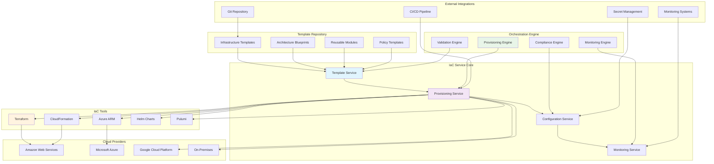

# Infrastructure as Code Service

**Version:** 1.0.0  
**Spring Boot:** 3.2.x  
**Java:** 17+  
**Build Tool:** Maven

## 📋 Overview

The Infrastructure as Code (IaC) Service is a comprehensive infrastructure management platform that enables automated provisioning, configuration, and management of cloud infrastructure using declarative code templates. It supports multiple cloud providers and IaC tools, providing a unified interface for infrastructure lifecycle management across the Exalt E-commerce Ecosystem.

## 🎯 Purpose

- **Infrastructure Automation**: Automated provisioning and configuration of cloud resources
- **Multi-Cloud Support**: Unified management across AWS, Azure, GCP, and on-premises
- **Template Management**: Version-controlled infrastructure templates and blueprints
- **Cost Optimization**: Resource optimization and cost monitoring
- **Compliance**: Infrastructure compliance validation and policy enforcement
- **Disaster Recovery**: Infrastructure backup and recovery planning

## 🏗️ Architecture



## 📁 Project Structure

```
infrastructure-as-code/
├── src/
│   ├── main/
│   │   ├── java/com/exalt/centralconfiguration/infrastructureascode/
│   │   │   ├── InfrastructureAsCodeApplication.java    # Main application class
│   │   │   ├── controller/
│   │   │   │   ├── TemplateController.java             # Template management API
│   │   │   │   ├── ProvisioningController.java         # Infrastructure provisioning API
│   │   │   │   ├── ResourceController.java             # Resource management API
│   │   │   │   └── ComplianceController.java           # Compliance validation API
│   │   │   ├── service/
│   │   │   │   ├── TemplateService.java                # Template management service
│   │   │   │   ├── ProvisioningService.java            # Infrastructure provisioning
│   │   │   │   ├── ConfigurationService.java           # Configuration management
│   │   │   │   ├── MonitoringService.java              # Infrastructure monitoring
│   │   │   │   ├── ComplianceService.java              # Policy compliance
│   │   │   │   └── CostOptimizationService.java        # Cost management
│   │   │   ├── model/
│   │   │   │   ├── InfrastructureTemplate.java         # Template entity
│   │   │   │   ├── ProvisioningRequest.java            # Provisioning request
│   │   │   │   ├── Resource.java                       # Infrastructure resource
│   │   │   │   ├── DeploymentPlan.java                 # Deployment plan
│   │   │   │   └── CompliancePolicy.java               # Compliance policy
│   │   │   ├── provider/
│   │   │   │   ├── CloudProvider.java                  # Cloud provider interface
│   │   │   │   ├── AwsProvider.java                    # AWS implementation
│   │   │   │   ├── AzureProvider.java                  # Azure implementation
│   │   │   │   ├── GcpProvider.java                    # GCP implementation
│   │   │   │   └── OnPremProvider.java                 # On-premises implementation
│   │   │   ├── engine/
│   │   │   │   ├── TerraformEngine.java                # Terraform execution engine
│   │   │   │   ├── CloudFormationEngine.java           # CloudFormation engine
│   │   │   │   ├── ArmTemplateEngine.java              # ARM template engine
│   │   │   │   └── HelmEngine.java                     # Helm chart engine
│   │   │   ├── validation/
│   │   │   │   ├── TemplateValidator.java              # Template validation
│   │   │   │   ├── PolicyValidator.java                # Policy validation
│   │   │   │   ├── CostValidator.java                  # Cost validation
│   │   │   │   └── SecurityValidator.java              # Security validation
│   │   │   ├── repository/
│   │   │   │   ├── TemplateRepository.java             # Template repository
│   │   │   │   ├── ResourceRepository.java             # Resource repository
│   │   │   │   ├── DeploymentRepository.java           # Deployment repository
│   │   │   │   └── ComplianceRepository.java           # Compliance repository
│   │   │   └── config/
│   │   │       ├── IaCConfiguration.java               # IaC configuration
│   │   │       ├── CloudProviderConfig.java            # Cloud provider config
│   │   │       ├── SecurityConfig.java                 # Security configuration
│   │   │       └── MonitoringConfig.java               # Monitoring configuration
│   │   └── resources/
│   │       ├── application.yml                         # Application configuration
│   │       ├── application-dev.yml                     # Development configuration
│   │       ├── application-staging.yml                 # Staging configuration
│   │       ├── application-prod.yml                    # Production configuration
│   │       └── templates/
│   │           ├── terraform/                          # Terraform templates
│   │           ├── cloudformation/                     # CloudFormation templates
│   │           ├── arm/                                # ARM templates
│   │           └── helm/                               # Helm charts
│   └── test/
│       └── java/com/exalt/centralconfiguration/infrastructureascode/
│           ├── InfrastructureAsCodeApplicationTest.java
│           ├── service/
│           │   ├── TemplateServiceTest.java
│           │   ├── ProvisioningServiceTest.java
│           │   └── ComplianceServiceTest.java
│           └── integration/
│               └── IaCIntegrationTest.java
├── tests/
│   ├── unit/
│   │   └── com/exalt/centralconfiguration/infrastructureascode/
│   │       └── validation/
│   │           └── TemplateValidatorTest.java
│   ├── integration/
│   │   └── com/exalt/centralconfiguration/infrastructureascode/
│   │       └── TemplateProcessorIntegrationTest.java
│   ├── e2e/
│   │   └── com/exalt/centralconfiguration/infrastructureascode/
│   │       └── InfrastructureAsCodeE2ETest.java
│   └── performance/
│       └── InfrastructureAsCodeLoadTest.js
├── k8s/
│   ├── deployment.yaml                                 # Kubernetes deployment
│   ├── service.yaml                                    # Kubernetes service
│   ├── configmap.yaml                                  # Configuration map
│   ├── secrets.yaml                                    # Secret management
│   └── ingress.yaml                                    # Ingress configuration
├── scripts/
│   ├── setup.sh                                        # Environment setup
│   ├── dev.sh                                          # Development utilities
│   ├── provision-infrastructure.sh                     # Infrastructure provisioning
│   └── validate-templates.sh                           # Template validation
├── docs/
│   ├── setup/
│   │   ├── installation.md                            # Installation guide
│   │   ├── configuration.md                           # Configuration guide
│   │   └── troubleshooting.md                         # Troubleshooting guide
│   ├── architecture/
│   │   ├── overview.md                                # Architecture overview
│   │   ├── providers.md                               # Cloud provider integration
│   │   └── templates.md                               # Template management
│   └── operations/
│       ├── monitoring.md                              # Monitoring guide
│       ├── compliance.md                              # Compliance management
│       └── cost-optimization.md                       # Cost optimization
├── templates/
│   ├── terraform/
│   │   ├── modules/                                    # Terraform modules
│   │   ├── environments/                               # Environment templates
│   │   └── policies/                                   # Terraform policies
│   ├── cloudformation/
│   │   ├── stacks/                                     # CloudFormation stacks
│   │   ├── nested/                                     # Nested templates
│   │   └── policies/                                   # CF policies
│   └── helm/
│       ├── charts/                                     # Helm charts
│       └── values/                                     # Values files
├── api-docs/
│   └── openapi.yaml                                    # API documentation
├── database/
│   ├── migrations/                                     # Database migrations
│   └── seeds/                                          # Test data seeds
├── i18n/
│   ├── en/messages.properties                          # English messages
│   ├── fr/messages.properties                          # French messages
│   ├── de/messages.properties                          # German messages
│   ├── es/messages.properties                          # Spanish messages
│   ├── ar/messages.properties                          # Arabic messages
│   └── i18n-config.json                               # I18n configuration
├── docker-compose.yml                                  # Local development setup
├── Dockerfile                                          # Container configuration
├── pom.xml                                             # Maven configuration
└── README.md                                           # This file
```

## 🚀 Getting Started

### Prerequisites

- **Java 17+**
- **Maven 3.9.6+**
- **Docker** (for containerized deployment)
- **Terraform 1.5+** (for Terraform templates)
- **AWS CLI** (for AWS resources)
- **Azure CLI** (for Azure resources)
- **gcloud CLI** (for GCP resources)
- **kubectl** (for Kubernetes resources)

### Local Development Setup

```bash
# Clone the repository
git clone <repository-url>
cd infrastructure-as-code

# Set up the environment
./scripts/setup.sh

# Start the development server
./scripts/dev.sh start

# Or use Maven directly
mvn spring-boot:run -Dspring.profiles.active=dev
```

### Environment Variables

```bash
# Required environment variables
export IAC_SERVICE_PORT=8095
export IAC_DATABASE_URL=jdbc:postgresql://localhost:5432/iacdb
export IAC_DATABASE_USERNAME=iac_user
export IAC_DATABASE_PASSWORD=iac_password

# Cloud Provider Credentials
export AWS_ACCESS_KEY_ID=your-aws-access-key
export AWS_SECRET_ACCESS_KEY=your-aws-secret-key
export AWS_DEFAULT_REGION=us-west-2

export AZURE_CLIENT_ID=your-azure-client-id
export AZURE_CLIENT_SECRET=your-azure-client-secret
export AZURE_TENANT_ID=your-azure-tenant-id

export GOOGLE_APPLICATION_CREDENTIALS=/path/to/gcp-service-account.json
export GOOGLE_CLOUD_PROJECT=your-gcp-project-id

# Terraform Configuration
export TF_VAR_environment=development
export TF_LOG=INFO
export TF_DATA_DIR=/tmp/terraform

# Template Repository
export TEMPLATE_REPOSITORY_URL=https://github.com/your-org/iac-templates
export TEMPLATE_REPOSITORY_BRANCH=main
```

## 💡 Core Components

### 1. Template Service

Manages infrastructure templates and blueprints:

```java
@Service
@Transactional
public class TemplateService {
    
    private final TemplateRepository templateRepository;
    private final TemplateValidator templateValidator;
    private final GitService gitService;
    
    public InfrastructureTemplate createTemplate(CreateTemplateRequest request) {
        // Validate template syntax
        ValidationResult validation = templateValidator.validate(request.getContent(), request.getType());
        if (!validation.isValid()) {
            throw new TemplateValidationException("Template validation failed", validation.getErrors());
        }
        
        InfrastructureTemplate template = InfrastructureTemplate.builder()
            .name(request.getName())
            .description(request.getDescription())
            .type(request.getType())
            .content(request.getContent())
            .version("1.0.0")
            .provider(request.getProvider())
            .tags(request.getTags())
            .createdBy(getCurrentUser())
            .createdAt(Instant.now())
            .build();
        
        // Save template
        template = templateRepository.save(template);
        
        // Store in Git repository
        gitService.commitTemplate(template);
        
        log.info("Created infrastructure template: {} (ID: {})", template.getName(), template.getId());
        return template;
    }
    
    public InfrastructureTemplate updateTemplate(String templateId, UpdateTemplateRequest request) {
        InfrastructureTemplate template = getTemplateById(templateId);
        
        // Validate updated content
        ValidationResult validation = templateValidator.validate(request.getContent(), template.getType());
        if (!validation.isValid()) {
            throw new TemplateValidationException("Template validation failed", validation.getErrors());
        }
        
        // Update template
        template.setContent(request.getContent());
        template.setDescription(request.getDescription());
        template.setVersion(incrementVersion(template.getVersion()));
        template.setUpdatedBy(getCurrentUser());
        template.setUpdatedAt(Instant.now());
        
        template = templateRepository.save(template);
        
        // Update Git repository
        gitService.commitTemplate(template);
        
        return template;
    }
    
    public List<InfrastructureTemplate> getTemplatesByProvider(CloudProvider provider) {
        return templateRepository.findByProviderAndActiveTrue(provider);
    }
    
    public TemplateValidationResult validateTemplate(String templateId) {
        InfrastructureTemplate template = getTemplateById(templateId);
        return templateValidator.validateComplete(template);
    }
    
    public List<InfrastructureTemplate> searchTemplates(TemplateSearchCriteria criteria) {
        return templateRepository.findByCriteria(criteria);
    }
}
```

### 2. Provisioning Service

Handles infrastructure provisioning and management:

```java
@Service
@Transactional
public class ProvisioningService {
    
    private final Map<CloudProvider, CloudProviderService> providers;
    private final Map<IaCTool, IaCEngine> engines;
    private final DeploymentRepository deploymentRepository;
    private final MonitoringService monitoringService;
    
    public ProvisioningResult provisionInfrastructure(ProvisioningRequest request) {
        try {
            // Validate provisioning request
            validateProvisioningRequest(request);
            
            // Create deployment plan
            DeploymentPlan plan = createDeploymentPlan(request);
            
            // Execute provisioning
            ProvisioningResult result = executeProvisioning(plan);
            
            // Save deployment record
            saveDeploymentRecord(plan, result);
            
            // Start monitoring
            monitoringService.startMonitoring(result.getResources());
            
            return result;
            
        } catch (Exception e) {
            log.error("Failed to provision infrastructure for request: {}", request.getId(), e);
            throw new ProvisioningException("Infrastructure provisioning failed", e);
        }
    }
    
    private DeploymentPlan createDeploymentPlan(ProvisioningRequest request) {
        InfrastructureTemplate template = templateService.getTemplateById(request.getTemplateId());
        
        DeploymentPlan plan = DeploymentPlan.builder()
            .id(UUID.randomUUID().toString())
            .templateId(template.getId())
            .environment(request.getEnvironment())
            .provider(request.getProvider())
            .region(request.getRegion())
            .parameters(request.getParameters())
            .createdBy(getCurrentUser())
            .createdAt(Instant.now())
            .build();
        
        // Validate deployment plan
        validateDeploymentPlan(plan);
        
        return plan;
    }
    
    private ProvisioningResult executeProvisioning(DeploymentPlan plan) {
        CloudProviderService provider = providers.get(plan.getProvider());
        IaCEngine engine = engines.get(plan.getTemplate().getType());
        
        // Execute infrastructure provisioning
        ExecutionContext context = ExecutionContext.builder()
            .plan(plan)
            .provider(provider)
            .engine(engine)
            .build();
        
        return engine.execute(context);
    }
    
    public DestroyResult destroyInfrastructure(String deploymentId) {
        Deployment deployment = deploymentRepository.findById(deploymentId)
            .orElseThrow(() -> new DeploymentNotFoundException("Deployment not found: " + deploymentId));
        
        CloudProviderService provider = providers.get(deployment.getProvider());
        IaCEngine engine = engines.get(deployment.getTemplate().getType());
        
        // Execute infrastructure destruction
        DestroyContext context = DestroyContext.builder()
            .deployment(deployment)
            .provider(provider)
            .engine(engine)
            .build();
        
        DestroyResult result = engine.destroy(context);
        
        // Update deployment status
        deployment.setStatus(DeploymentStatus.DESTROYED);
        deployment.setDestroyedAt(Instant.now());
        deploymentRepository.save(deployment);
        
        return result;
    }
    
    public List<Resource> getDeploymentResources(String deploymentId) {
        Deployment deployment = getDeploymentById(deploymentId);
        CloudProviderService provider = providers.get(deployment.getProvider());
        
        return provider.getResources(deployment);
    }
}
```

### 3. Terraform Engine

Terraform-specific execution engine:

```java
@Component
public class TerraformEngine implements IaCEngine {
    
    private final TerraformExecutor terraformExecutor;
    private final StateManager stateManager;
    private final VariableResolver variableResolver;
    
    @Override
    public ProvisioningResult execute(ExecutionContext context) {
        try {
            // Prepare workspace
            String workspace = prepareWorkspace(context);
            
            // Initialize Terraform
            terraformExecutor.init(workspace);
            
            // Plan infrastructure changes
            TerraformPlan plan = terraformExecutor.plan(workspace, context.getVariables());
            
            // Validate plan
            validateTerraformPlan(plan);
            
            // Apply infrastructure changes
            TerraformApplyResult applyResult = terraformExecutor.apply(workspace, plan);
            
            // Save state
            stateManager.saveState(context.getPlan().getId(), applyResult.getState());
            
            return ProvisioningResult.builder()
                .deploymentId(context.getPlan().getId())
                .status(ProvisioningStatus.SUCCESS)
                .resources(extractResources(applyResult))
                .outputs(applyResult.getOutputs())
                .duration(applyResult.getDuration())
                .build();
                
        } catch (Exception e) {
            log.error("Terraform execution failed for plan: {}", context.getPlan().getId(), e);
            throw new TerraformExecutionException("Terraform execution failed", e);
        }
    }
    
    @Override
    public DestroyResult destroy(DestroyContext context) {
        try {
            String workspace = getWorkspace(context.getDeployment());
            
            // Load Terraform state
            TerraformState state = stateManager.getState(context.getDeployment().getId());
            
            // Destroy infrastructure
            TerraformDestroyResult destroyResult = terraformExecutor.destroy(workspace, state);
            
            // Clean up workspace
            cleanupWorkspace(workspace);
            
            return DestroyResult.builder()
                .deploymentId(context.getDeployment().getId())
                .status(DestroyStatus.SUCCESS)
                .destroyedResources(destroyResult.getDestroyedResources())
                .duration(destroyResult.getDuration())
                .build();
                
        } catch (Exception e) {
            log.error("Terraform destroy failed for deployment: {}", context.getDeployment().getId(), e);
            throw new TerraformExecutionException("Terraform destroy failed", e);
        }
    }
    
    private String prepareWorkspace(ExecutionContext context) {
        String workspaceId = context.getPlan().getId();
        String workspacePath = String.format("/tmp/terraform/%s", workspaceId);
        
        // Create workspace directory
        File workspace = new File(workspacePath);
        workspace.mkdirs();
        
        // Write Terraform template
        writeTemplateToWorkspace(workspace, context.getPlan().getTemplate());
        
        // Write variables file
        writeVariablesToWorkspace(workspace, context.getVariables());
        
        // Write backend configuration
        writeBackendConfig(workspace, context.getPlan());
        
        return workspacePath;
    }
    
    private void validateTerraformPlan(TerraformPlan plan) {
        if (plan.hasErrors()) {
            throw new TerraformValidationException("Terraform plan validation failed", plan.getErrors());
        }
        
        // Validate resource counts
        if (plan.getResourcesToAdd().size() > 1000) {
            throw new TerraformValidationException("Too many resources to create: " + plan.getResourcesToAdd().size());
        }
        
        // Validate estimated costs
        if (plan.getEstimatedCost().compareTo(BigDecimal.valueOf(10000)) > 0) {
            log.warn("High estimated cost for deployment: ${}", plan.getEstimatedCost());
        }
    }
}
```

## 📚 Usage Examples

### Template Management

```java
@RestController
@RequestMapping("/api/templates")
@PreAuthorize("hasRole('IAC_ADMIN')")
public class TemplateController {
    
    private final TemplateService templateService;
    
    @PostMapping
    public ResponseEntity<InfrastructureTemplate> createTemplate(
            @Valid @RequestBody CreateTemplateRequest request) {
        
        InfrastructureTemplate template = templateService.createTemplate(request);
        return ResponseEntity.status(HttpStatus.CREATED).body(template);
    }
    
    @GetMapping("/{templateId}")
    public ResponseEntity<InfrastructureTemplate> getTemplate(@PathVariable String templateId) {
        InfrastructureTemplate template = templateService.getTemplateById(templateId);
        return ResponseEntity.ok(template);
    }
    
    @PostMapping("/{templateId}/validate")
    public ResponseEntity<TemplateValidationResult> validateTemplate(@PathVariable String templateId) {
        TemplateValidationResult result = templateService.validateTemplate(templateId);
        return ResponseEntity.ok(result);
    }
    
    @GetMapping
    public ResponseEntity<List<InfrastructureTemplate>> searchTemplates(
            @RequestParam(required = false) CloudProvider provider,
            @RequestParam(required = false) String environment,
            @RequestParam(required = false) List<String> tags) {
        
        TemplateSearchCriteria criteria = TemplateSearchCriteria.builder()
            .provider(provider)
            .environment(environment)
            .tags(tags)
            .build();
        
        List<InfrastructureTemplate> templates = templateService.searchTemplates(criteria);
        return ResponseEntity.ok(templates);
    }
}
```

### Infrastructure Provisioning

```java
@RestController
@RequestMapping("/api/infrastructure")
@PreAuthorize("hasRole('IAC_USER')")
public class ProvisioningController {
    
    private final ProvisioningService provisioningService;
    
    @PostMapping("/provision")
    public ResponseEntity<ProvisioningResult> provisionInfrastructure(
            @Valid @RequestBody ProvisioningRequest request) {
        
        ProvisioningResult result = provisioningService.provisionInfrastructure(request);
        return ResponseEntity.status(HttpStatus.ACCEPTED).body(result);
    }
    
    @DeleteMapping("/deployments/{deploymentId}")
    public ResponseEntity<DestroyResult> destroyInfrastructure(@PathVariable String deploymentId) {
        DestroyResult result = provisioningService.destroyInfrastructure(deploymentId);
        return ResponseEntity.ok(result);
    }
    
    @GetMapping("/deployments/{deploymentId}/resources")
    public ResponseEntity<List<Resource>> getDeploymentResources(@PathVariable String deploymentId) {
        List<Resource> resources = provisioningService.getDeploymentResources(deploymentId);
        return ResponseEntity.ok(resources);
    }
    
    @GetMapping("/deployments")
    public ResponseEntity<Page<Deployment>> getDeployments(
            @RequestParam(defaultValue = "0") int page,
            @RequestParam(defaultValue = "20") int size,
            @RequestParam(required = false) String environment,
            @RequestParam(required = false) CloudProvider provider) {
        
        Pageable pageable = PageRequest.of(page, size);
        Page<Deployment> deployments = provisioningService.getDeployments(pageable, environment, provider);
        return ResponseEntity.ok(deployments);
    }
}
```

### Terraform Template Example

```hcl
# AWS EKS Cluster Template
terraform {
  required_version = ">= 1.0"
  required_providers {
    aws = {
      source  = "hashicorp/aws"
      version = "~> 5.0"
    }
  }
}

variable "cluster_name" {
  description = "Name of the EKS cluster"
  type        = string
}

variable "environment" {
  description = "Environment (dev, staging, prod)"
  type        = string
}

variable "node_instance_type" {
  description = "EC2 instance type for worker nodes"
  type        = string
  default     = "t3.medium"
}

variable "desired_capacity" {
  description = "Desired number of worker nodes"
  type        = number
  default     = 2
}

variable "max_capacity" {
  description = "Maximum number of worker nodes"
  type        = number
  default     = 10
}

# VPC Configuration
module "vpc" {
  source = "terraform-aws-modules/vpc/aws"
  
  name = "${var.cluster_name}-vpc"
  cidr = "10.0.0.0/16"
  
  azs             = data.aws_availability_zones.available.names
  private_subnets = ["10.0.1.0/24", "10.0.2.0/24", "10.0.3.0/24"]
  public_subnets  = ["10.0.101.0/24", "10.0.102.0/24", "10.0.103.0/24"]
  
  enable_nat_gateway = true
  enable_vpn_gateway = false
  
  tags = {
    Environment = var.environment
    ManagedBy   = "terraform"
  }
}

# EKS Cluster
module "eks" {
  source = "terraform-aws-modules/eks/aws"
  
  cluster_name    = var.cluster_name
  cluster_version = "1.28"
  
  vpc_id     = module.vpc.vpc_id
  subnet_ids = module.vpc.private_subnets
  
  eks_managed_node_groups = {
    workers = {
      desired_capacity = var.desired_capacity
      max_capacity     = var.max_capacity
      min_capacity     = 1
      
      instance_types = [var.node_instance_type]
      
      k8s_labels = {
        Environment = var.environment
        NodeGroup   = "workers"
      }
    }
  }
  
  tags = {
    Environment = var.environment
    ManagedBy   = "terraform"
  }
}

# Outputs
output "cluster_endpoint" {
  description = "Endpoint for EKS control plane"
  value       = module.eks.cluster_endpoint
}

output "cluster_security_group_id" {
  description = "Security group ids attached to the cluster control plane"
  value       = module.eks.cluster_security_group_id
}

output "cluster_iam_role_name" {
  description = "IAM role name associated with EKS cluster"
  value       = module.eks.cluster_iam_role_name
}

output "cluster_certificate_authority_data" {
  description = "Base64 encoded certificate data required to communicate with the cluster"
  value       = module.eks.cluster_certificate_authority_data
}
```

## 🔧 Advanced Features

### Compliance Validation

```java
@Service
public class ComplianceService {
    
    private final List<CompliancePolicy> policies;
    private final PolicyEvaluator policyEvaluator;
    
    public ComplianceResult validateCompliance(String deploymentId) {
        Deployment deployment = deploymentRepository.findById(deploymentId)
            .orElseThrow(() -> new DeploymentNotFoundException("Deployment not found"));
        
        List<PolicyViolation> violations = new ArrayList<>();
        
        for (CompliancePolicy policy : policies) {
            PolicyEvaluationResult result = policyEvaluator.evaluate(policy, deployment);
            if (!result.isCompliant()) {
                violations.addAll(result.getViolations());
            }
        }
        
        return ComplianceResult.builder()
            .deploymentId(deploymentId)
            .compliant(violations.isEmpty())
            .violations(violations)
            .evaluatedAt(Instant.now())
            .build();
    }
    
    public List<CompliancePolicy> getApplicablePolicies(CloudProvider provider, String environment) {
        return policies.stream()
            .filter(policy -> policy.appliesTo(provider, environment))
            .collect(Collectors.toList());
    }
}
```

### Cost Optimization

```java
@Service
public class CostOptimizationService {
    
    private final CostAnalyzer costAnalyzer;
    private final ResourceOptimizer resourceOptimizer;
    
    public CostAnalysisResult analyzeCosts(String deploymentId, Period period) {
        Deployment deployment = getDeploymentById(deploymentId);
        List<Resource> resources = provisioningService.getDeploymentResources(deploymentId);
        
        CostAnalysis analysis = costAnalyzer.analyze(resources, period);
        
        return CostAnalysisResult.builder()
            .deploymentId(deploymentId)
            .totalCost(analysis.getTotalCost())
            .costByService(analysis.getCostByService())
            .costByResource(analysis.getCostByResource())
            .period(period)
            .recommendations(generateCostRecommendations(analysis))
            .build();
    }
    
    public List<CostOptimizationRecommendation> generateCostRecommendations(CostAnalysis analysis) {
        List<CostOptimizationRecommendation> recommendations = new ArrayList<>();
        
        // Identify underutilized resources
        analysis.getResources().stream()
            .filter(resource -> resource.getUtilization() < 20.0)
            .forEach(resource -> {
                recommendations.add(CostOptimizationRecommendation.builder()
                    .type(RecommendationType.DOWNSIZE)
                    .resource(resource)
                    .description("Resource is underutilized")
                    .potentialSavings(calculatePotentialSavings(resource))
                    .build());
            });
        
        // Identify opportunities for reserved instances
        analysis.getEc2Instances().stream()
            .filter(instance -> instance.getRunningTime().toDays() > 30)
            .forEach(instance -> {
                recommendations.add(CostOptimizationRecommendation.builder()
                    .type(RecommendationType.RESERVED_INSTANCE)
                    .resource(instance)
                    .description("Consider reserved instance for long-running workload")
                    .potentialSavings(calculateReservedInstanceSavings(instance))
                    .build());
            });
        
        return recommendations;
    }
}
```

### Multi-Cloud Template Management

```java
@Service
public class MultiCloudTemplateService {
    
    public CrossCloudDeploymentPlan createCrossCloudPlan(CrossCloudRequest request) {
        List<DeploymentComponent> components = new ArrayList<>();
        
        // AWS components
        if (request.getAwsComponents() != null) {
            for (AwsComponentSpec spec : request.getAwsComponents()) {
                components.add(createAwsComponent(spec));
            }
        }
        
        // Azure components
        if (request.getAzureComponents() != null) {
            for (AzureComponentSpec spec : request.getAzureComponents()) {
                components.add(createAzureComponent(spec));
            }
        }
        
        // GCP components
        if (request.getGcpComponents() != null) {
            for (GcpComponentSpec spec : request.getGcpComponents()) {
                components.add(createGcpComponent(spec));
            }
        }
        
        // Validate cross-cloud dependencies
        validateCrossCloudDependencies(components);
        
        return CrossCloudDeploymentPlan.builder()
            .id(UUID.randomUUID().toString())
            .components(components)
            .dependencies(calculateDependencies(components))
            .executionOrder(calculateExecutionOrder(components))
            .build();
    }
    
    private void validateCrossCloudDependencies(List<DeploymentComponent> components) {
        for (DeploymentComponent component : components) {
            for (String dependency : component.getDependencies()) {
                DeploymentComponent dependencyComponent = findComponent(components, dependency);
                if (dependencyComponent == null) {
                    throw new ValidationException("Dependency not found: " + dependency);
                }
                
                // Validate cross-cloud connectivity
                if (!component.getProvider().equals(dependencyComponent.getProvider())) {
                    validateCrossCloudConnectivity(component, dependencyComponent);
                }
            }
        }
    }
}
```

## 🧪 Testing

### Unit Tests

```java
@ExtendWith(MockitoExtension.class)
class TemplateServiceTest {
    
    @Mock
    private TemplateRepository templateRepository;
    
    @Mock
    private TemplateValidator templateValidator;
    
    @Mock
    private GitService gitService;
    
    @InjectMocks
    private TemplateService templateService;
    
    @Test
    void shouldCreateTemplateSuccessfully() {
        // Given
        CreateTemplateRequest request = CreateTemplateRequest.builder()
            .name("test-template")
            .description("Test template")
            .type(IaCTool.TERRAFORM)
            .content("resource \"aws_instance\" \"test\" {}")
            .provider(CloudProvider.AWS)
            .build();
        
        ValidationResult validationResult = ValidationResult.success();
        when(templateValidator.validate(request.getContent(), request.getType()))
            .thenReturn(validationResult);
        
        InfrastructureTemplate savedTemplate = InfrastructureTemplate.builder()
            .id("template-123")
            .name(request.getName())
            .build();
        
        when(templateRepository.save(any(InfrastructureTemplate.class)))
            .thenReturn(savedTemplate);
        
        // When
        InfrastructureTemplate result = templateService.createTemplate(request);
        
        // Then
        assertThat(result).isNotNull();
        assertThat(result.getName()).isEqualTo("test-template");
        verify(templateRepository).save(any(InfrastructureTemplate.class));
        verify(gitService).commitTemplate(savedTemplate);
    }
    
    @Test
    void shouldThrowExceptionForInvalidTemplate() {
        // Given
        CreateTemplateRequest request = CreateTemplateRequest.builder()
            .name("invalid-template")
            .content("invalid terraform syntax")
            .type(IaCTool.TERRAFORM)
            .build();
        
        ValidationResult validationResult = ValidationResult.failure(
            List.of(new ValidationError("syntax", "Invalid Terraform syntax"))
        );
        
        when(templateValidator.validate(request.getContent(), request.getType()))
            .thenReturn(validationResult);
        
        // When & Then
        assertThatThrownBy(() -> templateService.createTemplate(request))
            .isInstanceOf(TemplateValidationException.class)
            .hasMessageContaining("Template validation failed");
        
        verify(templateRepository, never()).save(any());
        verify(gitService, never()).commitTemplate(any());
    }
}
```

### Integration Tests

```java
@SpringBootTest(webEnvironment = SpringBootTest.WebEnvironment.RANDOM_PORT)
@TestPropertySource(properties = {
    "iac.terraform.enabled=true",
    "iac.cloudformation.enabled=true"
})
class IaCIntegrationTest {
    
    @Autowired
    private TestRestTemplate restTemplate;
    
    @Autowired
    private TemplateRepository templateRepository;
    
    @Test
    void shouldProvisionInfrastructureEndToEnd() {
        // Given
        InfrastructureTemplate template = createTestTemplate();
        templateRepository.save(template);
        
        ProvisioningRequest request = ProvisioningRequest.builder()
            .templateId(template.getId())
            .environment("test")
            .provider(CloudProvider.AWS)
            .region("us-west-2")
            .parameters(Map.of("instance_type", "t3.micro"))
            .build();
        
        // When
        ResponseEntity<ProvisioningResult> response = restTemplate
            .withBasicAuth("admin", "admin")
            .postForEntity("/api/infrastructure/provision", request, ProvisioningResult.class);
        
        // Then
        assertThat(response.getStatusCode()).isEqualTo(HttpStatus.ACCEPTED);
        assertThat(response.getBody()).isNotNull();
        assertThat(response.getBody().getStatus()).isEqualTo(ProvisioningStatus.SUCCESS);
    }
}
```

## 🚀 Deployment

### Docker Deployment

```dockerfile
FROM openjdk:17-jre-slim

# Install Terraform and cloud CLIs
RUN apt-get update && apt-get install -y \
    curl \
    unzip \
    wget \
    gnupg \
    software-properties-common

# Install Terraform
RUN wget -O- https://apt.releases.hashicorp.com/gpg | gpg --dearmor | \
    tee /usr/share/keyrings/hashicorp-archive-keyring.gpg
RUN echo "deb [signed-by=/usr/share/keyrings/hashicorp-archive-keyring.gpg] \
    https://apt.releases.hashicorp.com jammy main" | \
    tee /etc/apt/sources.list.d/hashicorp.list
RUN apt-get update && apt-get install -y terraform

# Install AWS CLI
RUN curl "https://awscli.amazonaws.com/awscli-exe-linux-x86_64.zip" -o "awscliv2.zip" \
    && unzip awscliv2.zip \
    && ./aws/install

# Install Azure CLI
RUN curl -sL https://aka.ms/InstallAzureCLIDeb | bash

# Install gcloud CLI
RUN curl https://sdk.cloud.google.com | bash
ENV PATH $PATH:/root/google-cloud-sdk/bin

# Set working directory
WORKDIR /app

# Copy application JAR
COPY target/infrastructure-as-code-*.jar app.jar

# Create non-root user
RUN groupadd -r iacuser && useradd -r -g iacuser iacuser
RUN chown -R iacuser:iacuser /app
USER iacuser

# Expose port
EXPOSE 8095

# Health check
HEALTHCHECK --interval=30s --timeout=3s --start-period=5s --retries=3 \
  CMD curl -f http://localhost:8095/actuator/health || exit 1

# Start application
ENTRYPOINT ["java", "-jar", "app.jar"]
```

### Kubernetes Deployment

```yaml
apiVersion: apps/v1
kind: Deployment
metadata:
  name: infrastructure-as-code
  namespace: central-configuration
spec:
  replicas: 2
  selector:
    matchLabels:
      app: infrastructure-as-code
  template:
    metadata:
      labels:
        app: infrastructure-as-code
    spec:
      serviceAccountName: iac-service-account
      containers:
      - name: iac-service
        image: exalt/infrastructure-as-code:1.0.0
        ports:
        - containerPort: 8095
        env:
        - name: SPRING_PROFILES_ACTIVE
          value: "prod"
        - name: IAC_DATABASE_URL
          valueFrom:
            secretKeyRef:
              name: iac-secrets
              key: database-url
        - name: AWS_ACCESS_KEY_ID
          valueFrom:
            secretKeyRef:
              name: iac-secrets
              key: aws-access-key-id
        - name: AWS_SECRET_ACCESS_KEY
          valueFrom:
            secretKeyRef:
              name: iac-secrets
              key: aws-secret-access-key
        resources:
          requests:
            memory: "1Gi"
            cpu: "500m"
          limits:
            memory: "2Gi"
            cpu: "1000m"
        livenessProbe:
          httpGet:
            path: /actuator/health
            port: 8095
          initialDelaySeconds: 60
          periodSeconds: 30
        readinessProbe:
          httpGet:
            path: /actuator/health
            port: 8095
          initialDelaySeconds: 30
          periodSeconds: 10
        volumeMounts:
        - name: terraform-workspace
          mountPath: /tmp/terraform
      volumes:
      - name: terraform-workspace
        emptyDir: {}
```

## 📖 Best Practices

### Template Development

1. **Modular Design**: Create reusable modules for common infrastructure patterns
2. **Version Control**: Use semantic versioning for infrastructure templates
3. **Documentation**: Include comprehensive documentation in templates
4. **Testing**: Validate templates before deployment
5. **Security**: Follow security best practices for each cloud provider

### Infrastructure Management

1. **State Management**: Use remote state storage for Terraform
2. **Environment Isolation**: Separate environments with different state files
3. **Resource Tagging**: Implement consistent tagging strategies
4. **Cost Monitoring**: Regular cost analysis and optimization
5. **Compliance**: Implement automated compliance validation

### Security

1. **Least Privilege**: Use minimal required permissions for cloud access
2. **Secret Management**: Store credentials in secure secret management systems
3. **Network Security**: Implement proper network segmentation
4. **Audit Logging**: Log all infrastructure changes and access
5. **Regular Updates**: Keep tools and dependencies updated

## 🤝 Support

For questions, issues, or contributions:

- **Documentation**: [Internal Wiki](https://wiki.exalt.com/infrastructure-as-code)
- **Issues**: [JIRA Project](https://jira.exalt.com/projects/IAC)
- **Support**: [Slack #central-configuration](https://exalt.slack.com/channels/central-configuration)
- **Email**: central-configuration@exalt.com

---

**License**: Internal Use - Exalt Application Limited  
**Maintainer**: Platform Infrastructure Team  
**Last Updated**: June 16, 2025