```mermaid
graph TB
    subgraph "Disaster Recovery Service"
        DRS[Disaster Recovery Service]
        BM[Backup Manager]
        FM[Failover Manager]
        RM[Recovery Manager]
        DM[Disaster Monitor]
        VM[Validation Manager]
    end
    
    subgraph "Backup Sources"
        DB[Databases]
        FS[File Systems]
        CF[Configurations]
        ST[State Data]
        LG[Logs]
    end
    
    subgraph "Storage Locations"
        S3[AWS S3]
        AZ_BLOB[Azure Blob]
        GCS[Google Cloud Storage]
        NFS[Network Storage]
        TAPE[Tape Storage]
    end
    
    subgraph "Recovery Targets"
        PRIMARY[Primary Site]
        DR_SITE[DR Site]
        CLOUD[Cloud Region]
        HYBRID[Hybrid Cloud]
    end
    
    subgraph "Monitoring Sources"
        INFRA[Infrastructure]
        APPS[Applications]
        NET[Network]
        SEC[Security]
        PERF[Performance]
    end
    
    subgraph "Recovery Types"
        FULL[Full Recovery]
        PARTIAL[Partial Recovery]
        POINT[Point-in-Time]
        FAILOVER[Failover]
        FAILBACK[Failback]
    end
    
    subgraph "Notifications"
        SL[Slack]
        EM[Email]
        SMS[SMS]
        PD[PagerDuty]
        WH[Webhooks]
    end
    
    DRS --> BM
    DRS --> FM
    DRS --> RM
    DRS --> DM
    DRS --> VM
    
    DB --> BM
    FS --> BM
    CF --> BM
    ST --> BM
    LG --> BM
    
    BM --> S3
    BM --> AZ_BLOB
    BM --> GCS
    BM --> NFS
    BM --> TAPE
    
    FM --> PRIMARY
    FM --> DR_SITE
    FM --> CLOUD
    FM --> HYBRID
    
    INFRA --> DM
    APPS --> DM
    NET --> DM
    SEC --> DM
    PERF --> DM
    
    FULL --> RM
    PARTIAL --> RM
    POINT --> RM
    FAILOVER --> FM
    FAILBACK --> FM
    
    DM --> SL
    DM --> EM
    DM --> SMS
    DM --> PD
    DM --> WH
    
    style DRS fill:#e1f5fe
    style BM fill:#f3e5f5
    style FM fill:#e8f5e8
    style RM fill:#fff3e0
```

# Disaster Recovery Service

**Version:** 1.0.0  
**Spring Boot:** 3.2.x  
**Java:** 17+  
**Build Tool:** Maven

## 📋 Overview

The Disaster Recovery Service is a comprehensive business continuity and disaster recovery management platform for the Exalt E-commerce Ecosystem. It provides automated backup and restore capabilities, failover mechanisms, disaster response orchestration, and recovery validation across all critical systems and data.

## 🎯 Purpose

- **Automated Backups**: Scheduled and on-demand backup of critical data and configurations
- **Disaster Detection**: Real-time monitoring and automatic disaster detection
- **Failover Management**: Automated failover to secondary systems and regions
- **Recovery Orchestration**: Coordinated recovery procedures across all services
- **Business Continuity**: Ensure minimal downtime and data loss during disasters
- **Compliance Management**: Meet regulatory requirements for data protection and recovery

## 🏗️ Architecture



## 📁 Project Structure

```
disaster-recovery/
├── src/
│   ├── main/
│   │   ├── java/com/exalt/centralconfiguration/disasterrecovery/
│   │   │   ├── DisasterRecoveryApplication.java          # Main application class
│   │   │   ├── config/
│   │   │   │   ├── BackupConfig.java                    # Backup configuration
│   │   │   │   ├── RecoveryConfig.java                  # Recovery configuration
│   │   │   │   ├── FailoverConfig.java                  # Failover configuration
│   │   │   │   └── MonitoringConfig.java                # Monitoring configuration
│   │   │   ├── controller/
│   │   │   │   ├── BackupController.java                # Backup REST API
│   │   │   │   ├── RecoveryController.java              # Recovery REST API
│   │   │   │   ├── FailoverController.java              # Failover REST API
│   │   │   │   └── MonitoringController.java            # Monitoring API
│   │   │   ├── service/
│   │   │   │   ├── BackupService.java                   # Backup management
│   │   │   │   ├── RecoveryService.java                 # Recovery orchestration
│   │   │   │   ├── FailoverService.java                 # Failover management
│   │   │   │   ├── DisasterMonitoringService.java       # Disaster detection
│   │   │   │   └── ValidationService.java               # Recovery validation
│   │   │   ├── repository/
│   │   │   │   ├── BackupRepository.java                # Backup metadata
│   │   │   │   ├── RecoveryRepository.java              # Recovery history
│   │   │   │   ├── FailoverRepository.java              # Failover records
│   │   │   │   └── DisasterEventRepository.java         # Disaster events
│   │   │   ├── model/
│   │   │   │   ├── Backup.java                          # Backup entity
│   │   │   │   ├── Recovery.java                        # Recovery entity
│   │   │   │   ├── FailoverEvent.java                   # Failover event
│   │   │   │   ├── DisasterEvent.java                   # Disaster event
│   │   │   │   └── RecoveryPlan.java                    # Recovery plan
│   │   │   ├── engine/
│   │   │   │   ├── DatabaseBackupEngine.java            # Database backups
│   │   │   │   ├── FileSystemBackupEngine.java          # File system backups
│   │   │   │   ├── ConfigurationBackupEngine.java       # Configuration backups
│   │   │   │   └── CloudBackupEngine.java               # Cloud storage backups
│   │   │   ├── monitor/
│   │   │   │   ├── InfrastructureMonitor.java           # Infrastructure monitoring
│   │   │   │   ├── ApplicationMonitor.java              # Application monitoring
│   │   │   │   ├── NetworkMonitor.java                  # Network monitoring
│   │   │   │   └── SecurityMonitor.java                 # Security monitoring
│   │   │   └── exception/
│   │   │       ├── BackupException.java                 # Backup exceptions
│   │   │       ├── RecoveryException.java               # Recovery exceptions
│   │   │       └── FailoverException.java               # Failover exceptions
│   │   └── resources/
│   │       ├── application.yml                          # Main configuration
│   │       ├── application-dev.yml                      # Development profile
│   │       ├── application-staging.yml                  # Staging profile
│   │       ├── application-prod.yml                     # Production profile
│   │       └── recovery-plans/
│   │           ├── database-recovery.yml                # Database recovery plan
│   │           ├── application-recovery.yml             # Application recovery plan
│   │           ├── network-recovery.yml                 # Network recovery plan
│   │           └── full-system-recovery.yml             # Full system recovery
│   └── test/
│       └── java/com/exalt/centralconfiguration/disasterrecovery/
│           ├── DisasterRecoveryApplicationTest.java
│           ├── service/
│           │   ├── BackupServiceTest.java
│           │   ├── RecoveryServiceTest.java
│           │   └── FailoverServiceTest.java
│           └── integration/
│               └── DisasterRecoveryIntegrationTest.java
├── tests/
│   ├── unit/
│   │   └── com/exalt/centralconfiguration/disasterrecovery/
│   │       ├── service/
│   │       │   └── BackupServiceTest.java
│   │       └── controller/
│   │           └── BackupControllerTest.java
│   ├── integration/
│   │   └── com/exalt/centralconfiguration/disasterrecovery/
│   │       └── DisasterRecoveryIntegrationTest.java
│   ├── e2e/
│   │   └── com/exalt/centralconfiguration/disasterrecovery/
│   │       └── DisasterRecoveryE2ETest.java
│   └── performance/
│       └── DisasterRecoveryPerformanceTest.js
├── scripts/
│   ├── backup/
│   │   ├── database-backup.sh                           # Database backup script
│   │   ├── filesystem-backup.sh                         # File system backup
│   │   ├── config-backup.sh                             # Configuration backup
│   │   └── incremental-backup.sh                        # Incremental backup
│   ├── recovery/
│   │   ├── database-recovery.sh                         # Database recovery
│   │   ├── filesystem-recovery.sh                       # File system recovery
│   │   ├── config-recovery.sh                           # Configuration recovery
│   │   └── full-recovery.sh                             # Full system recovery
│   ├── failover/
│   │   ├── failover-to-dr.sh                            # Failover to DR site
│   │   ├── failback-to-primary.sh                       # Failback to primary
│   │   ├── dns-failover.sh                              # DNS failover
│   │   └── load-balancer-failover.sh                    # Load balancer failover
│   ├── validation/
│   │   ├── backup-validation.sh                         # Backup validation
│   │   ├── recovery-validation.sh                       # Recovery validation
│   │   ├── integrity-check.sh                           # Data integrity check
│   │   └── performance-test.sh                          # Performance validation
│   └── monitoring/
│       ├── system-health-check.sh                       # System health monitoring
│       ├── disaster-detection.sh                        # Disaster detection
│       └── alerting.sh                                   # Alert management
├── k8s/
│   ├── deployment.yaml                                  # Kubernetes deployment
│   ├── service.yaml                                     # Kubernetes service
│   ├── configmap.yaml                                   # Configuration map
│   ├── secrets.yaml                                     # Secret management
│   └── cronjob.yaml                                     # Scheduled backups
├── docs/
│   ├── setup/
│   │   ├── installation.md                             # Installation guide
│   │   ├── configuration.md                            # Configuration guide
│   │   └── troubleshooting.md                          # Troubleshooting guide
│   ├── recovery/
│   │   ├── procedures.md                               # Recovery procedures
│   │   ├── runbooks.md                                 # Recovery runbooks
│   │   └── testing.md                                  # Recovery testing
│   └── operations/
│       ├── monitoring.md                               # Monitoring guide
│       ├── maintenance.md                              # Maintenance procedures
│       └── compliance.md                               # Compliance requirements
├── api-docs/
│   └── openapi.yaml                                     # API documentation
├── recovery-plans/
│   ├── rto-rpo-requirements.yml                        # RTO/RPO requirements
│   ├── database-recovery-plan.yml                      # Database recovery plan
│   ├── application-recovery-plan.yml                   # Application recovery plan
│   └── infrastructure-recovery-plan.yml                # Infrastructure recovery plan
├── i18n/
│   ├── en/messages.properties                           # English messages
│   ├── fr/messages.properties                           # French messages
│   ├── de/messages.properties                           # German messages
│   ├── es/messages.properties                           # Spanish messages
│   ├── ar/messages.properties                           # Arabic messages
│   └── i18n-config.json                                # I18n configuration
├── docker-compose.yml                                   # Local development setup
├── Dockerfile                                           # Container configuration
├── pom.xml                                              # Maven configuration
└── README.md                                            # This file
```

## 🚀 Getting Started

### Prerequisites

- **Java 17+**
- **Maven 3.9.6+**
- **Docker** (for containerized backups)
- **AWS CLI** (for S3 backups)
- **Azure CLI** (for Azure Blob backups)
- **PostgreSQL/MySQL** (for database backups)

### Local Development Setup

```bash
# Clone the repository
git clone <repository-url>
cd disaster-recovery

# Set up the environment
./scripts/setup.sh

# Start the development server
mvn spring-boot:run -Dspring.profiles.active=dev

# Or use Docker
docker-compose up -d
```

### Recovery Plans Setup

```bash
# Create recovery plan directories
mkdir -p recovery-plans/{database,application,infrastructure}

# Configure RTO/RPO requirements
recovery-plans/
├── rto-rpo-requirements.yml           # Recovery time and point objectives
├── database-recovery-plan.yml         # Database-specific recovery procedures
├── application-recovery-plan.yml      # Application recovery procedures
└── infrastructure-recovery-plan.yml   # Infrastructure recovery procedures
```

### Environment Variables

```bash
# Required environment variables
export DISASTER_RECOVERY_PORT=8891
export BACKUP_STORAGE_TYPE=S3
export AWS_S3_BUCKET=exalt-disaster-recovery-backups
export AWS_ACCESS_KEY_ID=your-aws-access-key
export AWS_SECRET_ACCESS_KEY=your-aws-secret-key
export AZURE_STORAGE_ACCOUNT=exaltbackups
export AZURE_STORAGE_KEY=your-azure-storage-key

# Database backup settings
export DB_BACKUP_SCHEDULE="0 2 * * *"  # Daily at 2 AM
export DB_BACKUP_RETENTION_DAYS=30
export DB_BACKUP_COMPRESSION=true

# Monitoring settings
export DISASTER_DETECTION_INTERVAL=60
export HEALTH_CHECK_TIMEOUT=30
export ALERT_ESCALATION_THRESHOLD=3

# Notification settings
export SLACK_DR_WEBHOOK_URL=https://hooks.slack.com/services/...
export EMAIL_DR_RECIPIENTS=dr-team@company.com
export SMS_DR_NUMBERS=+1234567890,+0987654321
export PAGERDUTY_SERVICE_KEY=your-pagerduty-key

# Optional environment variables
export BACKUP_PARALLEL_JOBS=4
export RECOVERY_TIMEOUT=3600
export FAILOVER_TIMEOUT=300
```

## 💡 Core Components

### 1. Backup Service

Core service for managing automated backups:

```java
@Service
@Slf4j
public class BackupService {
    
    @Autowired
    private DatabaseBackupEngine databaseBackupEngine;
    
    @Autowired
    private FileSystemBackupEngine fileSystemBackupEngine;
    
    @Autowired
    private ConfigurationBackupEngine configBackupEngine;
    
    @Autowired
    private BackupRepository backupRepository;
    
    @Scheduled(cron = "${backup.schedule:0 2 * * *}")
    public void executeScheduledBackups() {
        log.info("Starting scheduled backup process");
        
        try {
            // Get all active backup plans
            List<BackupPlan> backupPlans = getActiveBackupPlans();
            
            for (BackupPlan plan : backupPlans) {
                executeBackupPlan(plan);
            }
            
            log.info("Scheduled backup process completed successfully");
            
        } catch (Exception e) {
            log.error("Scheduled backup process failed", e);
            notificationService.sendBackupFailureAlert(e);
        }
    }
    
    public BackupResult executeBackup(BackupRequest request) {
        log.info("Starting backup for type: {} with strategy: {}", 
            request.getBackupType(), request.getStrategy());
        
        Backup backup = createBackup(request);
        
        try {
            // Update backup status
            backup.setStatus(BackupStatus.IN_PROGRESS);
            backup.setStartTime(Instant.now());
            backupRepository.save(backup);
            
            // Execute backup based on type
            BackupResult result = switch (request.getBackupType()) {
                case DATABASE -> executeDatabaseBackup(backup);
                case FILESYSTEM -> executeFileSystemBackup(backup);
                case CONFIGURATION -> executeConfigurationBackup(backup);
                case APPLICATION_STATE -> executeApplicationStateBackup(backup);
                case FULL_SYSTEM -> executeFullSystemBackup(backup);
                default -> throw new UnsupportedBackupTypeException(
                    "Backup type not supported: " + request.getBackupType());
            };
            
            // Update backup status
            backup.setStatus(BackupStatus.COMPLETED);
            backup.setEndTime(Instant.now());
            backup.setBackupSize(result.getBackupSize());
            backup.setBackupLocation(result.getBackupLocation());
            backupRepository.save(backup);
            
            // Validate backup integrity
            validateBackupIntegrity(backup);
            
            log.info("Backup completed successfully: {}", backup.getId());
            
            return result;
            
        } catch (Exception e) {
            log.error("Backup failed: {}", backup.getId(), e);
            
            backup.setStatus(BackupStatus.FAILED);
            backup.setError(e.getMessage());
            backup.setEndTime(Instant.now());
            backupRepository.save(backup);
            
            throw new BackupException("Backup failed", e);
        }
    }
    
    private BackupResult executeDatabaseBackup(Backup backup) {
        log.info("Executing database backup: {}", backup.getId());
        
        try {
            // Get database configuration
            DatabaseConfig dbConfig = getDatabaseConfig(backup.getSource());
            
            // Create backup based on strategy
            return switch (backup.getStrategy()) {
                case FULL -> databaseBackupEngine.createFullBackup(dbConfig, backup);
                case INCREMENTAL -> databaseBackupEngine.createIncrementalBackup(dbConfig, backup);
                case DIFFERENTIAL -> databaseBackupEngine.createDifferentialBackup(dbConfig, backup);
                case TRANSACTION_LOG -> databaseBackupEngine.createTransactionLogBackup(dbConfig, backup);
                default -> throw new UnsupportedBackupStrategyException(
                    "Backup strategy not supported: " + backup.getStrategy());
            };
            
        } catch (Exception e) {
            log.error("Database backup failed", e);
            throw new BackupException("Database backup failed", e);
        }
    }
    
    private BackupResult executeFileSystemBackup(Backup backup) {
        log.info("Executing file system backup: {}", backup.getId());
        
        try {
            FileSystemConfig fsConfig = getFileSystemConfig(backup.getSource());
            
            return switch (backup.getStrategy()) {
                case FULL -> fileSystemBackupEngine.createFullBackup(fsConfig, backup);
                case INCREMENTAL -> fileSystemBackupEngine.createIncrementalBackup(fsConfig, backup);
                case DIFFERENTIAL -> fileSystemBackupEngine.createDifferentialBackup(fsConfig, backup);
                case SNAPSHOT -> fileSystemBackupEngine.createSnapshotBackup(fsConfig, backup);
                default -> throw new UnsupportedBackupStrategyException(
                    "File system backup strategy not supported: " + backup.getStrategy());
            };
            
        } catch (Exception e) {
            log.error("File system backup failed", e);
            throw new BackupException("File system backup failed", e);
        }
    }
}
```

### 2. Recovery Service

Manages disaster recovery and system restoration:

```java
@Service
@Slf4j
public class RecoveryService {
    
    @Autowired
    private BackupRepository backupRepository;
    
    @Autowired
    private RecoveryRepository recoveryRepository;
    
    @Autowired
    private ValidationService validationService;
    
    @Autowired
    private NotificationService notificationService;
    
    public RecoveryResult executeRecovery(RecoveryRequest request) {
        log.info("Starting recovery process for type: {} to point: {}", 
            request.getRecoveryType(), request.getRecoveryPoint());
        
        Recovery recovery = createRecovery(request);
        
        try {
            // Validate recovery request
            validationService.validateRecoveryRequest(request);
            
            // Update recovery status
            recovery.setStatus(RecoveryStatus.IN_PROGRESS);
            recovery.setStartTime(Instant.now());
            recoveryRepository.save(recovery);
            
            // Send recovery start notification
            notificationService.sendRecoveryStartNotification(recovery);
            
            // Execute recovery based on type
            RecoveryResult result = switch (request.getRecoveryType()) {
                case FULL_SYSTEM -> executeFullSystemRecovery(recovery);
                case DATABASE_ONLY -> executeDatabaseRecovery(recovery);
                case APPLICATION_ONLY -> executeApplicationRecovery(recovery);
                case CONFIGURATION_ONLY -> executeConfigurationRecovery(recovery);
                case POINT_IN_TIME -> executePointInTimeRecovery(recovery);
                default -> throw new UnsupportedRecoveryTypeException(
                    "Recovery type not supported: " + request.getRecoveryType());
            };
            
            // Validate recovery
            ValidationResult validationResult = validationService.validateRecovery(recovery);
            
            if (!validationResult.isValid()) {
                throw new RecoveryValidationException(
                    "Recovery validation failed: " + validationResult.getErrors());
            }
            
            // Update recovery status
            recovery.setStatus(RecoveryStatus.COMPLETED);
            recovery.setEndTime(Instant.now());
            recovery.setRecoveryMetrics(result.getMetrics());
            recoveryRepository.save(recovery);
            
            // Send recovery success notification
            notificationService.sendRecoverySuccessNotification(recovery, result);
            
            log.info("Recovery completed successfully: {}", recovery.getId());
            
            return result;
            
        } catch (Exception e) {
            log.error("Recovery failed: {}", recovery.getId(), e);
            
            recovery.setStatus(RecoveryStatus.FAILED);
            recovery.setError(e.getMessage());
            recovery.setEndTime(Instant.now());
            recoveryRepository.save(recovery);
            
            // Send recovery failure notification
            notificationService.sendRecoveryFailureNotification(recovery, e);
            
            throw new RecoveryException("Recovery failed", e);
        }
    }
    
    private RecoveryResult executeFullSystemRecovery(Recovery recovery) {
        log.info("Executing full system recovery: {}", recovery.getId());
        
        try {
            // Get recovery plan
            RecoveryPlan plan = getRecoveryPlan(recovery.getRecoveryType());
            
            List<RecoveryStep> completedSteps = new ArrayList<>();
            
            // Execute recovery steps in order
            for (RecoveryStep step : plan.getSteps()) {
                log.info("Executing recovery step: {}", step.getName());
                
                StepResult stepResult = executeRecoveryStep(step, recovery);
                
                if (!stepResult.isSuccessful()) {
                    // Rollback completed steps
                    rollbackRecoverySteps(completedSteps);
                    throw new RecoveryStepException(
                        "Recovery step failed: " + step.getName() + ", " + stepResult.getError());
                }
                
                completedSteps.add(step);
            }
            
            return RecoveryResult.builder()
                .recoveryId(recovery.getId())
                .recoveryType(RecoveryType.FULL_SYSTEM)
                .status(RecoveryStatus.COMPLETED)
                .completedSteps(completedSteps.size())
                .totalSteps(plan.getSteps().size())
                .executionTime(calculateExecutionTime(recovery))
                .metrics(calculateRecoveryMetrics(recovery))
                .build();
                
        } catch (Exception e) {
            log.error("Full system recovery failed", e);
            throw new RecoveryException("Full system recovery failed", e);
        }
    }
    
    private RecoveryResult executePointInTimeRecovery(Recovery recovery) {
        log.info("Executing point-in-time recovery: {} to point: {}", 
            recovery.getId(), recovery.getRecoveryPoint());
        
        try {
            // Find appropriate backup for recovery point
            Backup backup = findBackupForRecoveryPoint(recovery.getRecoveryPoint());
            
            if (backup == null) {
                throw new RecoveryException(
                    "No suitable backup found for recovery point: " + recovery.getRecoveryPoint());
            }
            
            // Execute point-in-time recovery
            return executeBackupRestoration(backup, recovery);
            
        } catch (Exception e) {
            log.error("Point-in-time recovery failed", e);
            throw new RecoveryException("Point-in-time recovery failed", e);
        }
    }
}
```

### 3. Failover Service

Manages automated failover and failback operations:

```java
@Service
@Slf4j
public class FailoverService {
    
    @Autowired
    private FailoverRepository failoverRepository;
    
    @Autowired
    private DisasterMonitoringService monitoringService;
    
    @Autowired
    private NotificationService notificationService;
    
    public FailoverResult executeFailover(FailoverRequest request) {
        log.info("Starting failover from {} to {}", 
            request.getSourceSite(), request.getTargetSite());
        
        FailoverEvent failover = createFailoverEvent(request);
        
        try {
            // Validate failover request
            validateFailoverRequest(request);
            
            // Update failover status
            failover.setStatus(FailoverStatus.IN_PROGRESS);
            failover.setStartTime(Instant.now());
            failoverRepository.save(failover);
            
            // Send failover start notification
            notificationService.sendFailoverStartNotification(failover);
            
            // Execute failover based on type
            FailoverResult result = switch (request.getFailoverType()) {
                case AUTOMATIC -> executeAutomaticFailover(failover);
                case MANUAL -> executeManualFailover(failover);
                case PLANNED -> executePlannedFailover(failover);
                case EMERGENCY -> executeEmergencyFailover(failover);
                default -> throw new UnsupportedFailoverTypeException(
                    "Failover type not supported: " + request.getFailoverType());
            };
            
            // Update failover status
            failover.setStatus(FailoverStatus.COMPLETED);
            failover.setEndTime(Instant.now());
            failover.setFailoverMetrics(result.getMetrics());
            failoverRepository.save(failover);
            
            // Send failover success notification
            notificationService.sendFailoverSuccessNotification(failover, result);
            
            log.info("Failover completed successfully: {}", failover.getId());
            
            return result;
            
        } catch (Exception e) {
            log.error("Failover failed: {}", failover.getId(), e);
            
            failover.setStatus(FailoverStatus.FAILED);
            failover.setError(e.getMessage());
            failover.setEndTime(Instant.now());
            failoverRepository.save(failover);
            
            // Send failover failure notification
            notificationService.sendFailoverFailureNotification(failover, e);
            
            throw new FailoverException("Failover failed", e);
        }
    }
    
    private FailoverResult executeAutomaticFailover(FailoverEvent failover) {
        log.info("Executing automatic failover: {}", failover.getId());
        
        try {
            // Check source site health
            SiteHealthStatus sourceHealth = monitoringService.checkSiteHealth(failover.getSourceSite());
            
            if (sourceHealth.isHealthy()) {
                throw new FailoverException("Source site is healthy, automatic failover not required");
            }
            
            // Prepare target site
            prepareFai overTargetSite(failover.getTargetSite());
            
            // Execute failover steps
            List<FailoverStep> steps = getFailoverSteps(failover.getFailoverType());
            
            for (FailoverStep step : steps) {
                executeFailoverStep(step, failover);
            }
            
            // Update DNS and load balancer
            updateDNSRecords(failover.getSourceSite(), failover.getTargetSite());
            updateLoadBalancer(failover.getSourceSite(), failover.getTargetSite());
            
            // Validate failover
            validateFailoverSuccess(failover);
            
            return FailoverResult.builder()
                .failoverId(failover.getId())
                .failoverType(FailoverType.AUTOMATIC)
                .status(FailoverStatus.COMPLETED)
                .sourceSite(failover.getSourceSite())
                .targetSite(failover.getTargetSite())
                .executionTime(calculateExecutionTime(failover))
                .metrics(calculateFailoverMetrics(failover))
                .build();
                
        } catch (Exception e) {
            log.error("Automatic failover failed", e);
            throw new FailoverException("Automatic failover failed", e);
        }
    }
    
    public FailbackResult executeFailback(FailbackRequest request) {
        log.info("Starting failback from {} to {}", 
            request.getCurrentSite(), request.getOriginalSite());
        
        try {
            // Validate original site health
            SiteHealthStatus originalSiteHealth = monitoringService.checkSiteHealth(request.getOriginalSite());
            
            if (!originalSiteHealth.isHealthy()) {
                throw new FailbackException("Original site is not healthy for failback");
            }
            
            // Synchronize data
            synchronizeData(request.getCurrentSite(), request.getOriginalSite());
            
            // Execute failback
            FailoverResult failbackResult = executeFailover(
                FailoverRequest.builder()
                    .sourceSite(request.getCurrentSite())
                    .targetSite(request.getOriginalSite())
                    .failoverType(FailoverType.PLANNED)
                    .build()
            );
            
            return FailbackResult.builder()
                .failbackId(UUID.randomUUID())
                .originalSite(request.getOriginalSite())
                .currentSite(request.getCurrentSite())
                .status(FailbackStatus.COMPLETED)
                .executionTime(failbackResult.getExecutionTime())
                .build();
                
        } catch (Exception e) {
            log.error("Failback failed", e);
            throw new FailbackException("Failback failed", e);
        }
    }
}
```

## 📚 Recovery Scripts Examples

### Database Recovery Script

```bash
#!/bin/bash
# database-recovery.sh

set -e

BACKUP_FILE=${1:-$BACKUP_FILE}
RECOVERY_POINT=${2:-$RECOVERY_POINT}
DATABASE_NAME=${3:-$DATABASE_NAME}
RECOVERY_TYPE=${4:-FULL}

echo "Starting database recovery from backup: $BACKUP_FILE"

# Colors for output
GREEN='\033[0;32m'
BLUE='\033[0;34m'
RED='\033[0;31m'
YELLOW='\033[1;33m'
NC='\033[0m' # No Color

# Validate parameters
if [ -z "$BACKUP_FILE" ]; then
    echo -e "${RED}Error: Backup file not specified${NC}"
    exit 1
fi

if [ ! -f "$BACKUP_FILE" ]; then
    echo -e "${RED}Error: Backup file not found: $BACKUP_FILE${NC}"
    exit 1
fi

echo -e "${BLUE}Recovery Parameters:${NC}"
echo -e "  Backup File: $BACKUP_FILE"
echo -e "  Recovery Point: $RECOVERY_POINT"
echo -e "  Database: $DATABASE_NAME"
echo -e "  Recovery Type: $RECOVERY_TYPE"

# Pre-recovery checks
echo -e "${BLUE}Performing pre-recovery checks...${NC}"

# Check database connectivity
if ! pg_isready -h $DB_HOST -p $DB_PORT -U $DB_USER; then
    echo -e "${RED}Error: Cannot connect to database server${NC}"
    exit 1
fi

# Check disk space
REQUIRED_SPACE=$(du -sb "$BACKUP_FILE" | cut -f1)
AVAILABLE_SPACE=$(df "$DB_DATA_DIR" | awk 'NR==2 {print $4*1024}')

if [ "$REQUIRED_SPACE" -gt "$AVAILABLE_SPACE" ]; then
    echo -e "${RED}Error: Insufficient disk space for recovery${NC}"
    echo -e "  Required: $(numfmt --to=iec $REQUIRED_SPACE)"
    echo -e "  Available: $(numfmt --to=iec $AVAILABLE_SPACE)"
    exit 1
fi

# Create recovery log
RECOVERY_LOG="/var/log/disaster-recovery/recovery-$(date +%Y%m%d-%H%M%S).log"
mkdir -p "$(dirname "$RECOVERY_LOG")"
exec 1> >(tee -a "$RECOVERY_LOG")
exec 2> >(tee -a "$RECOVERY_LOG" >&2)

echo -e "${BLUE}Recovery log: $RECOVERY_LOG${NC}"

# Stop database services
echo -e "${BLUE}Stopping database services...${NC}"
systemctl stop postgresql
sleep 5

# Backup current data (if exists)
if [ -d "$DB_DATA_DIR" ] && [ "$(ls -A $DB_DATA_DIR)" ]; then
    echo -e "${YELLOW}Backing up current data directory...${NC}"
    CURRENT_BACKUP_DIR="/var/backups/pre-recovery-$(date +%Y%m%d-%H%M%S)"
    mkdir -p "$CURRENT_BACKUP_DIR"
    cp -rp "$DB_DATA_DIR" "$CURRENT_BACKUP_DIR/"
    echo -e "${GREEN}Current data backed up to: $CURRENT_BACKUP_DIR${NC}"
fi

# Clear data directory
echo -e "${BLUE}Clearing data directory...${NC}"
rm -rf "$DB_DATA_DIR"/*

# Extract backup
echo -e "${BLUE}Extracting backup...${NC}"
case "$BACKUP_FILE" in
    *.tar.gz)
        tar -xzf "$BACKUP_FILE" -C "$DB_DATA_DIR"
        ;;
    *.tar)
        tar -xf "$BACKUP_FILE" -C "$DB_DATA_DIR"
        ;;
    *.sql)
        # SQL dump restore
        createdb "$DATABASE_NAME"
        psql -h $DB_HOST -p $DB_PORT -U $DB_USER -d "$DATABASE_NAME" -f "$BACKUP_FILE"
        ;;
    *)
        echo -e "${RED}Error: Unsupported backup file format${NC}"
        exit 1
        ;;
esac

# Set proper permissions
echo -e "${BLUE}Setting permissions...${NC}"
chown -R postgres:postgres "$DB_DATA_DIR"
chmod 700 "$DB_DATA_DIR"

# Point-in-time recovery setup
if [ "$RECOVERY_TYPE" = "POINT_IN_TIME" ] && [ -n "$RECOVERY_POINT" ]; then
    echo -e "${BLUE}Setting up point-in-time recovery...${NC}"
    
    cat >> "$DB_DATA_DIR/recovery.conf" <<EOF
restore_command = 'cp /var/lib/postgresql/wal_archive/%f %p'
recovery_target_time = '$RECOVERY_POINT'
recovery_target_action = 'promote'
EOF
fi

# Start database
echo -e "${BLUE}Starting database...${NC}"
systemctl start postgresql

# Wait for database to be ready
echo -e "${BLUE}Waiting for database to be ready...${NC}"
for i in {1..60}; do
    if pg_isready -h $DB_HOST -p $DB_PORT -U $DB_USER; then
        break
    fi
    echo -e "  Attempt $i/60..."
    sleep 5
done

if ! pg_isready -h $DB_HOST -p $DB_PORT -U $DB_USER; then
    echo -e "${RED}Error: Database failed to start${NC}"
    exit 1
fi

# Validate recovery
echo -e "${BLUE}Validating recovery...${NC}"
./scripts/validation/recovery-validation.sh "$DATABASE_NAME"

if [ $? -eq 0 ]; then
    echo -e "${GREEN}Database recovery completed successfully!${NC}"
    echo -e "${GREEN}Database is healthy and ready for use${NC}"
else
    echo -e "${RED}Recovery validation failed${NC}"
    exit 1
fi

# Update recovery status
echo -e "${BLUE}Updating recovery status...${NC}"
curl -X POST \
    -H "Content-Type: application/json" \
    -d "{\"status\":\"completed\",\"database\":\"$DATABASE_NAME\",\"recoveryPoint\":\"$RECOVERY_POINT\"}" \
    "$DISASTER_RECOVERY_API/recovery/status"

echo -e "${GREEN}Recovery process completed successfully!${NC}"
```

### Failover Script

```bash
#!/bin/bash
# failover-to-dr.sh

set -e

SOURCE_SITE=${1:-$SOURCE_SITE}
TARGET_SITE=${2:-$TARGET_SITE}
FAILOVER_TYPE=${3:-MANUAL}

echo "Starting failover from $SOURCE_SITE to $TARGET_SITE"

# Colors for output
GREEN='\033[0;32m'
BLUE='\033[0;34m'
RED='\033[0;31m'
YELLOW='\033[1;33m'
NC='\033[0m' # No Color

# Validate parameters
if [ -z "$SOURCE_SITE" ] || [ -z "$TARGET_SITE" ]; then
    echo -e "${RED}Error: Source and target sites must be specified${NC}"
    exit 1
fi

# Create failover log
FAILOVER_LOG="/var/log/disaster-recovery/failover-$(date +%Y%m%d-%H%M%S).log"
mkdir -p "$(dirname "$FAILOVER_LOG")"
exec 1> >(tee -a "$FAILOVER_LOG")
exec 2> >(tee -a "$FAILOVER_LOG" >&2)

echo -e "${BLUE}Failover log: $FAILOVER_LOG${NC}"

# Step 1: Health check of target site
echo -e "${BLUE}Step 1: Checking target site health...${NC}"
if ! ./scripts/monitoring/system-health-check.sh "$TARGET_SITE"; then
    echo -e "${RED}Error: Target site is not healthy${NC}"
    exit 1
fi
echo -e "${GREEN}Target site is healthy${NC}"

# Step 2: Stop application traffic to source site
echo -e "${BLUE}Step 2: Stopping traffic to source site...${NC}"
./scripts/failover/load-balancer-failover.sh stop "$SOURCE_SITE"

# Step 3: Synchronize data to target site
echo -e "${BLUE}Step 3: Synchronizing data to target site...${NC}"
./scripts/backup/incremental-backup.sh "$SOURCE_SITE" "$TARGET_SITE"

# Step 4: Start services on target site
echo -e "${BLUE}Step 4: Starting services on target site...${NC}"
ssh "$TARGET_SITE" "docker-compose -f /opt/exalt/docker-compose.prod.yml up -d"

# Wait for services to be ready
echo -e "${BLUE}Waiting for services to be ready...${NC}"
sleep 30

# Step 5: Health check of target site services
echo -e "${BLUE}Step 5: Checking target site services...${NC}"
for service in user-service product-service order-service payment-service; do
    echo -e "  Checking $service..."
    
    for i in {1..12}; do
        if curl -sf "http://$TARGET_SITE:8080/$service/actuator/health" > /dev/null; then
            echo -e "${GREEN}  $service is healthy${NC}"
            break
        fi
        
        if [ $i -eq 12 ]; then
            echo -e "${RED}  $service failed to start${NC}"
            exit 1
        fi
        
        sleep 10
    done
done

# Step 6: Update DNS records
echo -e "${BLUE}Step 6: Updating DNS records...${NC}"
./scripts/failover/dns-failover.sh "$SOURCE_SITE" "$TARGET_SITE"

# Step 7: Update load balancer
echo -e "${BLUE}Step 7: Updating load balancer...${NC}"
./scripts/failover/load-balancer-failover.sh update "$SOURCE_SITE" "$TARGET_SITE"

# Step 8: Final validation
echo -e "${BLUE}Step 8: Final validation...${NC}"
sleep 60  # Wait for DNS propagation

# Test critical endpoints
CRITICAL_ENDPOINTS=(
    "/api/v1/users/health"
    "/api/v1/products/health"
    "/api/v1/orders/health"
    "/api/v1/payments/health"
)

for endpoint in "${CRITICAL_ENDPOINTS[@]}"; do
    echo -e "  Testing $endpoint..."
    
    if curl -sf "https://api.exalt.com$endpoint" > /dev/null; then
        echo -e "${GREEN}  $endpoint is accessible${NC}"
    else
        echo -e "${RED}  $endpoint is not accessible${NC}"
        exit 1
    fi
done

# Step 9: Update monitoring
echo -e "${BLUE}Step 9: Updating monitoring configuration...${NC}"
curl -X POST \
    -H "Content-Type: application/json" \
    -d "{\"activeSite\":\"$TARGET_SITE\",\"standbysite\":\"$SOURCE_SITE\",\"failoverTime\":\"$(date -u +%Y-%m-%dT%H:%M:%SZ)\"}" \
    "$MONITORING_API/failover/update"

# Step 10: Send notifications
echo -e "${BLUE}Step 10: Sending notifications...${NC}"
./scripts/notifications/slack-notify.sh "Failover completed: $SOURCE_SITE -> $TARGET_SITE"
./scripts/notifications/email-notify.sh "Failover Completed" "Failover from $SOURCE_SITE to $TARGET_SITE completed successfully at $(date)"

echo -e "${GREEN}Failover completed successfully!${NC}"
echo -e "${GREEN}Active site: $TARGET_SITE${NC}"
echo -e "${GREEN}Standby site: $SOURCE_SITE${NC}"
```

## 🔐 Security Features

### Disaster Recovery Access Control

```java
@RestController
@RequestMapping("/api/v1/disaster-recovery")
@PreAuthorize("hasRole('ADMIN')")
@Slf4j
public class BackupController {
    
    @Autowired
    private BackupService backupService;
    
    @PostMapping("/backups")
    @PreAuthorize("hasRole('BACKUP_ADMIN')")
    public ResponseEntity<BackupResult> createBackup(
            @Valid @RequestBody BackupRequest request,
            Authentication authentication) {
        
        log.info("Backup request received from user: {} for type: {}", 
            authentication.getName(), request.getBackupType());
        
        try {
            BackupResult result = backupService.executeBackup(request);
            
            // Audit log
            auditService.logBackupExecution(authentication.getName(), request, result);
            
            return ResponseEntity.ok(result);
            
        } catch (Exception e) {
            log.error("Backup failed", e);
            return ResponseEntity.status(HttpStatus.INTERNAL_SERVER_ERROR)
                .body(BackupResult.failed(e.getMessage()));
        }
    }
    
    @PostMapping("/recovery")
    @PreAuthorize("hasRole('RECOVERY_ADMIN')")
    public ResponseEntity<RecoveryResult> executeRecovery(
            @Valid @RequestBody RecoveryRequest request,
            Authentication authentication) {
        
        log.info("Recovery request received from user: {} for type: {}", 
            authentication.getName(), request.getRecoveryType());
        
        try {
            // Additional authorization for production recovery
            if ("production".equals(request.getEnvironment())) {
                if (!hasProductionRecoveryPermission(authentication.getName())) {
                    throw new AccessDeniedException("Production recovery requires special authorization");
                }
            }
            
            RecoveryResult result = recoveryService.executeRecovery(request);
            
            // Audit log
            auditService.logRecoveryExecution(authentication.getName(), request, result);
            
            return ResponseEntity.ok(result);
            
        } catch (Exception e) {
            log.error("Recovery failed", e);
            return ResponseEntity.status(HttpStatus.INTERNAL_SERVER_ERROR)
                .body(RecoveryResult.failed(e.getMessage()));
        }
    }
}
```

## 📊 Monitoring and Health Checks

### Disaster Recovery Health Indicators

```java
@Component
public class DisasterRecoveryHealthIndicator implements HealthIndicator {
    
    @Autowired
    private BackupRepository backupRepository;
    
    @Autowired
    private DisasterMonitoringService monitoringService;
    
    @Override
    public Health health() {
        try {
            Map<String, Object> details = new HashMap<>();
            
            // Check recent backup status
            LocalDateTime last24Hours = LocalDateTime.now().minus(24, ChronoUnit.HOURS);
            List<Backup> recentBackups = backupRepository.findByCreatedAtAfter(last24Hours);
            
            long successfulBackups = recentBackups.stream()
                .filter(b -> b.getStatus() == BackupStatus.COMPLETED)
                .count();
            
            long failedBackups = recentBackups.stream()
                .filter(b -> b.getStatus() == BackupStatus.FAILED)
                .count();
            
            details.put("recentBackups", recentBackups.size());
            details.put("successfulBackups", successfulBackups);
            details.put("failedBackups", failedBackups);
            
            // Check DR site health
            SiteHealthStatus drSiteHealth = monitoringService.checkSiteHealth("dr-site");
            details.put("drSiteHealth", drSiteHealth.getStatus());
            
            // Check backup storage health
            StorageHealthStatus storageHealth = monitoringService.checkStorageHealth();
            details.put("backupStorageHealth", storageHealth.getStatus());
            
            // Overall health determination
            boolean isHealthy = failedBackups == 0 && 
                               drSiteHealth.isHealthy() && 
                               storageHealth.isHealthy();
            
            return isHealthy ? 
                Health.up().withDetails(details).build() :
                Health.down().withDetails(details).build();
                
        } catch (Exception e) {
            return Health.down()
                .withDetail("error", e.getMessage())
                .build();
        }
    }
}
```

## 🧪 Testing

### Unit Tests

```java
@ExtendWith(MockitoExtension.class)
class BackupServiceTest {
    
    @Mock
    private DatabaseBackupEngine databaseBackupEngine;
    
    @Mock
    private BackupRepository backupRepository;
    
    @Mock
    private NotificationService notificationService;
    
    @InjectMocks
    private BackupService backupService;
    
    @Test
    void shouldExecuteDatabaseBackupSuccessfully() {
        // Given
        BackupRequest request = createDatabaseBackupRequest();
        Backup backup = createBackup(request);
        BackupResult expectedResult = createBackupResult();
        
        when(backupRepository.save(any())).thenReturn(backup);
        when(databaseBackupEngine.createFullBackup(any(), any())).thenReturn(expectedResult);
        
        // When
        BackupResult result = backupService.executeBackup(request);
        
        // Then
        assertThat(result).isNotNull();
        assertThat(result.getStatus()).isEqualTo(BackupStatus.COMPLETED);
        assertThat(result.getBackupType()).isEqualTo(BackupType.DATABASE);
        
        verify(backupRepository, times(2)).save(backup);
    }
}
```

## 🚀 Deployment

### Docker Deployment

```dockerfile
FROM openjdk:17-jre-slim

# Install required tools
RUN apt-get update && apt-get install -y \
    curl \
    wget \
    bash \
    postgresql-client \
    mysql-client \
    aws-cli \
    && rm -rf /var/lib/apt/lists/*

# Set working directory
WORKDIR /app

# Copy application JAR
COPY target/disaster-recovery-*.jar app.jar

# Copy scripts
COPY scripts/ /app/scripts/
RUN chmod +x /app/scripts/**/*.sh

# Create non-root user
RUN groupadd -r dr && useradd -r -g dr dr
RUN chown -R dr:dr /app
USER dr

# Expose port
EXPOSE 8891

# Health check
HEALTHCHECK --interval=30s --timeout=3s --start-period=5s --retries=3 \
  CMD curl -f http://localhost:8891/actuator/health || exit 1

# Start application
ENTRYPOINT ["java", "-jar", "app.jar"]
```

## 📖 Best Practices

### Backup Strategy

1. **3-2-1 Rule**: 3 copies, 2 different media, 1 offsite
2. **Regular Testing**: Test backup and recovery procedures regularly
3. **Automated Validation**: Validate backup integrity automatically
4. **Incremental Backups**: Use incremental backups for efficiency
5. **Retention Policies**: Implement appropriate retention policies

### Recovery Planning

1. **RTO/RPO Objectives**: Define clear recovery time and point objectives
2. **Recovery Testing**: Regular disaster recovery testing
3. **Documentation**: Maintain up-to-date recovery procedures
4. **Prioritization**: Prioritize critical systems for recovery
5. **Communication Plans**: Clear communication during disasters

### Security

1. **Backup Encryption**: Encrypt all backup data
2. **Access Control**: Strict access control for DR operations
3. **Audit Logging**: Comprehensive audit trails
4. **Secure Storage**: Use secure backup storage locations
5. **Regular Reviews**: Regular security reviews of DR procedures

## 🤝 Support

For questions, issues, or contributions:

- **Documentation**: [Internal Wiki](https://wiki.exalt.com/disaster-recovery)
- **Issues**: [JIRA Project](https://jira.exalt.com/projects/DR)
- **Support**: [Slack #disaster-recovery](https://exalt.slack.com/channels/disaster-recovery)
- **Email**: disaster-recovery@exalt.com

---

**License**: Internal Use - Exalt Application Limited  
**Maintainer**: Platform Infrastructure Team  
**Last Updated**: June 16, 2025
