```mermaid
graph TB
    subgraph "Config Server"
        CS[Config Server]
        SC[Security Config]
        EP[Encryption Provider]
        GR[Git Repository]
    end
    
    subgraph "Configuration Sources"
        LGR[Local Git Repo]
        RGR[Remote Git Repo]
        FS[File System]
        VAULT[HashiCorp Vault]
    end
    
    subgraph "Client Services"
        MS1[User Service]
        MS2[Product Service]
        MS3[Order Service]
        MS4[Payment Service]
        MSN[Other Services...]
    end
    
    subgraph "Configuration Types"
        APP[Application Config]
        DB[Database Config]
        SEC[Security Config]
        INT[Integration Config]
        LOG[Logging Config]
    end
    
    subgraph "Environments"
        DEV[Development]
        STG[Staging]
        PROD[Production]
        TEST[Testing]
    end
    
    CS --> SC
    CS --> EP
    CS --> GR
    
    LGR --> CS
    RGR --> CS
    FS --> CS
    VAULT --> CS
    
    CS --> MS1
    CS --> MS2
    CS --> MS3
    CS --> MS4
    CS --> MSN
    
    APP --> CS
    DB --> CS
    SEC --> CS
    INT --> CS
    LOG --> CS
    
    DEV --> CS
    STG --> CS
    PROD --> CS
    TEST --> CS
    
    style CS fill:#e1f5fe
    style SC fill:#f3e5f5
    style EP fill:#e8f5e8
    style GR fill:#fff3e0
```

# Config Server Service

**Version:** 1.0.0  
**Spring Boot:** 3.2.x  
**Java:** 17+  
**Build Tool:** Maven

## 📋 Overview

The Config Server Service is a centralized configuration management service built on Spring Cloud Config Server. It provides externalized configuration management for all microservices in the Gogidix E-commerce Ecosystem, enabling dynamic configuration updates, environment-specific configurations, and centralized configuration governance.

## 🎯 Purpose

- **Centralized Configuration**: Single source of truth for all application configurations
- **Environment Management**: Separate configurations for development, staging, and production
- **Dynamic Updates**: Hot reloading of configurations without service restarts
- **Security**: Encrypted configuration properties and secure access control
- **Version Control**: Git-based configuration versioning and audit trail
- **Multi-tenancy**: Support for different configuration profiles and labels

## 🏗️ Architecture



## 📁 Project Structure

```
config-server/
├── src/
│   ├── main/
│   │   ├── java/com/exalt/centralconfiguration/configserver/
│   │   │   ├── ConfigServerApplication.java        # Main application class
│   │   │   └── config/
│   │   │       ├── SecurityConfig.java             # Security configuration
│   │   │       ├── EncryptionConfig.java           # Property encryption config
│   │   │       ├── GitRepositoryConfig.java        # Git repository settings
│   │   │       └── ActuatorConfig.java             # Monitoring configuration
│   │   └── resources/
│   │       ├── application.yml                     # Server configuration
│   │       ├── bootstrap.yml                       # Bootstrap configuration
│   │       ├── application-dev.yml                 # Development profile
│   │       ├── application-staging.yml             # Staging profile
│   │       ├── application-prod.yml                # Production profile
│   │       └── config/
│   │           ├── encryption-key.txt              # Encryption key (gitignored)
│   │           └── known_hosts                     # SSH known hosts
│   └── test/
│       └── java/com/exalt/centralconfiguration/configserver/
│           ├── ConfigServerApplicationTest.java
│           ├── config/
│           │   └── SecurityConfigTest.java
│           └── integration/
│               └── ConfigServerIntegrationTest.java
├── tests/
│   ├── unit/
│   │   └── com/exalt/centralconfiguration/configserver/
│   │       └── config/
│   │           └── SecurityConfigTest.java
│   ├── integration/
│   │   └── com/exalt/centralconfiguration/configserver/
│   │       └── ConfigServerIntegrationTest.java
│   ├── e2e/
│   │   └── com/exalt/centralconfiguration/configserver/
│   │       └── ConfigServerE2ETest.java
│   └── performance/
│       └── ConfigServerLoadTest.js
├── k8s/
│   ├── deployment.yaml                             # Kubernetes deployment
│   ├── service.yaml                                # Kubernetes service
│   ├── configmap.yaml                              # Configuration map
│   ├── secrets.yaml                                # Secret management
│   └── ingress.yaml                                # Ingress configuration
├── scripts/
│   ├── setup.sh                                    # Environment setup
│   ├── dev.sh                                      # Development utilities
│   ├── start-server.sh                             # Server startup script
│   └── backup-config.sh                           # Configuration backup
├── docs/
│   ├── setup/
│   │   ├── installation.md                        # Installation guide
│   │   ├── configuration.md                       # Configuration guide
│   │   └── troubleshooting.md                     # Troubleshooting guide
│   ├── architecture/
│   │   ├── overview.md                            # Architecture overview
│   │   ├── security.md                            # Security architecture
│   │   └── scalability.md                         # Scalability considerations
│   └── operations/
│       ├── monitoring.md                          # Monitoring guide
│       ├── backup-restore.md                      # Backup and restore
│       └── performance-tuning.md                  # Performance optimization
├── api-docs/
│   └── openapi.yaml                                # API documentation
├── database/
│   ├── migrations/                                 # Database migrations (if used)
│   └── seeds/                                      # Test data seeds
├── i18n/
│   ├── en/messages.properties                      # English messages
│   ├── fr/messages.properties                      # French messages
│   ├── de/messages.properties                      # German messages
│   ├── es/messages.properties                      # Spanish messages
│   ├── ar/messages.properties                      # Arabic messages
│   └── i18n-config.json                           # I18n configuration
├── docker-compose.yml                              # Local development setup
├── Dockerfile                                      # Container configuration
├── pom.xml                                         # Maven configuration
└── README.md                                       # This file
```

## 🚀 Getting Started

### Prerequisites

- **Java 17+**
- **Maven 3.9.6+**
- **Git** (for configuration repository)
- **Docker** (optional, for containerized deployment)
- **Kubernetes** (optional, for K8s deployment)

### Local Development Setup

```bash
# Clone the repository
git clone <repository-url>
cd config-server

# Set up the environment
./scripts/setup.sh

# Start the development server
./scripts/dev.sh start

# Or use Maven directly
mvn spring-boot:run -Dspring.profiles.active=dev
```

### Configuration Repository Setup

```bash
# Create configuration repository
mkdir config-repo
cd config-repo
git init

# Create configuration files
mkdir -p configs/{dev,staging,prod}

# Example configuration structure
configs/
├── application.yml                    # Global configuration
├── application-dev.yml                # Development environment
├── application-staging.yml            # Staging environment
├── application-prod.yml               # Production environment
├── user-service.yml                   # User service specific config
├── user-service-dev.yml               # User service dev config
├── product-service.yml                # Product service config
└── order-service.yml                  # Order service config
```

### Environment Variables

```bash
# Required environment variables
export CONFIG_SERVER_PORT=8888
export CONFIG_GIT_URI=https://github.com/your-org/config-repo
export CONFIG_GIT_USERNAME=your-username
export CONFIG_GIT_PASSWORD=your-token
export CONFIG_ENCRYPT_KEY=your-encryption-key

# Optional environment variables
export CONFIG_GIT_BRANCH=main
export CONFIG_GIT_SEARCH_PATHS=configs/{profile}
export CONFIG_SECURITY_USERNAME=admin
export CONFIG_SECURITY_PASSWORD=admin-password
```

## 💡 Core Components

### 1. Configuration Server Application

Main Spring Boot application with Config Server enabled:

```java
@SpringBootApplication
@EnableConfigServer
@EnableEurekaClient  // Optional: if using service discovery
public class ConfigServerApplication {
    
    public static void main(String[] args) {
        SpringApplication.run(ConfigServerApplication.class, args);
    }
    
    @Bean
    public CorsConfigurationSource corsConfigurationSource() {
        CorsConfiguration configuration = new CorsConfiguration();
        configuration.setAllowedOriginPatterns(List.of("*"));
        configuration.setAllowedMethods(List.of("GET", "POST", "PUT", "DELETE", "OPTIONS"));
        configuration.setAllowedHeaders(List.of("*"));
        configuration.setAllowCredentials(true);
        
        UrlBasedCorsConfigurationSource source = new UrlBasedCorsConfigurationSource();
        source.registerCorsConfiguration("/**", configuration);
        return source;
    }
}
```

### 2. Security Configuration

Secure access to configuration endpoints:

```java
@Configuration
@EnableWebSecurity
@EnableGlobalMethodSecurity(prePostEnabled = true)
public class SecurityConfig {
    
    @Value("${config.security.username:admin}")
    private String username;
    
    @Value("${config.security.password:admin}")
    private String password;
    
    @Bean
    public SecurityFilterChain filterChain(HttpSecurity http) throws Exception {
        http
            .csrf(csrf -> csrf.disable())
            .cors(cors -> cors.configurationSource(corsConfigurationSource()))
            .authorizeHttpRequests(auth -> auth
                .requestMatchers("/actuator/health", "/actuator/info").permitAll()
                .requestMatchers("/encrypt/**", "/decrypt/**").hasRole("ADMIN")
                .anyRequest().authenticated()
            )
            .httpBasic(Customizer.withDefaults())
            .sessionManagement(session -> 
                session.sessionCreationPolicy(SessionCreationPolicy.STATELESS));
        
        return http.build();
    }
    
    @Bean
    public UserDetailsService userDetailsService() {
        UserDetails admin = User.builder()
            .username(username)
            .password(passwordEncoder().encode(password))
            .roles("ADMIN", "USER")
            .build();
        
        return new InMemoryUserDetailsManager(admin);
    }
    
    @Bean
    public PasswordEncoder passwordEncoder() {
        return new BCryptPasswordEncoder();
    }
    
    @Bean
    public CorsConfigurationSource corsConfigurationSource() {
        CorsConfiguration configuration = new CorsConfiguration();
        configuration.setAllowedOriginPatterns(List.of("*"));
        configuration.setAllowedMethods(List.of("GET", "POST", "PUT", "DELETE", "OPTIONS"));
        configuration.setAllowedHeaders(List.of("*"));
        configuration.setAllowCredentials(true);
        
        UrlBasedCorsConfigurationSource source = new UrlBasedCorsConfigurationSource();
        source.registerCorsConfiguration("/**", configuration);
        return source;
    }
}
```

### 3. Encryption Configuration

Secure handling of sensitive configuration properties:

```java
@Configuration
public class EncryptionConfig {
    
    @Value("${encrypt.key:default-key}")
    private String encryptKey;
    
    @Bean
    @Primary
    public TextEncryptor textEncryptor() {
        return new BasicTextEncryptor() {
            {
                setPassword(encryptKey);
            }
        };
    }
    
    @EventListener
    public void handleEncryptionEvent(EncryptFailureEvent event) {
        log.error("Encryption failed for property: {}", event.getPropertyName(), event.getCause());
    }
    
    @EventListener
    public void handleDecryptionEvent(DecryptFailureEvent event) {
        log.error("Decryption failed for property: {}", event.getPropertyName(), event.getCause());
    }
}
```

## 📚 Configuration Management

### Configuration File Structure

```yaml
# application.yml (Global configuration)
management:
  endpoints:
    web:
      exposure:
        include: "*"
  endpoint:
    health:
      show-details: always

logging:
  level:
    org.springframework.cloud.config: DEBUG
    com.gogidix: INFO
  pattern:
    console: "%d{HH:mm:ss.SSS} [%thread] %-5level %logger{36} - %msg%n"

---
# user-service.yml (Service-specific configuration)
server:
  port: 8081

spring:
  datasource:
    url: jdbc:postgresql://localhost:5432/userdb
    username: '{cipher}AQA...'  # Encrypted value
    password: '{cipher}BQB...'  # Encrypted value
    driver-class-name: org.postgresql.Driver
  
  jpa:
    hibernate:
      ddl-auto: validate
    show-sql: false
    properties:
      hibernate:
        dialect: org.hibernate.dialect.PostgreSQLDialect
        format_sql: true

app:
  jwt:
    secret: '{cipher}CQC...'     # Encrypted JWT secret
    expiration: 3600000

  email:
    smtp:
      host: smtp.gmail.com
      port: 587
      username: '{cipher}DQD...' # Encrypted email username
      password: '{cipher}EQE...' # Encrypted email password

  external-apis:
    payment-gateway:
      url: https://api.payment-gateway.com
      api-key: '{cipher}FQF...'  # Encrypted API key
      timeout: 5000

---
# user-service-dev.yml (Development overrides)
spring:
  datasource:
    url: jdbc:postgresql://localhost:5432/userdb_dev
  
  jpa:
    hibernate:
      ddl-auto: create-drop
    show-sql: true

logging:
  level:
    com.gogidix: DEBUG
    org.hibernate.SQL: DEBUG

app:
  external-apis:
    payment-gateway:
      url: https://sandbox.payment-gateway.com
```

### Environment-Specific Configurations

```yaml
# application-dev.yml
spring:
  cloud:
    config:
      server:
        git:
          uri: file:///path/to/local/config-repo
          clone-on-start: true
          force-pull: true

server:
  port: 8888

encrypt:
  key: dev-encryption-key

---
# application-staging.yml
spring:
  cloud:
    config:
      server:
        git:
          uri: https://github.com/your-org/config-repo-staging
          username: '{cipher}...'
          password: '{cipher}...'
          default-label: staging
          search-paths: configs/staging

server:
  port: 8888

encrypt:
  key: '{cipher}staging-encryption-key'

---
# application-prod.yml
spring:
  cloud:
    config:
      server:
        git:
          uri: https://github.com/your-org/config-repo-prod
          username: '{cipher}...'
          password: '{cipher}...'
          default-label: main
          search-paths: configs/prod
          timeout: 10
          clone-on-start: true

server:
  port: 8888

encrypt:
  key: '{cipher}prod-encryption-key'

management:
  security:
    enabled: true
```

## 🔐 Security Features

### Property Encryption

```bash
# Encrypt sensitive properties
curl -X POST \
  http://localhost:8888/encrypt \
  -H 'Content-Type: text/plain' \
  -u admin:admin-password \
  -d 'my-secret-password'

# Response: AQA7fLvBT1z9qZ2x3c4v5b6n7m8k9j0h1g2f3d4s5a6p7o8i9u0y

# Decrypt properties
curl -X POST \
  http://localhost:8888/decrypt \
  -H 'Content-Type: text/plain' \
  -u admin:admin-password \
  -d 'AQA7fLvBT1z9qZ2x3c4v5b6n7m8k9j0h1g2f3d4s5a6p7o8i9u0y'

# Response: my-secret-password
```

### Access Control

```java
@RestController
@RequestMapping("/config")
@PreAuthorize("hasRole('ADMIN')")
public class ConfigManagementController {
    
    @Autowired
    private EnvironmentRepository environmentRepository;
    
    @GetMapping("/refresh")
    public ResponseEntity<String> refreshConfigurations() {
        try {
            // Trigger configuration refresh
            applicationEventPublisher.publishEvent(new RefreshEvent());
            return ResponseEntity.ok("Configuration refreshed successfully");
        } catch (Exception e) {
            return ResponseEntity.status(HttpStatus.INTERNAL_SERVER_ERROR)
                .body("Failed to refresh configuration: " + e.getMessage());
        }
    }
    
    @PostMapping("/validate")
    public ResponseEntity<ValidationResult> validateConfiguration(
            @RequestBody ConfigurationValidationRequest request) {
        
        ValidationResult result = configurationValidator.validate(request);
        return ResponseEntity.ok(result);
    }
    
    @GetMapping("/applications/{application}/profiles/{profile}")
    public ResponseEntity<Environment> getConfiguration(
            @PathVariable String application,
            @PathVariable String profile,
            @RequestParam(defaultValue = "main") String label) {
        
        Environment environment = environmentRepository.findOne(application, profile, label);
        return ResponseEntity.ok(environment);
    }
}
```

## 📊 Monitoring and Health Checks

### Actuator Configuration

```yaml
management:
  endpoints:
    web:
      exposure:
        include: "*"
      base-path: /actuator
  endpoint:
    health:
      show-details: always
      show-components: always
    info:
      enabled: true
    env:
      enabled: true
      show-values: never  # Security: don't expose sensitive values
    configprops:
      enabled: true
      show-values: never

  health:
    diskspace:
      enabled: true
      threshold: 100MB
    git:
      enabled: true
    ping:
      enabled: true

  info:
    git:
      mode: full
    build:
      enabled: true
    java:
      enabled: true
```

### Custom Health Indicators

```java
@Component
public class GitRepositoryHealthIndicator implements HealthIndicator {
    
    @Autowired
    private MultipleJGitEnvironmentRepository gitRepository;
    
    @Override
    public Health health() {
        try {
            // Check if Git repository is accessible
            gitRepository.refresh();
            
            return Health.up()
                .withDetail("repository", "accessible")
                .withDetail("lastRefresh", Instant.now())
                .build();
                
        } catch (Exception e) {
            return Health.down()
                .withDetail("repository", "inaccessible")
                .withDetail("error", e.getMessage())
                .build();
        }
    }
}

@Component
public class ConfigServerMetrics {
    
    private final Counter configRequestCounter;
    private final Timer configResponseTimer;
    private final Gauge activeConnectionsGauge;
    
    public ConfigServerMetrics(MeterRegistry meterRegistry) {
        this.configRequestCounter = Counter.builder("config.requests.total")
            .description("Total number of configuration requests")
            .register(meterRegistry);
            
        this.configResponseTimer = Timer.builder("config.response.time")
            .description("Configuration response time")
            .register(meterRegistry);
            
        this.activeConnectionsGauge = Gauge.builder("config.connections.active")
            .description("Active connections to config server")
            .register(meterRegistry, this, ConfigServerMetrics::getActiveConnections);
    }
    
    public void incrementConfigRequest(String application, String profile) {
        configRequestCounter.increment(
            Tags.of("application", application, "profile", profile)
        );
    }
    
    public void recordResponseTime(Duration duration, String application) {
        configResponseTimer.record(duration, Tags.of("application", application));
    }
    
    private double getActiveConnections() {
        // Implementation to count active connections
        return activeConnectionCount;
    }
}
```

## 🧪 Testing

### Unit Tests

```java
@ExtendWith(MockitoExtension.class)
class SecurityConfigTest {
    
    @InjectMocks
    private SecurityConfig securityConfig;
    
    @Test
    void shouldConfigureSecurityCorrectly() {
        // Given
        HttpSecurity httpSecurity = mock(HttpSecurity.class);
        
        // When
        SecurityFilterChain filterChain = securityConfig.filterChain(httpSecurity);
        
        // Then
        assertThat(filterChain).isNotNull();
        // Additional assertions for security configuration
    }
    
    @Test
    void shouldCreateAdminUser() {
        // When
        UserDetailsService userDetailsService = securityConfig.userDetailsService();
        UserDetails admin = userDetailsService.loadUserByUsername("admin");
        
        // Then
        assertThat(admin.getUsername()).isEqualTo("admin");
        assertThat(admin.getAuthorities()).extracting("authority")
            .containsExactlyInAnyOrder("ROLE_ADMIN", "ROLE_USER");
    }
}
```

### Integration Tests

```java
@SpringBootTest(webEnvironment = SpringBootTest.WebEnvironment.RANDOM_PORT)
@TestPropertySource(properties = {
    "spring.cloud.config.server.git.uri=classpath:/test-config-repo",
    "config.security.username=test",
    "config.security.password=test"
})
class ConfigServerIntegrationTest {
    
    @Autowired
    private TestRestTemplate restTemplate;
    
    @Test
    void shouldReturnConfigurationForApplication() {
        // Given
        String url = "/user-service/dev";
        
        // When
        ResponseEntity<Environment> response = restTemplate
            .withBasicAuth("test", "test")
            .getForEntity(url, Environment.class);
        
        // Then
        assertThat(response.getStatusCode()).isEqualTo(HttpStatus.OK);
        assertThat(response.getBody()).isNotNull();
        assertThat(response.getBody().getName()).isEqualTo("user-service");
        assertThat(response.getBody().getProfiles()).contains("dev");
    }
    
    @Test
    void shouldReturnUnauthorizedWithoutCredentials() {
        // Given
        String url = "/user-service/dev";
        
        // When
        ResponseEntity<String> response = restTemplate.getForEntity(url, String.class);
        
        // Then
        assertThat(response.getStatusCode()).isEqualTo(HttpStatus.UNAUTHORIZED);
    }
    
    @Test
    void shouldEncryptAndDecryptProperties() {
        // Given
        String plainText = "secret-password";
        
        // When - Encrypt
        ResponseEntity<String> encryptResponse = restTemplate
            .withBasicAuth("test", "test")
            .postForEntity("/encrypt", plainText, String.class);
        
        String encryptedValue = encryptResponse.getBody();
        
        // When - Decrypt
        ResponseEntity<String> decryptResponse = restTemplate
            .withBasicAuth("test", "test")
            .postForEntity("/decrypt", encryptedValue, String.class);
        
        // Then
        assertThat(encryptResponse.getStatusCode()).isEqualTo(HttpStatus.OK);
        assertThat(decryptResponse.getStatusCode()).isEqualTo(HttpStatus.OK);
        assertThat(decryptResponse.getBody()).isEqualTo(plainText);
    }
}
```

## 🚀 Deployment

### Docker Deployment

```dockerfile
FROM openjdk:17-jre-slim

# Set working directory
WORKDIR /app

# Copy application JAR
COPY target/config-server-*.jar app.jar

# Create non-root user
RUN groupadd -r configserver && useradd -r -g configserver configserver
RUN chown -R configserver:configserver /app
USER configserver

# Expose port
EXPOSE 8888

# Health check
HEALTHCHECK --interval=30s --timeout=3s --start-period=5s --retries=3 \
  CMD curl -f http://localhost:8888/actuator/health || exit 1

# Start application
ENTRYPOINT ["java", "-jar", "app.jar"]
```

### Kubernetes Deployment

```yaml
apiVersion: apps/v1
kind: Deployment
metadata:
  name: config-server
  namespace: central-configuration
spec:
  replicas: 2
  selector:
    matchLabels:
      app: config-server
  template:
    metadata:
      labels:
        app: config-server
    spec:
      containers:
      - name: config-server
        image: exalt/config-server:1.0.0
        ports:
        - containerPort: 8888
        env:
        - name: SPRING_PROFILES_ACTIVE
          value: "prod"
        - name: CONFIG_GIT_URI
          valueFrom:
            secretKeyRef:
              name: config-server-secrets
              key: git-uri
        - name: CONFIG_GIT_USERNAME
          valueFrom:
            secretKeyRef:
              name: config-server-secrets
              key: git-username
        - name: CONFIG_GIT_PASSWORD
          valueFrom:
            secretKeyRef:
              name: config-server-secrets
              key: git-password
        - name: CONFIG_ENCRYPT_KEY
          valueFrom:
            secretKeyRef:
              name: config-server-secrets
              key: encrypt-key
        resources:
          requests:
            memory: "512Mi"
            cpu: "250m"
          limits:
            memory: "1Gi"
            cpu: "500m"
        livenessProbe:
          httpGet:
            path: /actuator/health
            port: 8888
          initialDelaySeconds: 60
          periodSeconds: 30
        readinessProbe:
          httpGet:
            path: /actuator/health
            port: 8888
          initialDelaySeconds: 30
          periodSeconds: 10
        volumeMounts:
        - name: config-volume
          mountPath: /app/config
      volumes:
      - name: config-volume
        configMap:
          name: config-server-config
```

## 📖 Best Practices

### Configuration Management

1. **Separate Environments**: Use different Git repositories or branches for different environments
2. **Encrypt Sensitive Data**: Always encrypt passwords, API keys, and other sensitive information
3. **Use Profiles**: Leverage Spring profiles for environment-specific configurations
4. **Version Control**: Track all configuration changes through Git
5. **Validate Configurations**: Implement validation to catch configuration errors early

### Security

1. **Access Control**: Implement proper authentication and authorization
2. **Network Security**: Use HTTPS for all communications
3. **Secret Management**: Integrate with external secret management systems
4. **Audit Logging**: Log all configuration access and changes
5. **Regular Updates**: Keep dependencies and base images updated

### Performance

1. **Caching**: Enable configuration caching to reduce Git repository calls
2. **Connection Pooling**: Configure appropriate connection pools
3. **Resource Limits**: Set appropriate CPU and memory limits
4. **Monitoring**: Monitor response times and resource usage
5. **Load Balancing**: Use multiple instances for high availability

## 🤝 Support

For questions, issues, or contributions:

- **Documentation**: [Internal Wiki](https://wiki.gogidix.com/config-server)
- **Issues**: [JIRA Project](https://jira.gogidix.com/projects/CONFIG)
- **Support**: [Slack #central-configuration](https://gogidix.slack.com/channels/central-configuration)
- **Email**: central-configuration@gogidix.com

---

**License**: Internal Use - Gogidix Technologies  
**Maintainer**: Platform Infrastructure Team  
**Last Updated**: June 16, 2025