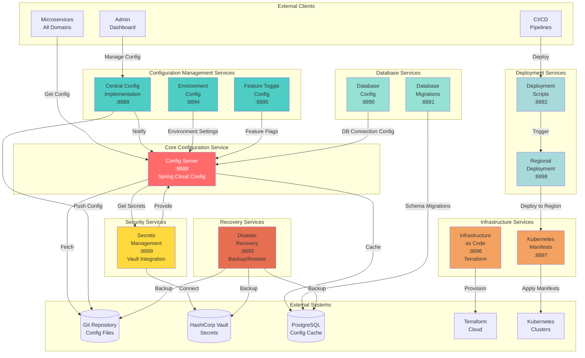
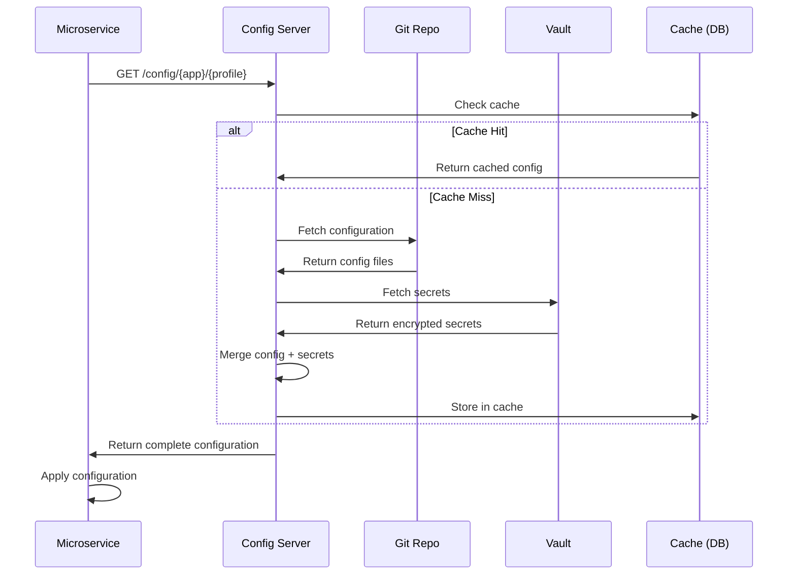
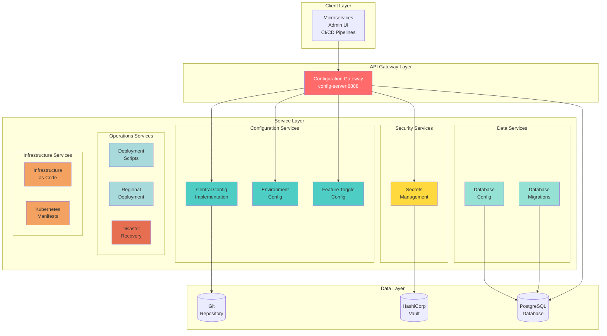
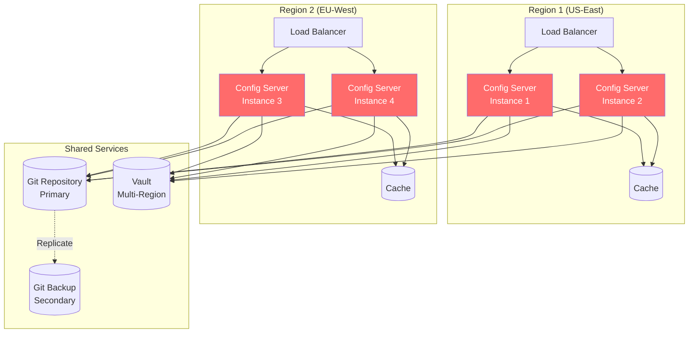
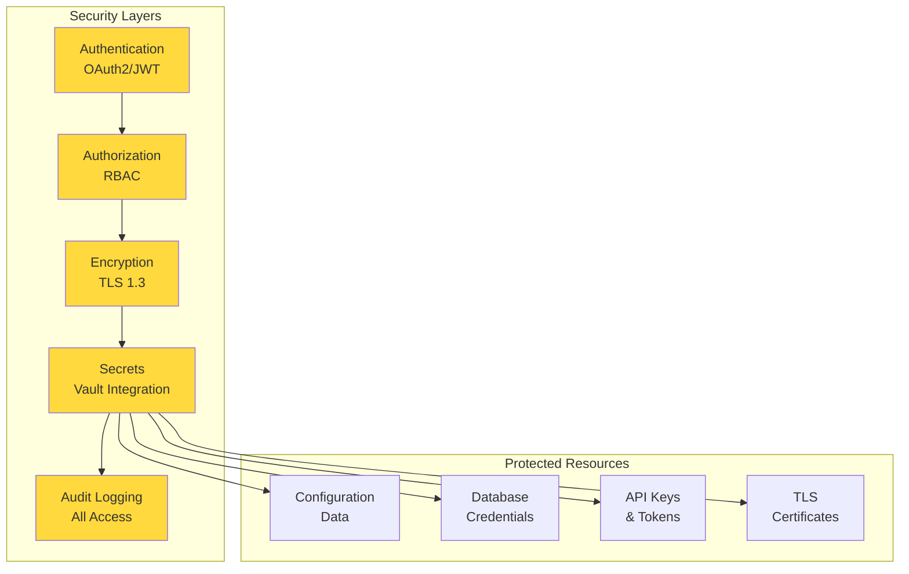

# Central Configuration Domain - Complete System Architecture

**Domain:** Foundation - Central Configuration  
**Services:** 12 (1 core + 11 infrastructure/config)  
**Purpose:** Centralized configuration management for entire Gogidix ecosystem

---

## 🏗️ Complete System Architecture



---

## 🎯 Service Interaction Matrix

| Service | Depends On | Provides To | Purpose |
|---------|-----------|-------------|---------|
| **config-server** | Git, Vault, PostgreSQL | All Microservices | Core config distribution |
| **central-configuration-implementation** | Git | config-server | Config aggregation |
| **database-config** | PostgreSQL | All Services | DB connection strings |
| **database-migrations** | PostgreSQL | All Services | Schema versioning |
| **deployment-scripts** | regional-deployment | CI/CD | Deployment automation |
| **disaster-recovery** | All Data Stores | Ops Team | Backup/Restore |
| **environment-config** | config-server | All Services | Environment settings |
| **feature-toggle-config** | config-server | All Services | Feature flags |
| **infrastructure-as-code** | Terraform | Ops Team | IaC management |
| **kubernetes-manifests** | K8s Clusters | Ops Team | K8s configs |
| **regional-deployment** | K8s, deployment-scripts | CI/CD | Multi-region deploy |
| **secrets-management** | Vault | config-server | Secrets provider |

---

## 🔄 Configuration Flow Diagram



---

## 🏗️ Layered Architecture View



---

## 📦 Service Grouping and Responsibilities

### Group 1: Core Configuration (3 services)
**Purpose:** Central configuration distribution

| Service | Port | Responsibility |
|---------|------|---------------|
| config-server | 8888 | Spring Cloud Config Server |
| central-configuration-implementation | 8889 | Config aggregation and storage |
| environment-config | 8894 | Multi-environment settings |

**Key Features:**
- Real-time configuration updates
- Environment-specific configs
- Profile-based configuration
- Git-backed configuration

---

### Group 2: Feature Management (1 service)
**Purpose:** Feature flag management

| Service | Port | Responsibility |
|---------|------|---------------|
| feature-toggle-config | 8895 | Feature flag configuration |

**Key Features:**
- Dynamic feature toggles
- A/B testing support
- Gradual rollouts
- Emergency kill switches

---

### Group 3: Database Management (2 services)
**Purpose:** Database configuration and migrations

| Service | Port | Responsibility |
|---------|------|---------------|
| database-config | 8890 | DB connection configuration |
| database-migrations | 8891 | Flyway/Liquibase migrations |

**Key Features:**
- Multi-database support
- Connection pooling config
- Schema versioning
- Migration automation

---

### Group 4: Security (1 service)
**Purpose:** Secrets and sensitive data management

| Service | Port | Responsibility |
|---------|------|---------------|
| secrets-management | 8899 | Vault integration |

**Key Features:**
- Encrypted secrets storage
- Dynamic secret generation
- Automatic secret rotation
- Audit logging

---

### Group 5: Deployment (2 services)
**Purpose:** Automated deployment orchestration

| Service | Port | Responsibility |
|---------|------|---------------|
| deployment-scripts | 8892 | CI/CD automation |
| regional-deployment | 8898 | Multi-region deployment |

**Key Features:**
- Blue-green deployments
- Canary releases
- Multi-region coordination
- Rollback automation

---

### Group 6: Infrastructure (2 services)
**Purpose:** Infrastructure as Code management

| Service | Port | Responsibility |
|---------|------|---------------|
| infrastructure-as-code | 8896 | Terraform management |
| kubernetes-manifests | 8897 | K8s config management |

**Key Features:**
- Terraform state management
- K8s manifest generation
- Infrastructure versioning
- Drift detection

---

### Group 7: Operations (1 service)
**Purpose:** Disaster recovery and backup

| Service | Port | Responsibility |
|---------|------|---------------|
| disaster-recovery | 8893 | Backup/restore automation |

**Key Features:**
- Automated backups
- Point-in-time recovery
- Cross-region replication
- Recovery testing

---

## 🚀 Deployment Architecture



---

## 📊 Communication Patterns

### Pattern 1: Synchronous Configuration Fetch
```
Microservice → Config Server → Git/Vault/Cache → Config Server → Microservice
```
**Use Case:** Service startup, configuration reload

### Pattern 2: Async Configuration Push
```
Admin → Central Config → Git → Webhook → Config Server → Broadcast → Microservices
```
**Use Case:** Runtime configuration updates

### Pattern 3: Deployment Orchestration
```
CI/CD → Deployment Scripts → Regional Deployment → K8s Manifests → Kubernetes
```
**Use Case:** New version deployment

### Pattern 4: Secret Rotation
```
Vault → Secrets Management → Config Server → Notify → All Microservices
```
**Use Case:** Automatic secret rotation

---

## 🔒 Security Architecture



---

## 📈 Scalability & Performance

### Horizontal Scaling
- **Config Server:** 2-10 instances per region
- **Support Services:** 1-2 instances per region
- **Load Balancing:** Round-robin with health checks

### Caching Strategy
- **L1 Cache:** In-memory (JVM) - 5 min TTL
- **L2 Cache:** Redis/PostgreSQL - 30 min TTL
- **L3 Cache:** Git repository - on-demand

### Performance Targets
- **Config Fetch:** < 100ms (cached)
- **Config Fetch:** < 500ms (uncached)
- **Config Update:** < 1s propagation
- **Availability:** 99.99%

---

## 🎯 Architecture Principles

### 1. **Centralization**
✅ Single source of truth for all configuration

### 2. **Security First**
✅ All secrets encrypted, TLS everywhere, audit everything

### 3. **High Availability**
✅ Multi-region, redundant, automated failover

### 4. **Developer Experience**
✅ Simple API, auto-refresh, environment parity

### 5. **Infrastructure as Code**
✅ Everything versioned, reproducible, auditable

---

## ✅ System Architecture Assessment

**Overall Design:** ✅ EXCELLENT  
**Separation of Concerns:** ✅ Clear service boundaries  
**Scalability:** ✅ Horizontal scaling supported  
**Security:** ✅ Defense in depth  
**Resilience:** ✅ Multi-region, redundancy  
**Maintainability:** ✅ Clear responsibilities  

**Status:** ✅ **PRODUCTION READY - SYSTEM ARCHITECTURE CERTIFIED**

---

**Document Version:** 1.0  
**Last Updated:** 2025-10-26  
**Status:** ✅ COMPLETE
